# SUPERB Plan v3 — Productization, Proof & the Handler-DX Wave

**Created:** 2026-09-17 08:35 CEST · **Predecessor:** `doc/planning/archived/2026-09-16_15-01_SUPERB-visibility-correctness-and-batteries-plan.md` (EXECUTED, verdict banner inline) + the 2026-09-17 05-52 and 08-08 session reports.
**Scope:** ALL open go-appkit work — the 38 TODO_LIST items, both 2026-09-17 status reports' §f backlogs merged and de-duplicated, standing rituals, and the demand-gated battery waves. Nothing open is excluded; gated items are IN the plan with their gates named.

**State this plan starts from (all verified this morning):** 11 modules, every suite `-race` green, 0 golangci issues everywhere, structure linter 0, core tagged **v0.5.0** (proxy-proven), integration re-pinned, F104 + composition contracts + fr MetricsHook + health examples all landed. The three 2026-09-16 defect classes (ghost docs tag, span-naming regression, realtime buffering) are FIXED AND SHIPPED.

---

## Verschlimmbesserung guards (non-negotiable, from AGENTS.md)

1. API-break check (`go doc -all` snapshot diff) before EVERY tag — additions-only = minor, any removal = breaking + migration notes.
2. Never tag a go.mod carrying a filesystem `replace`; annotated tags only.
3. Hermetic `GOWORK=off` verify per released module; fresh-consumer proxy test after every push (use the new recipe, F-C4).
4. Lint each module from its own directory, SEQUENTIALLY; re-run the structure linter after ANY AGENTS edit (binary counts wc+1 — keep a ≥1-line buffer).
5. TODO edits: replace-with-assert only + the `grep -c "^- \["` count gate.
6. Doc snippets are code: compile-check in a scratch module against the PUBLISHED tag before landing.
7. Don't duplicate the battery spec — port from it and reference it.
8. Env-gate FIRST: ephemeral `Addr` in every server script (8080 = SigNoz), no curl/wget, GOEXPERIMENT=jsonv2 where required.
9. This plan commits only its own file — shared-doc edits are tasks, never done silently inside other work.
10. Ship-loop discipline: tag trains follow feature waves within the same session when the API surface is stable.

---

## Pareto breakdown

### The 1% that delivers 51% — "close the ship loop, unlock the ceiling"

| # | Why it carries half the remaining value |
| - | --------------------------------------- |
| C1 pkg.go.dev render closure | The wave's LAST open release-correctness question; three pages 404 only on crawler lag. |
| C2 core semantics godoc fix + v0.5.1 | `Addr()`/`Running()` during-shutdown semantics bit us in tests TODAY; a consumer hit it in production drain hooks. Godoc-only train = ~45 min, kills a real trap at the source. |
| C5 httputil `NewServerListener` (USER-GATED) | THE unlock: one upstream API opens the composition refactor (C20-class work) AND Core TLS AND removes the async-bind contract divergence — the ceiling of everything deferred in core. |

### The 4% that delivers 64% — adds "make the new module believable + make rituals durable"

| # | Why |
| - | --- |
| C3 testkit `TestServer.Shutdown` | Encodes today's double-shutdown latency finding as API. |
| C4 proxy-check recipe/script | The release ritual's last hand-rolled step becomes copy-paste (3rd hand-roll today). |
| C11–C14 security proof quartet | govulncheck, browser CSP pass, example service, threat-model page — the security module is shipped but unproven to a skeptical consumer; this quartet is its trust story. |

### The 20% that delivers 80% — adds "the handler-DX wave + the folded contract"

| # | Why |
| - | --- |
| C15 security+realtime integration test | Proves the composition consumers will actually build (rate-limit in front of SSE). |
| C16 CI dependabot-parity assert | A module without CI/dependabot coverage is a release-train blind spot; make the gap fail loudly. |
| C17 HTML reports sweep | Four stale reports are unannotated truth debt. |
| C21–C26 W3 httpx core four | ResultHandler (classification parity with errorpages), no-leak errors, bind+validation, conditional GET — the highest-demand battery cluster; each is a consumer-visible daily-use feature. |
| C27 W5 C2 projection→broadcast folded contract | THE must-have for every cqrs+realtime consumer (kills the pre-fold-state race). |

### The remaining 20% to 100%

W3 completions (B3/B5/B6/B7/B8), W5 C1/C3 + realtime train, the full W4 ops&data wave + tags, watchlist/rituals, and every gated long-tail item (cordis, core v1.0.0, EventConfig opt-ins, toolchain bump, benchstat, dprint fix, docs retract, statusRecorder). Detail in the tables below — included, sorted, sized, gated.

---

## Comprehensive plan (30–100 min tasks, sorted by impact/effort/customer-value)

| ID | Task | Wave | Est | Gate / depends on | Customer value |
| -- | ---- | ---- | --- | ----------------- | -------------- |
| C1 | pkg.go.dev render re-check for docs@v0.3.0, health@v0.1.1, security@v0.1.0; close the TODO `[~]` | A | 30m | crawler lag | Trust: published pages resolve |
| C2 | Core godoc semantics fix (`Addr`/`Running` during drain) → API-break check (doc-only) → v0.5.1 tag + push + proxy check | A | 60m | C4 recipe ready | Removes a REAL drain-hook trap |
| C4 | Commit the fresh-consumer proxy check as `doc/recipes/fresh-consumer-proxy-check.md` + optional script | A | 30m | — | Release ritual becomes durable |
| C3 | `testkit.TestServer.Shutdown` helper (marks cleanup no-op, kills double-shutdown latency) + tests (UNRELEASED, rides next core train) | A | 45m | — | Faster, less surprising tests |
| C9 | File upstream Draft 1 (go-sse `ReplayFiltered`) + Draft 2 (httputil Logging ctx) | A | 30m | **USER GATE** | Upstream fixes land for everyone |
| C10 | statusRecorder swap in httputil (~10 lines) | A | 30m | **USER GATE** (open since 09-16) | Closes oldest open gate |
| C5 | httputil `NewServerListener(ln, cfg, handler)` upstream | A | 100m | **USER GATE** | Unblocks C6–C8 + TLS |
| C6 | Composition spike re-run vs `NewServerListener` → written verdict | B | 60m | C5 | Decides the C20-class refactor |
| C7 | Core composition refactor (Service composes httputil.Server), full contract suite green | B | 100m | C6 verdict = GO | Removes split-brain risk class |
| C8 | Core TLS: `ServiceConfig.TLS{CertFile, KeyFile}` + StartTLS wiring + tests | B | 100m | C5 | PapDashboard's first demand |
| C11 | govulncheck on health + security | B | 30m | networked machine | Supply-chain proof |
| C12 | Browser CSP pass over health dashboard (manual recipe or chromedp) | B | 60m | method choice (asked) | Client-side CSP proof |
| C13 | security example service (full hardened chain, errorpages/example pattern) | B | 100m | — | Copy-paste hardening for consumers |
| C14 | security threat-model page (battery → threat → test table) | B | 60m | — | Audit-ready security story |
| C15 | integration test: security rate-limit in front of realtime SSE | C | 60m | — | Proves the default composition |
| C16 | CI step: every module dir has a dependabot entry + CI matrix slot | C | 45m | — | No silent coverage gaps |
| C17 | Sweep the 4 never-opened HTML reports — annotate or archive + index update | C | 60m | — | Truth debt cleared |
| C21 | httpx module scaffold (go.mod, doc.go, lint config, CI matrix, dependabot, go.work note) | D | 60m | — | New battery home |
| C22 | B1 ResultHandler family + classification-parity pin vs `appkit.HTTPStatus`/errorpages | D | 100m | C21 | Daily-use error handling |
| C23 | B9 no-leak error responses (messages never reach the wire unless allowed) | D | 45m | C21 | Security-by-default errors |
| C24 | B2 bind+validate JSON/body with typed failures | D | 100m | C21 | Kills hand-rolled decode boilerplate |
| C25 | B4 conditional GET / ETag (promote go-etag from indirect) | D | 100m | C21 | Caching for free |
| C26 | httpx v0.1.0 train: API-break check vs nothing (new), CHANGELOG, tag, push, proxy test | D | 60m | C22–C25 green | Consumers can `go get` it |
| C27 | W5 C2 projection→broadcast folded contract (cqrs+realtime, kill the fold-state race) | E | 100m | — | The must-have composition |
| C28 | W5 C1 SSE drop/backpressure counters (absorbs TELEMETRY §6 candidate) | E | 100m | — | Observable backpressure |
| C29 | realtime train tag (C27/C28 in) if landed | E | 60m | C27/C28 | Consumers get the fixes |
| C18 | AGENTS cap-note truth (binary counts wc+1) + optionally file the go-structure-linter line-count fix | C | 30m | g3 answer | Doc truth |
| C19 | benchstat attempt (network) + benchmark delta pass over core/otel; fallback documented | C | 30m | network | Honest perf numbers |
| C20 | Watchlist refresh ritual (cordis consumers, PapDashboard v0.3.1+, nixpkgs, dprint exit-14) | C | 30m | — | Gates stay current |
| C30 | W3 B3 ResponseWriter contract tests | F | 100m | C21 | Compile-time writer correctness |
| C31 | W3 B5 content negotiation | F | 100m | C21 | Correct Accept handling |
| C32 | W3 B7 per-route write deadlines | F | 100m | C21 | Slow-client protection |
| C33 | W3 B6 route introspection + golden test | F | 100m | C21 | Route table as data |
| C34 | W3 B8 route metadata → docs feed | F | 100m | C33 | Docs auto-generated from routes |
| C35 | W5 C3 per-subscriber auth+filter | F | 100m | C29 train | Multi-tenant SSE |
| C36 | W4 worker supervisor+pool module | F | 100m | — | Background job backbone |
| C37 | W4 sqlite ops kit (lease/backup/ledger) | F | 100m | — | SQLite ops safety |
| C38 | W4 polite outbound client | F | 100m | — | Rate-limited HTTP client |
| C39 | W4 do bridge (samber/do wiring) | F | 100m | — | DI ergonomics |
| C40 | W4 D7 idempotency store | F | 100m | — | Safe retries |
| C41 | W4 D4 atomic file write (floor go-atomic-write ≥ v0.5.1, Windows trap) | F | 100m | — | Durable file writes |
| C42 | W4 D6 webhook module | F | 100m | — | Outbound webhooks with retries |
| C43 | W4 F1/F4 config modules | F | 100m | — | Typed config loading |
| C44 | W4 wave tag(s) + proxy tests | F | 60m | C36–C43 | Consumers resolve from proxy |
| C45 | docs `retract v0.2.0` riding the next docs tag | G | 30m | next docs train | Stale-proxy safety |
| C46 | health v0.1.2 train (DashboardHardenedPreset + examples are UNRELEASED) | G | 45m | next wave | Consumers get the preset |
| C47 | integration re-pin ritual (next train) | G | 30m | next train | Always tests what consumers resolve |
| C48 | cqrs README cookbook re-verify vs scenario/v4 after next go-cqrs-lite release | G | 30m | upstream release | Docs stay true |
| C49 | cqrs EventConfig opt-ins (encryption/signing/idempotency/scheduling) | G | 100m | **demand-gated** | Only when a consumer asks |
| C50 | cordis bridge | G | 100m | 2/3 triggers unmet | Reactive composition, someday |
| C51 | core v1.0.0 exit-criteria graduation | G | 60m | consumer count | 1.0 signal |
| C52 | toolchain bump (nixpkgs > 1.26.7) + GOEXPERIMENT note cleanup | G | 30m | upstream toolchain | Simpler build docs |
| C53 | dprint exit-14 upstream fix | G | 30m | upstream | No more --no-verify escape |

---

## Fine plan (≤12 min micro-tasks, sorted — ALL todos included)

| ID | Task | From | Gate/dep |
| -- | ---- | ---- | -------- |
| F1 | Re-fetch docs@v0.3.0 page, record status | C1 | — |
| F2 | Re-fetch health@v0.1.1 + security@v0.1.0 pages | C1 | — |
| F3 | Update TODO pkg.go.dev item with verdicts; close `[~]` if all render (count gate) | C1 | F1–F2 |
| F4 | Draft `doc/recipes/fresh-consumer-proxy-check.md` (the /tmp-module ritual, ephemeral-Addr first) | C4 | — |
| F5 | Add optional `scripts/proxy-check.sh`-equivalent (Go file, no curl) | C4 | F4 |
| F6 | Compile-check recipe's snippet against published tag | C4 | F5 |
| F7 | Write `doc/recipes/` README pointer + status-index mention | C4 | F6 |
| F8 | Patch `Addr()` doc: nil during drain (not just before Start) | C2 | — |
| F9 | Patch `Running()` doc: false once Shutdown starts | C2 | F8 |
| F10 | Sweep core doc.go/README for the same claim; fix | C2 | F9 |
| F11 | go doc snapshot diff v0.5.0 vs tree (expect doc-only) | C2 | F10 |
| F12 | Date core CHANGELOG `v0.5.1`, hermetic verify | C2 | F11 |
| F13 | Tag v0.5.1 (annotated, doc-fix message), push | C2 | F12 |
| F14 | Fresh-consumer proxy check per recipe | C2 | F13 |
| F15 | Re-pin integration to v0.5.1; suite green; TODO closure w/ evidence | C2 | F14 |
| F16 | Write `TestServer.Shutdown` signature + no-op-cleanup mechanism | C3 | — |
| F17 | Tests: explicit-shutdown path, cleanup-noop path, errCh semantics | C3 | F16 |
| F18 | README testkit section note + CHANGELOG `[Unreleased]` line; suite green | C3 | F17 |
| F19 | Re-read go-sse draft; verify ReplayFiltered API sketch against go-sse v0.6.0 source | C9 | GATE |
| F20 | Re-read httputil Logging draft; verify emit point in source | C9 | GATE |
| F21 | File both (gh issue) with verified evidence; TODO close | C9 | GATE, F19–F20 |
| F22 | Locate statusRecorder swap site in httputil; confirm 10-line scope | C10 | GATE |
| F23 | Swap + httputil test suite green | C10 | GATE, F22 |
| F24 | httputil doc-only tag train + proxy check | C10 | GATE, F23 |
| F25 | httputil branch: `Server` config struct gains listener-injection constructor | C5 | GATE |
| F26 | Implement `NewServerListener(ln, cfg, handler)`; sync-bind error path classified | C5 | GATE, F25 |
| F27 | Port appkit's shutdown-phase log contract expectations into httputil tests | C5 | GATE, F26 |
| F28 | httputil suite + lint green; upstream PR (draft) | C5 | GATE, F27 |
| F29 | Spike harness: boot Service over injected listener; bind-fail path | C6 | C5 merged |
| F30 | Re-run 6/7-field config mapping + phase-log/error contract table | C6 | F29 |
| F31 | Write verdict doc (GO/NO-GO) + AGENTS claim update | C6 | F30 |
| F32 | Refactor Service to compose httputil.Server (keep public API frozen) | C7 | C6 GO |
| F33 | Port phase logging + classified `listen_failed` onto new base | C7 | F32 |
| F34 | Full core suite + integration composition suite green 3× | C7 | F33 |
| F35 | API-break diff (must be zero API delta) + CHANGELOG `[Unreleased]` | C7 | F34 |
| F36 | `ServiceConfig.TLS` struct + Validate rules | C8 | C5 merged |
| F37 | `Start`/`StartTLS` wiring + `listen_failed` classification parity | C8 | F36 |
| F38 | Tests: cert load failure, handshake, drain over TLS | C8 | F37 |
| F39 | CHANGELOG + README TLS section (compile-checked snippet) | C8 | F38 |
| F40 | Install/run govulncheck (health) — record findings | C11 | network |
| F41 | govulncheck (security) — record findings; route any hits to TODO | C11 | network |
| F42 | Write the manual CSP pass recipe (exact dashboard URL, profile flags, what to look for) | C12 | — |
| F43 | Execute pass (chromedp if installable, else hand off) + record verdict | C12 | F42 |
| F44 | `security/example/main.go`: chain composition skeleton | C13 | — |
| F45 | Wire all 8 batteries into the example with per-route demos | C13 | F44 |
| F46 | Live E2E: harden-chain requests through the full appkit stack | C13 | F45 |
| F47 | Example README + root README link | C13 | F46 |
| F48 | Threat-model skeleton: battery → threat → test mapping table | C14 | — |
| F49 | Fill per-battery rows (API-key, CSRF, rate-limit, origin, body, sanitize, CSP, headers) | C14 | F48 |
| F50 | Known-gaps section (what the module does NOT defend) + README link | C14 | F49 |
| F51 | Write `TestRateLimitBeforeSSE`: hardened chain → realtime mount | C15 | — |
| F52 | Assert: 429 aborts before SSE headers; allowed key streams fine | C15 | F51 |
| F53 | Suite green + integration CHANGELOG/TODO note | C15 | F52 |
| F54 | CI: add dependabot-parity job skeleton (dirs vs workflow matrix) | C16 | — |
| F55 | Assert + fail message listing missing coverage; run on CI | C16 | F54 |
| F56 | Open each of the 4 stale HTML reports; write 1-line verdicts | C17 | — |
| F57 | Annotate or archive per verdicts; update status index + gate | C17 | F56 |
| F58 | Update AGENTS cap note to "376 target / binary counts +1" | C18 | g3 answer |
| F59 | Optionally file go-structure-linter line-count issue (verified: pre-edit commit fails) | C18 | g3 answer |
| F60 | Install benchstat (or record block); re-run 2 core benchmarks with -count=10 | C19 | network |
| F61 | Record mean±sd deltas in core README baselines | C19 | F60 |
| F62 | Watchlist: cordis consumers, PapDashboard v0.3.1+, nixpkgs go version, dprint fix | C20 | — |
| F63 | TODO watchlist item update with evidence (ls-remote outputs) | C20 | F62 |
| F64 | httpx `go.mod` + `doc.go` + LICENSE + `.golangci.yml` (satellite standard) | C21 | — |
| F65 | Register httpx in CI matrix + dependabot + go.work note (gitignored) | C21 | F64 |
| F66 | Fresh-worktree smoke: build+test outside workspace | C21 | F65 |
| F67 | B1 API: `ResultHandler` config struct + family classification via error-family | C22 | C21 |
| F68 | Classification-parity test: httpx mapping ≡ `appkit.HTTPStatus` ≡ errorpages table | C22 | F67 |
| F69 | B1 handlers: JSON/HTML modes; README + compile-checked snippets | C22 | F68 |
| F70 | B9: response-writer guard — classified errors render, internals never leak | C23 | C21 |
| F71 | B9 tests: leak traps (wrapped sentinels, fmt.Errorf chains, panics) | C23 | F70 |
| F72 | B2: bind API (JSON body, size caps) with typed `BindError` | C24 | C21 |
| F73 | B2: validation hooks + field-error mapping; tests | C24 | F72 |
| F74 | B4: ETag compute/compare + `If-None-Match` handling; promote go-etag dep | C25 | C21 |
| F75 | B4 tests: 304 paths, weak/strong validators, Vary | C25 | F74 |
| F76 | httpx CHANGELOG `[Unreleased]` → dated v0.1.0; API-break check (new module: none) | C26 | C22–C25 |
| F77 | Hermetic verify + tag httpx/v0.1.0 + push | C26 | F76 |
| F78 | Fresh-consumer proxy check for httpx | C26 | F77 |
| F79 | C2 design: folded broadcast contract sketch (projection commit → SSE event ordering) | C27 | — |
| F80 | Implement fold hook in realtime hub (ordered handoff, no dup/no gap) | C27 | F79 |
| F81 | Race test: projection commit vs broadcast interleave (the pre-fold race, pinned) | C27 | F80 |
| F82 | C1 counters: drop/backpressure metrics on hub + handler (names = contract) | C28 | — |
| F83 | C1 tests: buffer-full drop, slow subscriber, heartbeat interplay | C28 | F82 |
| F84 | TELEMETRY.md: promote §6 candidate into catalogue with the new names | C28 | F83 |
| F85 | realtime CHANGELOG entries; suite green 3× | C29 | C27–C28 |
| F86 | realtime API-break check vs v0.1.1 → minor/breaking decision + tag train + proxy | C29 | F85 |
| F87 | B3: ResponseWriter contract test-kit (flush/hijack/unwrapper matrix) | C30 | C21 |
| F88 | B5: content negotiation (Accept parsing, q-values, 406) | C31 | C21 |
| F89 | B5 tests: q-ordering, wildcard, mixed | C31 | F88 |
| F90 | B7: per-route write deadline option + timeout classification | C32 | C21 |
| F91 | B7 tests: slow client cut, deadline reset per request | C32 | F90 |
| F92 | B6: route introspection (patterns, methods, handlers) + golden-file test | C33 | C21 |
| F93 | B8: metadata struct + docs-feed adapter for the docs module | C34 | C33 |
| F94 | C3: per-subscriber auth+filter hooks + tests | C35 | C29 train |
| F95 | W4 worker: supervisor+pool skeleton | C36 | — |
| F96 | W4 worker: graceful drain + panic isolation + tests | C36 | F95 |
| F97 | W4 sqlite kit: lease primitives + tests | C37 | — |
| F98 | W4 sqlite kit: backup + ledger + tests | C37 | F97 |
| F99 | W4 polite client: rate-limit + retry budget + tests | C38 | — |
| F100 | W4 do bridge: scoped registrations + lifecycle + tests | C39 | — |
| F101 | W4 D7: idempotency store API (key, ttl, replay) + tests | C40 | — |
| F102 | W4 D4: atomic write via go-atomic-write; Windows trap test | C41 | — |
| F103 | W4 D6: webhook signing + retry/backoff + tests | C42 | — |
| F104 | W4 F1/F4: config load/env overlay + tests | C43 | — |
| F105 | W4 CHANGELOGs + per-module tags + proxy checks (batched train) | C44 | C36–C43 |
| F106 | docs module: add `retract v0.2.0` + CHANGELOG line (UNRELEASED) | C45 | next docs train |
| F107 | docs tag train when next docs change ships | C45 | F106 |
| F108 | health CHANGELOG date + tag v0.1.2 + proxy check | C46 | next wave |
| F109 | integration go.mod bump ritual + suite 3× + TODO note | C47 | next train |
| F110 | Cookbook verification pass (scenario/v4, testutil snippets compile) | C48 | upstream release |
| F111 | EventConfig opt-ins spike ONLY on demand signal (record trigger) | C49 | demand |
| F112 | cordis bridge spike ONLY when trigger 2+3 met | C50 | triggers |
| F113 | v1.0.0: re-count consumers, re-audit exit criteria, graduate or document block | C51 | consumers |
| F114 | Toolchain bump sweep: go directives, GOEXPERIMENT note deletions, CI matrix | C52 | nixpkgs |
| F115 | dprint exit-14: file upstream (verified repro) or land skip-step fix | C53 | upstream |

(Standing rituals — scheduled, not new work: F47/F78/F86/F105 proxy checks use F4's recipe; every tag train repeats F11/F12/F13/F14; every AGENTS edit re-runs the structure linter; every TODO edit asserts + counts.)

---

## Execution graph

```mermaid
flowchart TD
    subgraph WAVE_A["Wave A — 1% → 51%: ship-loop truth"]
        C1[C1 pkg.go.dev re-check]
        C4[C4 proxy-check recipe]
        C2[C2 core godoc fix → v0.5.1]
        C9[C9 file upstream drafts]
        C10[C10 statusRecorder swap]
        C5[C5 httputil NewServerListener]
        C3[C3 testkit Shutdown helper]
    end

    subgraph WAVE_B["Wave B — 4% → 64%: proof + unlock"]
        C6[C6 composition spike re-run]
        C7[C7 core composition refactor]
        C8[C8 core TLS]
        C11[C11 govulncheck]
        C12[C12 browser CSP pass]
        C13[C13 security example]
        C14[C14 threat-model page]
    end

    subgraph WAVE_C["Wave C — 20% → 80%: composition + hygiene"]
        C15[C15 sec+realtime test]
        C16[C16 CI parity assert]
        C17[C17 reports sweep]
        C18[C18 AGENTS cap note]
        C19[C19 benchstat]
        C20[C20 watchlist]
    end

    subgraph WAVE_D["Wave D — handler-DX wave"]
        C21[C21 httpx scaffold]
        C22[C22 B1 ResultHandler]
        C23[C23 B9 no-leak]
        C24[C24 B2 bind+validate]
        C25[C25 B4 conditional GET]
        C26[C26 httpx v0.1.0 train]
    end

    subgraph WAVE_E["Wave E — realtime completions"]
        C27[C27 C2 folded contract]
        C28[C28 C1 backpressure counters]
        C29[C29 realtime train]
    end

    subgraph WAVE_F["Wave F — W4 ops & data + W3/W5 rest"]
        C30[C30 B3 writer contract]
        C31[C31 B5 content negotiation]
        C32[C32 B7 write deadlines]
        C33[C33 B6 route introspection]
        C34[C34 B8 metadata feed]
        C35[C35 C3 subscriber auth]
        C36[C36 worker]
        C37[C37 sqlite kit]
        C38[C38 polite client]
        C39[C39 do bridge]
        C40[C40 idempotency]
        C41[C41 atomic write]
        C42[C42 webhook]
        C43[C43 config]
        C44[C44 W4 trains]
    end

    subgraph WAVE_G["Wave G — gated long tail"]
        C45[C45 docs retract]
        C46[C46 health v0.1.2]
        C47[C47 integration re-pin]
        C48[C48 cookbook ritual]
        C49[C49 EventConfig opt-ins]
        C50[C50 cordis bridge]
        C51[C51 core v1.0.0]
        C52[C52 toolchain bump]
        C53[C53 dprint fix]
    end

    C4 --> C2
    C1 --> DONE1{{ship loop closed}}
    C2 --> DONE1
    C9 -. USER GATE .-> C5
    C10 -. USER GATE .-> httputil2[httputil]
    C5 --> C6 -->|GO verdict| C7
    C5 --> C8
    C6 -->|NO-GO| KEEP{{keep current Service, document}}
    C21 --> C22 --> C26
    C21 --> C23 --> C26
    C21 --> C24 --> C26
    C21 --> C25 --> C26
    C27 --> C29
    C28 --> C29
    C22 --> C30
    C33 --> C34
    C36 --> C44
    C37 --> C44
    C38 --> C44
    C39 --> C44
    C40 --> C44
    C41 --> C44
    C42 --> C44
    C43 --> C44
    C49 -. demand .-> C49
    C50 -. 2/3 triggers .-> C50
```

**Order of execution:** Wave A (C4 → C2 → C1, then gates) → Wave B proofs (C11–C14) → Wave C hygiene → Wave D (C21 → C22/C23/C24/C25 in parallel → C26) → Wave E (C27/C28 → C29) → Waves F/G as demand and gates allow. Every train ends with: hermetic verify → tag → push → proxy check → integration re-pin → TODO close (same commit as the work).

---

*This plan commits only this file. Shared-doc edits (TODO_LIST, FEATURES, AGENTS) are explicit tasks inside the waves, never silent side effects. Next planning cycle: after the Wave A/B gates are answered or W3 ships, whichever comes first.*
