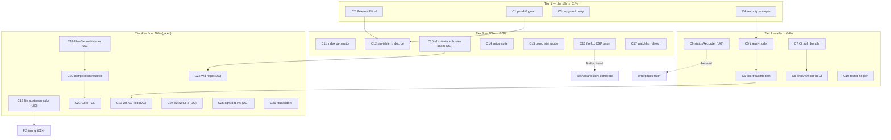

# SUPERB Plan v4 — Drift Guards, Security Adoption & the Gated Unlocks

**Created:** 2026-09-17 19:20 CEST · **Predecessor:** `doc/planning/archived/2026-09-17_08-35_SUPERB-productization-proof-and-handler-dx.md` (v3 — superseded UNEXECUTED; its gates carry forward) ← `doc/planning/archived/2026-09-16_15-01_SUPERB-visibility-correctness-and-batteries-plan.md` (EXECUTED) · **Inputs:** TODO_LIST.md (21 open items, post docs-health rebuild 2026-09-17), the 19-13 status report §f (50 items, harvested), AGENTS Deferred Register.

**Scope:** ALL open go-appkit work — every TODO_LIST item, every harvested §f item, every standing ritual and watchlist entry appears EXACTLY ONCE below (Coverage Map at the bottom proves it). Gated items are IN the plan with their gates named; this plan does not self-authorize gates.

**State this plan starts from (all verified 2026-09-17):** 11 modules, every suite `-race` green, 0 golangci issues, structure linter 0, every module tag on origin through core v0.5.1, fresh-consumer proxy-proven, **pkg.go.dev VERIFIED (all pages render)**, TODO_LIST open-only, `doc/status/` archive clean, `doc/`/`docs/` split brain dead. The three 2026-09-16 defect classes (ghost docs tag, span-naming regression, realtime buffering) are FIXED AND SHIPPED. **Known drift classes that bit twice on 2026-09-17:** AGENTS release-line vs actual tags (v0.5.0-vs-v0.5.1) and sibling-pin staleness (setup v0.4.0→v0.5.0 mid-day). Nothing enforces either today.

---

## Verschlimmbesserung guards (non-negotiable, from AGENTS.md + v3)

1. API-break check (`go doc -all` snapshot diff) before EVERY tag — additions-only = minor; any removal = breaking + migration notes.
2. Never tag a go.mod carrying a filesystem `replace`; annotated tags only.
3. Hermetic `GOWORK=off` verify per released module; fresh-consumer proxy test after every push (`doc/recipes/fresh-consumer-proxy-check.md`).
4. Lint each module from its own directory, SEQUENTIALLY; re-run the structure linter after ANY AGENTS edit (binary counts wc+1 — keep ≥1-line buffer; 376/377 today).
5. TODO edits: replace-with-assert only + the `grep -c "^- \["` count gate.
6. Doc snippets are code: compile-check in a scratch module against the PUBLISHED tag before landing.
7. Don't duplicate the battery spec — port from it and reference it (`doc/feedback/processed/2026-09-04_batteries-included-sdk-gap-analysis.md`).
8. Env-gate FIRST: ephemeral `Addr` everywhere (8080 = SigNoz), no curl/wget (python/firefox instead), GOEXPERIMENT=jsonv2 where required.
9. This plan commits only its own file (+ the v3 superseded banner); shared-doc edits are tasks, never done silently inside other work.
10. Verify-then-write: no fact enters a living doc from a report without a fresh check (2026-09-17 lesson: setup's pin moved between the 14:22 audit and the evening pass).
11. Verdicts are records, not intentions: annotate `done` only after the cited action succeeded (2026-09-17 memory-write lesson).
12. Gates stay gates: USER-GATED and DEMAND-GATED items are executed only after their gate closes; the plan tracks them, it does not open them.

---

## The Pareto breakdown

### The 1% that delivers 51% — "kill the drift classes, open the security door"

| C# | Task (30–100 min)                                                                 | Why it carries half the remaining value                                                                                                          | Effort |
| -- | --------------------------------------------------------------------------------- | ------------------------------------------------------------------------------------------------------------------------------------------------ | ------ |
| C1 | **Pin-drift guard**: `integration/pin_drift_test.go` asserting the documented pin map + a CI step asserting the AGENTS "ON ORIGIN through" version exists in `git tag -l` | Two drift incidents in ONE day (AGENTS v0.5.0-vs-v0.5.1; setup v0.4.0→v0.5.0) were both findable by one grep and nothing ran it. This makes the whole class a red test forever. | 60min  |
| C2 | **Release Ritual update** (AGENTS, net-zero lines): explicit "update AGENTS release-state + module lines + TODO header" step + the `docs:` tag-message convention | The ritual, not memory, is what prevents the next release-time drift; v0.5.1 shipped while AGENTS still said v0.5.0.                              | 30min  |
| C3 | **Depguard deny `cqrs-htmx/setup` repo-wide** (root + satellite configs, negative-test proven) | "setup is NEVER a dependency of appkit" is enforced by prose today; one accidental import would invert the ecosystem's dependency direction.      | 45min  |
| C4 | **security example service** (`security/example/`, errorpages/example pattern): full hardened chain live on an appkit service with an E2E check pass | The newest module has zero adoption surface; security batteries without a runnable demo are the biggest unconverted consumer value in the repo.   | 90min  |

### The 4% that delivers 64% (+13%) — "complete the security story, make CI tell the truth"

| C#  | Task                                                                                                   | Why                                                                                                                                              | Effort |
| --- | ------------------------------------------------------------------------------------------------------ | ------------------------------------------------------------------------------------------------------------------------------------------------ | ------ |
| C5  | **security threat-model page** (per-battery threat → attack → pinning test table, README section)       | Adoption needs the WHY per battery; the tests already pin the behavior — the table converts them into an auditable security story.                | 60min  |
| C6  | **security + realtime composition test** in `integration/` (rate-limit in front of SSE)                 | First cross-module proof that the security chain composes with the realtime transport (429 flood + stream survival) — the pattern W3/W5 will reuse. | 60min  |
| C7  | **CI truth bundle**: full read of the proxy-smoke job (LATEST resolution proof) + dependabot/CI parity assert step | CI is the trust anchor; today one module could silently lose its dependabot entry or matrix slot and nothing would fail.                           | 60min  |
| C8  | **Fresh-consumer proxy smoke in CI** (workflow_dispatch, network-probe step, graceful-skip message)      | The release ritual's most important check currently exists only as a hand-rolled /tmp dance; CI-ifying it removes the human step.                  | 60min  |
| C9  | **statusRecorder swap** (USER GATE): `errorpages` hand-rolled wrapper → `httputil.ResponseRecorder`     | Two ResponseWriter wrappers, one job; ~10 lines once the architecture-taste gate is answered (open since 2026-09-16).                             | 15min  |
| C10 | **testkit explicit-shutdown helper** (`TestServer.Shutdown` marks cleanup no-op)                        | Removes the double-shutdown `errCh` wait from every test that manages its own lifecycle — pure DX win on the newest core sub-package.             | 45min  |

### The 20% that delivers 80% (+16%) — "automate the truth, close the env-blocked gaps"

| C#  | Task                                                                                                          | Why                                                                                                                                               | Effort |
| --- | ------------------------------------------------------------------------------------------------------------- | ------------------------------------------------------------------------------------------------------------------------------------------------- | ------ |
| C11 | **Status-index auto-generation** (`doc/status/generate_index.py` → Current table + archived count between markers) | The index rotted once already (28→36 in one day); a script makes docs-health passes mechanical and the counts unlieable.                            | 60min  |
| C12 | **Pin-table extraction**: integration pins → `integration/doc.go`; AGENTS section shrinks to a pointer (net-negative lines) | Single-sources the pins next to the go.mod they describe; relieves the AGENTS cap that keeps producing compressed, rot-prone lines.                 | 45min  |
| C13 | **Browser CSP pass — now FEASIBLE**: firefox exists at `/etc/profiles/per-user/lars/bin/firefox` (found 19:20); headless run of health example + `DashboardHardenedPreset` under strict CSP | The strict-CSP configuration has server-side proof only; firefox headless closes the last honest gap in the dashboard-hardening story.             | 60min  |
| C14 | **Full setup-suite hermetic run** (their repo, `GOWORK=off`, bounded)                                          | Extends today's 3/3 appkit-composition green to suite-green; any failure is THEIR surface, and we want to know before they flip the default.       | 60min  |
| C15 | **benchstat probe + re-baseline**: `nix run nixpkgs#benchstat` (never probed), then otel benchmarks n=10 through real benchstat | Replaces the hand-rolled mean±sd protocol with the real tool on the ±25%-drift box; closes a claim that has said "candidate" for three sessions.    | 45min  |
| C16 | **v1 criteria refresh + `svc.Routes()` seam proposal**: fold the documented-wiring-test lesson into `doc/planning/core-v1-exit-criteria.md`; write the Routes() API sketch as a USER GATE | v1.0.0 is the release target; the seam decision unblocks or kills W3 B6/B8 before any battery work starts.                                         | 45min  |
| C17 | **Watchlist refresh execution**: cordis consumers/tags, PapDashboard v0.3.1+, nixpkgs toolchain, dprint exit-14, structure-linter upstream, pkg.go.dev quarterly note | Six standing checks with stale as-of dates; one bounded pass re-grounds them all.                                                                  | 45min  |

### The final 20% to reach 100% — "the gated unlocks and the demand-gated bay" (deliberate restraint)

| C#   | Task                                                                                                   | Gate                                          | Effort   |
| ---- | ------------------------------------------------------------------------------------------------------ | --------------------------------------------- | -------- |
| C18  | File the two upstream asks (go-sse `ReplayFiltered` Draft 1, httputil Logging request-context Draft 2; verify-before-filing + github-voice) | USER GATE (filing)                            | 45min    |
| C19  | Implement `httputil.NewServerListener(ln, cfg, handler)` upstream (cross-repo)                          | USER GATE (public-API addition)               | 100min   |
| C20  | Re-run the composition spike against the new API; execute the `Service`-on-`httputil.Server` refactor   | gated on C19                                  | 100min   |
| C21  | Core TLS option (`ServiceConfig.TLS{CertFile, KeyFile}`)                                                | gated on C19 (PapDashboard's first demand)    | 60min    |
| C22  | W3 `httpx` module kickoff: B1 ResultHandler family (classification-parity pin vs errorpages), then B2/B9 | DEMAND GATE (+ C16 seam for B6/B8 only)       | 100min   |
| C23  | W5 C2 projection→broadcast folded contract (the cqrs+realtime must-have)                                | DEMAND GATE                                   | 100min   |
| C24  | W4/W5 remainder + W1 F2 (D4 atomic write, D7 idempotency, C1 drop counters, F2 timing after C18-Draft2) | DEMAND GATE                                   | 100min   |
| C25  | cqrs EventConfig opt-ins (encryption/v4, signing/v4; candidates: idempotency/sqlstore, scheduling)      | DEMAND GATE                                   | 100min   |
| C26  | Ritual riders: Retract docs/v0.2.0 on the next docs train; cqrs cookbook re-verify on the next go-cqrs-lite release; AGENTS slim-down DECISION; process chores (memory lesson from a writable session, §f ≤10 cap, docs-health cited-fact freshness rule) | various (trigger/user/env)                    | 60min    |

---

## Fine-Grained Plan (≤12 min micro-tasks — ALL TODOs)

Every comprehensive task decomposed; each row is one sitting ≤12 min. Execute top-to-bottom within a tier; tiers 2+ can interleave after their dependencies (see the execution graph).

### Tier 1 — the 1% (C1–C4)

| F#  | Task                                                                                                   | C#  | Min |
| --- | ------------------------------------------------------------------------------------------------------ | --- | --- |
| F1  | Read `integration/go.mod` + AGENTS release line; write the expected-pins map as test fixtures          | C1  | 12  |
| F2  | Write `integration/pin_drift_test.go`: parse own go.mod, assert every documented pin                    | C1  | 12  |
| F3  | Add the AGENTS-release-line check (script or test: version string ∈ `git tag -l`)                        | C1  | 12  |
| F4  | Wire both checks into CI (new `pin-drift` job or step); run once green locally                          | C1  | 12  |
| F5  | Parameter comment: where the pin-philosophy decision (g-1) changes the assertion                        | C1  | 6   |
| F6  | AGENTS Release Ritual: fold in "update AGENTS release-state + module lines + TODO header" as an explicit step (net-zero lines) | C2  | 12  |
| F7  | Add the `docs:` tag-message convention for doc-only releases to the same ritual                          | C2  | 6   |
| F8  | Structure linter + wc cap check after the AGENTS edit                                                    | C2  | 6   |
| F9  | Read root `.golangci.yml` depguard settings; add the `cqrs-htmx/setup` deny rule                         | C3  | 12  |
| F10 | Mirror the deny into satellite `.golangci.yml` configs where depguard is enabled (or document inheritance) | C3  | 12  |
| F11 | Negative test: scratch file importing setup → expect the lint hit → delete                               | C3  | 12  |
| F12 | Sequential golangci runs: root + touched modules; 0 findings                                             | C3  | 12  |
| F13 | Read `errorpages/example/main.go` + the security module's exported API (8 batteries)                     | C4  | 12  |
| F14 | Scaffold `security/example/main.go`: appkit service + APIKeyAuth + RateLimit + BodyLimit                 | C4  | 12  |
| F15 | Add CSP nonce + SecurityHeaders via OuterMiddlewares; wire the nonce extractor; build                    | C4  | 12  |
| F16 | Live E2E on ephemeral port (python checks): 401 without key, 200 with, 413 over-limit, 429 on flood, CSP/HSTS headers present | C4  | 12  |
| F17 | security README: example section + run instructions; root README row gains the example link              | C4  | 12  |
| F18 | Example lint + `-race`; structure linter (examples-directory excluded — verify)                          | C4  | 12  |

### Tier 2 — the 4% (C5–C10)

| F#  | Task                                                                                                   | C#  | Min |
| --- | ------------------------------------------------------------------------------------------------------ | --- | --- |
| F19 | Draft the battery→threat→test table (A1–A8) from the security tests' own names                           | C5  | 12  |
| F20 | Write the threat-model section into `security/README.md` (module self-contained; no new top-level file)  | C5  | 12  |
| F21 | Cross-link: root README security row + FEATURES security note                                            | C5  | 6   |
| F22 | Prose/lint pass; DONE                                                                                   | C5  | 6   |
| F23 | Check security module deps for GOEXPERIMENT implications before touching integration (bluemonday json use) | C6  | 12  |
| F24 | Write `integration/security_realtime_test.go`: RateLimit in front of the realtime Handler                | C6  | 12  |
| F25 | Assert: flood → 429 with Retry-After; legit subscriber still streams; `-race` green 3×                   | C6  | 12  |
| F26 | `go mod tidy` + confirm integration still resolves PUBLISHED tags only; lint                             | C6  | 12  |
| F27 | Read the proxy-smoke job end-to-end; record the LATEST-resolution proof in the job comment               | C7  | 12  |
| F28 | Write the dependabot/CI parity assert (module dirs vs `.github/dependabot.yml` vs ci.yml matrix)         | C7  | 12  |
| F29 | Run the parity logic locally; fix any drift it finds                                                     | C7  | 12  |
| F30 | Commit the CI change; validate yaml (actionlint or parse)                                               | C7  | 12  |
| F31 | Draft the `workflow_dispatch` proxy-smoke job from the recipe                                            | C8  | 12  |
| F32 | Add the network probe step with a graceful, loud skip message when blocked                               | C8  | 12  |
| F33 | Trigger one manual dispatch; record the result (PASS or documented skip)                                 | C8  | 12  |
| F34 | Recipes README: document the manual dispatch step                                                        | C8  | 6   |
| F35 | USER GATE check-in: statusRecorder swap — if blessed, swap to `httputil.ResponseRecorder`                | C9  | 12  |
| F36 | errorpages suite + lint + CHANGELOG `[Unreleased]` entry                                                 | C9  | 12  |
| F37 | If declined: close the TODO item with a Won't-implement verdict + date                                    | C9  | 6   |
| F38 | Read `testkit.go` teardown path; design `TestServer.Shutdown` (cleanup no-op marker)                     | C10 | 12  |
| F39 | Implement + test: double-shutdown no longer pays the `errCh` wait; suite green                           | C10 | 12  |
| F40 | testkit CHANGELOG + README snippet update                                                                | C10 | 6   |

### Tier 3 — the 20% (C11–C17)

| F#  | Task                                                                                                   | C#  | Min |
| --- | ------------------------------------------------------------------------------------------------------ | --- | --- |
| F41 | Write `doc/status/generate_index.py` (walk archived/, emit Current table + count between HTML-comment markers) | C11 | 12  |
| F42 | Run it; diff the README; add the one-line usage note                                                     | C11 | 12  |
| F43 | Write `integration/doc.go`: the pin table + the LATEST-published philosophy                              | C12 | 12  |
| F44 | Shrink the AGENTS integration section to a pointer (net-negative lines — pays back the cap)              | C12 | 12  |
| F45 | Structure linter + `integration` build + suite                                                           | C12 | 12  |
| F46 | Build + run health example with `DashboardHardenedPreset` on an ephemeral port                           | C13 | 12  |
| F47 | `firefox --headless` feasibility probe against `/health` (screenshot + console capture)                   | C13 | 12  |
| F48 | Execute the strict-CSP checklist (scripts blocked? nonce bootstrap works? statics served?); record verdicts | C13 | 12  |
| F49 | Write the browser-side verdict into health README (Gotchas) + close/keep the TODO item                   | C13 | 12  |
| F50 | `cd /home/lars/projects/cqrs-htmx && GOWORK=off go test ./setup/...` (bounded)                            | C14 | 12  |
| F51 | Triage failures (containers? network?); record the verdict in their repo's tracking or the next report    | C14 | 12  |
| F52 | `nix run nixpkgs#benchstat -- --help` — the never-probed assumption                                      | C15 | 6   |
| F53 | If available: otel 3 benchmarks `-count=10` → benchstat vs the recorded baseline                          | C15 | 12  |
| F54 | Record the result; close the candidate or re-scope it                                                    | C15 | 6   |
| F55 | Fold the documented-wiring-test lesson into `doc/planning/core-v1-exit-criteria.md`                       | C16 | 6   |
| F56 | Draft the `svc.Routes()` seam API sketch (USER GATE document)                                             | C16 | 12  |
| F57 | Cross-link the seam proposal from ROADMAP's raw idea                                                      | C16 | 6   |
| F58 | `git ls-remote`: cordis tags/consumers; PapDashboard tags                                                 | C17 | 6   |
| F59 | nix-instantiate go version; dprint + structure-linter upstream checks                                     | C17 | 12  |
| F60 | Refresh the TODO watchlist item with fresh as-of dates                                                    | C17 | 6   |

### Tier 4 — the final 20% (C18–C26, gated)

| F#  | Task                                                                                                   | C#  | Min | Gate        |
| --- | ------------------------------------------------------------------------------------------------------ | --- | --- | ----------- |
| F61 | verify-before-filing: re-verify Draft 1's pinned sources (go-sse v0.6.0)                                 | C18 | 12  | USER (file) |
| F62 | File the go-sse issue (github-voice)                                                                     | C18 | 12  | USER (file) |
| F63 | File the httputil Logging request-context issue (Draft 2)                                                | C18 | 12  | USER (file) |
| F64 | Implement `NewServerListener` in httputil + tests                                                        | C19 | 12× | USER (API)  |
| F65 | httputil release ritual (API-break check, tag, push, proxy test)                                         | C19 | 12  | USER (API)  |
| F66 | Re-run the composition spike against the new API                                                         | C20 | 12  | C19         |
| F67 | Execute the `Service` refactor behind the spike verdict                                                  | C20 | 12× | C19         |
| F68 | Shutdown phase-log/error contract re-pin after the refactor                                              | C20 | 12  | C19         |
| F69 | `ServiceConfig.TLS{CertFile, KeyFile}` design + API-break check                                          | C21 | 12  | C19         |
| F70 | Core TLS implementation + tests + README                                                                 | C21 | 12× | C19         |
| F71 | Scaffold the `httpx` module (go.mod, doc.go, CI, dependabot, lint config)                                | C22 | 12  | DEMAND      |
| F72 | B1 ResultHandler family + the classification-parity pin vs errorpages                                    | C22 | 12× | DEMAND      |
| F73 | B2 bind+validation; B9 no-leak error responses                                                           | C22 | 12× | DEMAND      |
| F74 | W5 C2 projection→broadcast folded contract + race tests                                                  | C23 | 12× | DEMAND      |
| F75 | W4 D4 atomic file write (Windows syscall trap test)                                                      | C24 | 12  | DEMAND      |
| F76 | W4 D7 idempotency store; W5 C1 drop counters (dedupe `WithOnDrop`)                                       | C24 | 12× | DEMAND      |
| F77 | W1 F2 timing battery (after C18 Draft 2 lands — shared duration source)                                  | C24 | 12  | DEMAND+C18  |
| F78 | cqrs encryption/v4 + signing/v4 opt-ins behind EventConfig                                               | C25 | 12× | DEMAND      |
| F79 | Retract docs/v0.2.0 in the next docs release train                                                       | C26 | 6   | TRIGGER     |
| F80 | cqrs README cookbook re-verify vs scenario/v4 on the next go-cqrs-lite release                            | C26 | 12  | TRIGGER     |
| F81 | AGENTS slim-down DECISION (what graduates; user call)                                                    | C26 | 12  | USER        |
| F82 | Land the rg `-r` lesson in the global memory file (writable session/machine)                              | C26 | 6   | ENV         |
| F83 | Adopt the §f ≤10 cap + docs-health cited-fact freshness rule (process notes in the status README)         | C26 | 12  | —           |

**Watchlist riders (not tasks — standing):** their M4 threading → refresh reference-consumer line + smoke metrics through setup; their default-flip → refresh again; govulncheck from a networked machine; pkg.go.dev quarterly re-fetch. All live in TODO_LIST P3.

---

## Coverage Map — every open item → exactly one owner

| Source item | Owner |
| --- | --- |
| TODO P2 pin-drift guard | C1 (F1–F5) |
| TODO P2 Release Ritual additions | C2 (F6–F8) |
| TODO P2 pin table → integration/doc.go | C12 (F43–F45) |
| TODO P2 depguard deny | C3 (F9–F12) |
| TODO P2 security trio (threat-model / example / composition test) | C4 (F13–F18) / C5 (F19–F22) / C6 (F23–F26) |
| TODO P2 browser CSP pass | C13 (F46–F49) |
| TODO P2 CI dependabot-parity assert | C7 (F28–F29) |
| TODO P2 fresh-consumer smoke in CI | C8 (F31–F34) |
| TODO P2 testkit shutdown helper | C10 (F38–F40) |
| TODO P2 statusRecorder (USER GATE) | C9 (F35–F37) |
| TODO P2 composition blocked on upstream | C19–C20 (gated) |
| TODO P2 upstream asks drafted (USER GATE) | C18 (F61–F63) |
| TODO P2 health parity — govulncheck | watchlist rider (ENV) |
| TODO P2 otel benchstat candidate | C15 (F52–F54) |
| TODO P2 v1.0.0 exit criteria | C16 (F55–F57) |
| TODO P3 W3–W5 batteries | C22–C24 (DEMAND) |
| TODO P3 cqrs EventConfig opt-ins | C25 (DEMAND) |
| TODO P3 full setup-suite run | C14 (F50–F51) |
| TODO P3 AGENTS slim-down decision | C26/F81 (USER) |
| TODO P3 cqrs cookbook ritual | C26/F80 (TRIGGER) |
| TODO P3 dprint exit-14 | watchlist rider (C17/F59 checks status) |
| TODO P3 cordis / PapDashboard / toolchain / watchlist refresh | C17 (F58–F60) + riders |
| Report §f-6 ci.yml proxy-smoke read | C7 (F27) |
| Report §f-22 memory lesson | C26/F82 (ENV) |
| Report §f-34 pkg.go.dev quarterly | watchlist rider |
| Report §f-37 index auto-generation | C11 (F41–F42) |
| Report §f-38 cited-fact freshness rule | C26/F83 |
| Report §f-39 lychee/link check in CI | folded into C7 decision (F27–F30: adopt only if the parity step doesn't already cover the need) |
| Report §f-40 §f ≤10 cap | C26/F83 |
| Report §f-41 planning-README index | decided: no index (verified 2026-09-17 19:13) — CLOSED, no owner needed |
| Report §f-42 archived-index granularity | solved by C11 |
| Report §f-49 svc.Routes() seam | C16 (F56–F57, USER GATE) |
| Retract docs/v0.2.0 (docs/CHANGELOG Planned) | C26/F79 (TRIGGER) |
| NewServerListener / composition refactor / Core TLS chain | C19–C21 (USER) |
| AGENTS release-state single-owner + §g Q3 | C1 + C12 implement the documented state; the migration question stays USER-gated (F81 adjacent) |
| §g Q1 pin philosophy | parameter comment F5; USER decision re-scopes C1 assertions only |
| §g Q2 cross-repo posture | governs the watchlist riders, not a task |

## Execution graph

**Gate legend:** UG = USER GATE · DG = DEMAND GATE · TRIGGER = external release event · ENV = environment capability.

**Sequencing rule:** Tiers 1→2→3 by default; C4→C5→C6 is the one in-tier chain (example informs the threat table informs the composition test); C12 after C1/C2 so the AGENTS shrink lands on top of the ritual edit; everything in Tier 4 waits for its gate, not for Tiers 1–3.
