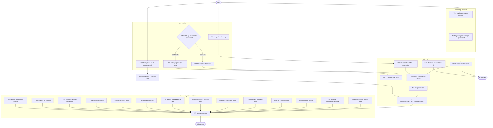

# Execution Plan — Health-Stack Correctness Train (Pareto)

**Created:** 2026-09-20 11:47 CEST
**Scope:** all 50 tasks from `doc/status/2026-09-20_11-37_samber-do-health-review-session.md` §f (findings F1–F8 + session-noticed items) — nothing else; pre-existing `TODO_LIST.md` items stay tracked there.
**Method:** pareto-planning — 1% → 51%, 4% → 64%, 20% → 80%, remaining 80% of tasks → final 20%.

---

## 0. Context & Safety Rails (anti-Verschlimmbessern)

This train touches a **released, consumer-pinned library family**. Hard rails:

1. **GATE Q1 (root go.mod):** no `go.mod`/`go.work` edit until the deliberate-or-accident question is answered. Evidence so far: auto-commit `d5c6693`, no dependency requires 1.27.1, all satellites 1.26.7, and `scripts/check-pin-drift.sh` now **FAILS** with "workspace mismatch — every local workspace command fails" (repo's own tooling flags it).
2. **GATE Q3 (upstream filings):** drafting is free; filing anything to go-health/samber/do is USER-gated (verify-before-filing + github-voice).
3. **Release Ritual (AGENTS) is law for T07/T08:** API-break check, CHANGELOG dating, hermetic verify, annotated tags only, same-train AGENTS/TODO updates, `check-pin-drift.sh` green before push, never tag a `replace`-carrying go.mod.
4. **health stays injector-free and core-free** — the F4 adapter must NOT add samber/do to the health module.
5. **integration pins PUBLISHED tags only** — T11 runs strictly after T07/T09.
6. No API breaks anywhere (0.x: minor bumps + migration notes at most); no new nolint without justification; suites stay `-race -count=1` green.

**Fresh evidence this pass:** `check-pin-drift.sh` FAIL line (2026-09-20 11:47) is committed evidence for Q1 = accident hypothesis.

---

## 1. Pareto Breakdown

Result = consumer-facing correctness + trust in the health stack.

| Tier          | Tasks (of 27 medium)              | Delivers | Why this tier                                                                                                                                                                    |
| ------------- | --------------------------------- | -------- | -------------------------------------------------------------------------------------------------------------------------------------------------------------------------------- |
| **1% → 51%**  | T01, T02 (2 tasks ≈ 2.4h)         | **51%**  | Consumer-surface protection against the silent `WithHealthRecorder` cliff (F1): godoc warning + working injector-path example. Cheapest, highest-value, zero release dependency. |
| **4% → 64%**  | + T03, T04*, T06 (5 tasks ≈ 4.7h) | **64%**  | Proof (composed stack runs once, T03), toolchain sanity (F6 fix, T04*, gated on Q1), contract currency (frh → go-health v0.2.0, T06).                                            |
| **20% → 80%** | + T05, T07–T12 (12 tasks ≈ 14h)   | **80%**  | Release train (health v0.1.2, frh v0.1.3 + proxy checks + same-train state), CI go-directive assert, integration composition test, `Mounted.Start` bugfix.                       |
| **last 20%**  | T13–T27 (15 tasks ≈ 19.5h)        | **100%** | Gotcha docs, adapter, lint/benchmark/E2E re-verifications, examples, determinism polish, upstream drafts, v0.3.0 evaluation, scorecard re-run.                                   |

\* T04 blocked on GATE Q1.

**The "other 20% to reach 100%":** T13–T27 — explicitly enumerated below; nothing dropped.

---

## 2. Plan A — Comprehensive Tasks (30–100 min, ALL 50 todos, impact-sorted)

| #   | Task                                                                                                                                        | Covers items   | Min | Impact   | Effort | Customer value | Depends / Gate       |
| --- | ------------------------------------------------------------------------------------------------------------------------------------------- | -------------- | --- | -------- | ------ | -------------- | -------------------- |
| T01 | F1 godoc: NewProbe warns `WithHealthRecorder` is silently dropped (+defensive-variant sketch)                                               | 1,4,5          | 45  | Critical | S      | High           | —                    |
| T02 | F1 injector-path godoc example + composed quick-start in README/doc.go                                                                      | 2,11           | 90  | Critical | M      | High           | T01                  |
| T03 | Composed-stack manual proof run (injector+Checkable+Trigger+health.New+Mounted, assertions recorded)                                        | 10             | 60  | Critical | M      | High           | —                    |
| T04 | F6 root go.mod: decision card → execute branch A (revert) or B (propagate) + LSP re-verify                                                  | 20,21,22,23    | 45  | Critical | S      | High           | **GATE Q1**          |
| T05 | CI assert: all 11 go.mod go-directives identical (script + workflow step)                                                                   | 24             | 45  | High     | S      | Med            | after T04            |
| T06 | frh: bump go-health v0.1.3→v0.2.0 + suite + API-diff + CHANGELOG                                                                            | 12,13          | 45  | High     | S      | Med            | —                    |
| T07 | Release health v0.1.2 (Ritual: break-check, date CHANGELOG, hermetic verify, tag+push)                                                      | 14             | 90  | High     | M      | High           | T01,T02              |
| T08 | Release frh v0.1.3 + same-train AGENTS/TODO updates + `check-pin-drift.sh` green                                                            | 15,18,19,44    | 60  | High     | M      | Med            | T06                  |
| T09 | Fresh-consumer proxy checks (health v0.1.2, frh v0.1.3) + pkg.go.dev spot                                                                   | 16             | 45  | High     | S      | Med            | T07,T08              |
| T10 | integration/go.mod: pin health+frh published tags                                                                                           | 6              | 30  | High     | S      | Med            | T09                  |
| T11 | `TestHealthStackThroughAppkitService`: lockstep 503 + trigger capture + recorder row                                                        | 7,8,9          | 100 | High     | L      | High           | T10                  |
| T12 | C1 bugfix: `Mounted.Start` resets `started` on dashboard-failure (failing test first)                                                       | 32             | 60  | High     | M      | Med            | —                    |
| T13 | F5 lazy-healthy gotcha: frh doc.go + README + scratch-module compile check                                                                  | 25,26          | 45  | Med      | S      | Med            | —                    |
| T14 | F7: `Register` → `do.ProvideNamedValue` + duplicate-name godoc + suite                                                                      | 29,30          | 30  | Med      | S      | Low            | —                    |
| T15 | F4 shutdown adapter: design note (health stays injector-free) + implement + test                                                            | 27,28          | 90  | Med      | M      | Med            | design gate          |
| T16 | Quality sweep: golangci-lint health+frh (fix findings) + CI-matrix/dependabot parity verify                                                 | 35,48          | 30  | Med      | S      | Low            | —                    |
| T17 | F1 upstream pack: re-verify on v0.3.0, draft issue, self-review checklist                                                                   | 3              | 45  | Med      | S      | Med            | **GATE Q3 (filing)** |
| T18 | Upstream drafts batch: do-v2 lazy-healthy doc note + append Logging-correlation cross-ref to outgoing drafts                                | 46,42          | 30  | Low      | S      | Low            | **GATE Q3 (filing)** |
| T19 | Re-verify claims: frh benchmark vs 4.7µs + health-example live E2E lockstep                                                                 | 36,37          | 60  | Med      | M      | Low            | —                    |
| T20 | No-dashboard example path teaching `cfg.ReadyCheck = mounted.Ready`                                                                         | 38             | 30  | Med      | S      | Med            | —                    |
| T21 | security+health hardened example (`DashboardHardenedPreset` + nonce + CSP)                                                                  | 39             | 90  | Med      | M      | Med            | —                    |
| T22 | Docs/indexing: status-README index, AGENTS in-place pointers (ritual line, F1 wording, Integration rows post-release), TODO supersede marks | 41,43,45,47,49 | 45  | Med      | S      | Low            | T08 for rows         |
| T23 | Determinism: sorted `failingServiceNames` + `firstError` contract doc + tests                                                               | 33,34          | 30  | Low      | S      | Low            | —                    |
| T24 | `Drain()` on never-started probe: test + doc-or-guard decision                                                                              | 40             | 30  | Low      | S      | Low            | —                    |
| T25 | go-health v0.3.0 evaluation: aggregate/federation API read + adoption memo                                                                  | 17             | 60  | Med      | M      | Med            | —                    |
| T26 | samber-do-auditlog wiring example (demand-gated, optional)                                                                                  | 31             | 60  | Low      | M      | Low            | skip unless asked    |
| T27 | Scorecard re-run: adoption score delta appended as review addendum                                                                          | 50             | 30  | Med      | S      | Low            | after T07–T12        |

**Coverage: 50/50 items** (mapping column "Covers items" refers to status-report §f numbering).

---

## 3. Plan B — Micro Tasks (≤12 min each, ALL todos, execution order)

| ID  | Task                                                                                                        | Min | From | Gate/Check     |
| --- | ----------------------------------------------------------------------------------------------------------- | --- | ---- | -------------- |
| M01 | Read current NewProbe doc block; confirm option-forwarding sentence                                         | 5   | T01  | —              |
| M02 | Write warning: `WithHealthRecorder` silently dropped on injector-free path (cite go-health accessors.go:61) | 10  | T01  | —              |
| M03 | Add pointer: use injector path (`health.New`) for Trigger; link doc.go quick start                          | 8   | T01  | —              |
| M04 | Sketch defensive variant API (error on recorder options); park decision note                                | 10  | T01  | no impl yet    |
| M05 | `gofmt` + build + quick suite run (health)                                                                  | 8   | T01  | green          |
| M06 | Draft godoc example: injector + `frhealth.Register` + `health.New(WithHealthRecorder(Trigger))`             | 12  | T02  | —              |
| M07 | Complete example: failing service; `// Output:` line                                                        | 10  | T02  | —              |
| M08 | `go test -run Example -count=1` until output matches                                                        | 10  | T02  | green          |
| M09 | README/doc.go: composed quick-start section referencing the example                                         | 10  | T02  | —              |
| M10 | Suite + lint touched file                                                                                   | 8   | T02  | green          |
| M11 | Scratch test: wire injector+Checkable+Trigger+health.New+Mounted behind `httptest`                          | 12  | T03  | —              |
| M12 | Assert: readiness 503 post-Drain; recorder row present; trigger fires on failing check                      | 12  | T03  | —              |
| M13 | Record evidence in status addendum                                                                          | 5   | T03  | —              |
| M14 | Present Q1 decision card (branch A/B + consequences)                                                        | 5   | T04  | **GATE Q1**    |
| M15 | Branch A: `go mod edit -go=1.26.7` (root) + `go mod tidy`                                                   | 10  | T04  | —              |
| M16 | Branch A: root `go build ./...` + `go vet` (GOWORK on)                                                      | 10  | T04  | green          |
| M17 | Branch B: go.work directive + AGENTS toolchain lines + CI note                                              | 10  | T04  | —              |
| M18 | Either branch: sanity suites on 2 satellites                                                                | 12  | T04  | green          |
| M19 | Reopen diagnostics — expect 17 workspace errors gone                                                        | 5   | T04  | LSP green      |
| M20 | Choose mechanism: `scripts/check-go-directives.sh`                                                          | 10  | T05  | —              |
| M21 | Script: fail if go-directives differ across `*/go.mod`                                                      | 10  | T05  | —              |
| M22 | Wire into `ci.yml`; run locally                                                                             | 10  | T05  | green          |
| M23 | frh: `go get go-health@v0.2.0` + `go mod tidy`                                                              | 8   | T06  | —              |
| M24 | Full suite `-race -count=1`                                                                                 | 10  | T06  | green          |
| M25 | API diff v0.1.3→v0.2.0 vs adapter usage (HealthRecorder unchanged?)                                         | 10  | T06  | unchanged      |
| M26 | frh CHANGELOG `[Unreleased]` entry                                                                          | 5   | T06  | —              |
| M27 | Health: API-break check vs v0.1.1 (archive + `go doc` diff)                                                 | 12  | T07  | additions-only |
| M28 | Health: date CHANGELOG → v0.1.2, delta text                                                                 | 8   | T07  | —              |
| M29 | Health: hermetic verify (`GOWORK=off GOEXPERIMENT=jsonv2`) test+vet+build                                   | 12  | T07  | green          |
| M30 | Health: annotated tag + push                                                                                | 10  | T07  | tag on origin  |
| M31 | frh: date CHANGELOG v0.1.3; verify no `replace` in go.mod                                                   | 10  | T08  | no replace     |
| M32 | frh: annotated tag + push                                                                                   | 8   | T08  | tag on origin  |
| M33 | AGENTS Release State + module bullets (same train)                                                          | 10  | T08  | —              |
| M34 | TODO_LIST header release-state line                                                                         | 5   | T08  | —              |
| M35 | `./scripts/check-pin-drift.sh` → green                                                                      | 5   | T08  | green          |
| M36 | Fresh-consumer proxy check: health v0.1.2 (recipe)                                                          | 12  | T09  | resolves       |
| M37 | Fresh-consumer proxy check: frh v0.1.3                                                                      | 12  | T09  | resolves       |
| M38 | pkg.go.dev render spot-check both                                                                           | 8   | T09  | render         |
| M39 | integration: `go get` health+frh published tags                                                             | 10  | T10  | —              |
| M40 | integration: tidy + `GOWORK=off` build                                                                      | 8   | T10  | green          |
| M41 | Test skeleton: cfg + probe + `Mounted` wiring                                                               | 12  | T11  | —              |
| M42 | Injector: `Register` Checkable + failingDB + `health.New(WithHealthRecorder(Trigger))`                      | 10  | T11  | —              |
| M43 | Start mounted+svc; assert `/health/ready` 200                                                               | 10  | T11  | green          |
| M44 | Drain path: lockstep 503 on both readiness surfaces                                                         | 12  | T11  | green          |
| M45 | Trigger capture: recorder buffer non-empty after failing batch                                              | 10  | T11  | green          |
| M46 | Recorder row visible in probe cached response                                                               | 8   | T11  | green          |
| M47 | integration suite `-race` + module lint                                                                     | 8   | T11  | green          |
| M48 | Failing test: dashboard `Start` failure → retry `Mounted.Start` must be allowed                             | 12  | T12  | red first      |
| M49 | Fix: reset `started=false` on dashboard-failure branch (symmetry with probe path)                           | 8   | T12  | green          |
| M50 | Full health suite re-run                                                                                    | 5   | T12  | green          |
| M51 | frh doc.go gotcha: lazy-healthy semantics; eager invoke is load-bearing                                     | 10  | T13  | —              |
| M52 | README same + cross-link doc.go                                                                             | 8   | T13  | —              |
| M53 | Scratch-module compile-check of README snippets (ritual)                                                    | 10  | T13  | compiles       |
| M54 | `Register`: swap to `do.ProvideNamedValue`, drop eager invoke                                               | 8   | T14  | —              |
| M55 | Register tests + full frh suite                                                                             | 10  | T14  | green          |
| M56 | Godoc: duplicate-name panic note                                                                            | 5   | T14  | —              |
| M57 | Adapter home decision (frh-side; NO samber/do into health) + dep-direction check                            | 12  | T15  | stance kept    |
| M58 | Design note written (report addendum / TODO)                                                                | 10  | T15  | —              |
| M59 | Implement adapter; compile                                                                                  | 10  | T15  | —              |
| M60 | Tests: Drain→Shutdown ordering via adapter                                                                  | 10  | T15  | green          |
| M61 | `golangci-lint run` health                                                                                  | 10  | T16  | 0 new          |
| M62 | `golangci-lint run` frh                                                                                     | 10  | T16  | 0 new          |
| M63 | Fix/justify findings                                                                                        | 12  | T16  | —              |
| M64 | Verify CI matrix + dependabot entries cover health+frh                                                      | 10  | T16  | parity         |
| M65 | Re-verify cliff against go-health v0.3.0 (target of the ask)                                                | 8   | T17  | evidence       |
| M66 | Draft issue: repro, source lines, proposed sentinel error                                                   | 12  | T17  | —              |
| M67 | Self-review vs verify-before-filing checklist                                                               | 8   | T17  | **GATE Q3**    |
| M68 | Draft do-v2 doc-note ask (lazy-healthy semantics)                                                           | 10  | T18  | **GATE Q3**    |
| M69 | Append Logging-correlation cross-ref to `doc/feedback/outgoing/2026-09-16_upstream-asks-gosse-httputil.md`  | 8   | T18  | —              |
| M70 | Run frh Trigger benchmark                                                                                   | 10  | T19  | —              |
| M71 | Compare vs documented ~4.7µs; note drift                                                                    | 5   | T19  | —              |
| M72 | Run health/example; TERM it; curl both readiness surfaces for lockstep 503                                  | 12  | T19  | lockstep       |
| M73 | Record evidence                                                                                             | 5   | T19  | —              |
| M74 | Example/README: no-dashboard path with `cfg.ReadyCheck = mounted.Ready`                                     | 12  | T20  | —              |
| M75 | Compile-check snippet                                                                                       | 8   | T20  | compiles       |
| M76 | Design hardened example: security nonce extractor + `DashboardHardenedPreset` + CSP middleware              | 12  | T21  | —              |
| M77 | Implement skeleton                                                                                          | 12  | T21  | —              |
| M78 | Middleware outside module; serve                                                                            | 10  | T21  | —              |
| M79 | curl: CSP header present, dashboard 200                                                                     | 10  | T21  | green          |
| M80 | Suite/lint example                                                                                          | 8   | T21  | green          |
| M81 | `doc/status/README.md`: index 11-37 report + this plan                                                      | 8   | T22  | —              |
| M82 | AGENTS in-place: session-start toolchain sanity line (Gotchas)                                              | 8   | T22  | cap 376/377    |
| M83 | AGENTS in-place: reconcile NewProbe gotcha wording with F1                                                  | 8   | T22  | cap            |
| M84 | AGENTS Integration table: health/frh rows                                                                   | 8   | T22  | after M35      |
| M85 | TODO_LIST: supersede marks for planned items; link plan                                                     | 8   | T22  | —              |
| M86 | `failingServiceNames` → sorted; test                                                                        | 10  | T23  | green          |
| M87 | `firstError` any-order contract doc                                                                         | 5   | T23  | —              |
| M88 | Quick test: Drain before Start                                                                              | 8   | T24  | —              |
| M89 | Doc-or-guard decision from result                                                                           | 10  | T24  | —              |
| M90 | Read go-health v0.3.0 `aggregate` API                                                                       | 12  | T25  | —              |
| M91 | Read `federation` API                                                                                       | 10  | T25  | —              |
| M92 | Adoption memo → TODO/ROADMAP entry                                                                          | 10  | T25  | —              |
| M93 | auditlog example skeleton (frh example_test)                                                                | 12  | T26  | optional       |
| M94 | Wire + run + document                                                                                       | 10  | T26  | optional       |
| M95 | Re-run adoption scoring; append addendum to review report                                                   | 12  | T27  | —              |

**Coverage: 95 micro tasks → all 50 items, 27 medium tasks. Total ≈ 24h medium-estimated, ≈ 15h micro-estimated (micro uses real estimates; overlap expected).**

---

## 4. Execution Graph

Reading order: START → T01/T03/T06 in parallel; Q1 gate fires T04 early; release train T07→T08→T09→T10→T11 is strictly serial; T27 closes.

---

## 5. Git & Ritual Notes

- Pre-plan state was clean (daemon `6f7b5c1` carried TODO_LIST harvest + status report).
- `check-pin-drift.sh` currently FAILS on the F6 mismatch — the failure is pre-existing and explicitly carried forward until Q1 is answered; the release train (T07/T08) must NOT push while it fails, which is one more reason T04 sits in the 4% tier.
- Commits: detailed messages per harness format; push explicitly authorized by requester.
