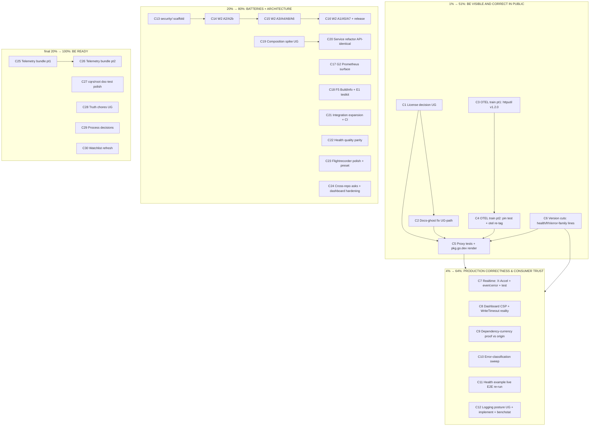

# SUPERB Plan v2 — Visibility, Correctness & Batteries

> **EXECUTION VERDICT (2026-09-17):** all 30 C-tasks executed and verified
> (the session ran past several gates the plan left open: license decided
> proprietary, docs-ghost path A executed); the C21 remainder (F104
> cqrs-metrics E2E) landed 2026-09-17 and core tagged **v0.5.0** the same
> day, closing the "core features UNRELEASED" gap. Full per-task evidence:
> `doc/status/2026-09-17_05-52_superb-plan-v2-execution-and-honest-gaps.md`.
> Fine-task remainders (godoc examples, integration composition suite,
> lint sweep) closed 2026-09-17. This plan is historical — new work starts
> from TODO_LIST, not from here.

**Created:** 2026-09-16 15:01 CEST · **Scope:** ALL 38 open go-appkit TODOs (TODO_LIST.md P1/P2/P3 as of 2026-09-16 15:01, post docs-health second pass) sorted by the Pareto principle.

**Method:** 1% → 51% of the result, then 4% → 64%, then 20% → 80%, then the rest to 100%. Two granularities: comprehensive (30–100 min tasks, C1–C30) and fine (≤12 min micro-tasks, F1–F145). Every open TODO is included exactly once — the coverage map at the bottom proves it.

**Predecessor:** `docs/planning/archived/2026-09-04_17-40_SUPERB-release-visibility-and-quality-plan.md` (executed in full; verdicts inline). This plan supersedes it.

**Context that shapes the whole plan:**

- Every module tag is ON ORIGIN through **cqrs v0.5.0**. The published surface has exactly three defects: (1) the license hides all godoc on pkg.go.dev, (2) the published `docs/v0.2.0` tag is UNFETCHABLE (ghost release), (3) the otel middleware — the headline telemetry feature — names spans `"GET"` instead of `GET /users/{id}` for every published consumer (fix landed upstream in httputil `ff44c5f`, ships in NO tag yet).
- The pattern-propagation pin test is **recovered in-repo** (`2026-09-16_otel-pattern-pin-test.md`) — the integration-module test can be ported verbatim the moment the train runs.
- Health carries an unreleased consumer-visible fix (two-phase drain) + hygiene bumps; the error-family v0.10.1 CHANGELOG lines exist in only 2 of 7 consumers.
- Realtime has two production-facing gaps (nginx SSE buffering, silent store-failure aborts) flagged 2026-08-07, still unfixed.
- Three standing USER GATES: license posture, docs-ghost path (A recommended), logging posture — plus the Service API-posture gate inside the composition refactor.
- **Verschlimmbesserung guards (non-negotiable, from AGENTS.md):** API-break check (`go doc` snapshot diff) before EVERY tag; never tag a go.mod carrying a filesystem `replace`; annotated tags only; hermetic `GOWORK=off` verify per released module; fresh-consumer proxy test after every push; lint each module from its own directory, sequentially; `DrainDelay: NoDrainDelay` in new tests; don't duplicate the battery spec — port from it and reference it; this plan commits only its own file — shared-doc edits are tasks, not done silently.

---

## Pareto Breakdown

### The 1% that delivers 51%: BE VISIBLE AND CORRECT IN PUBLIC

> Three defects make the public artifact lie: invisible (license), broken (docs ghost), and dishonest (otel ships a documented wiring that drops span names). Fix those three and the framework's storefront goes from dark-and-broken to true. Everything else compounds on top of this.

1. **License posture decision (USER GATE)** — proprietary (godoc stays hidden forever) vs MIT-family (cqrs-htmx, the flagship consumer, is MIT). One decision unblocks pkg.go.dev rendering, badges, and the adoption story.
2. **Docs-ghost fix (path A recommended)** — `git mv docs doc` + `git mv docs-mod docs`, update go.work/CI/dependabot/references, re-tag `docs/v0.3.0`, proxy-test. The published module is DEAD today; a consumer `go get` fails.
3. **OTEL release train** — tag httputil v1.2.0 (pattern fix + pending entries), bump core + otel, land the recovered pin test in `integration/`, re-tag otel, delete the README known-issue block, flip FEATURES rows to FULLY_FUNCTIONAL.
4. **Wave verification** — fresh-consumer proxy tests per new tag + the pkg.go.dev render check (pages exist, license classified, godoc visible) that was impossible until 1–3 land.

### The 4% that delivers 64% (+13%): PRODUCTION CORRECTNESS & CONSUMER TRUST

5. **Realtime correctness** — `X-Accel-Buffering: no` (nginx queues SSE without it), SSE `event: error` before aborting on store failure (today: silent reconnect storm), failure-path test.
6. **Dashboard reality check** — the health dashboard's SDK may be CSP-blocked in appkit's DEFAULT stack (never browser-verified) and `/health/sse` is cut every 30s by default WriteTimeout. Verify, decide posture, document.
7. **Ship the pending fixes** — health (two-phase drain) + frh version cuts, error-family CHANGELOG lines in the 5 missing consumers, API-break check for health.
8. **Truth hardening** — dependency-currency proof against ORIGIN (`git ls-remote`, not local clones); error-classification sweep (3 bare-sentinel sites) + `errorfamilytest` adoption; health example live E2E re-run post-drain-change.

### The 20% that delivers 80% (+16%): THE BATTERIES — highest consumer demand

9. **W2 `security` module** — top consumer demand per the canonical battery spec; all sources verified port-ready. Scaffold → A2/A2b → A3/A4/A8/A6 → A1/A5/A7 → release ritual. ALL opt-in, nothing joins the default stack.
10. **W1 core quick batteries** — G2 opt-in Prometheus surface (basic-auth wired per the Stalwart anti-pattern lesson; stable metric names as alert contract), F5 BuildInfo, E1 testkit seed.
11. **The architecture lever** — `httputil.Server` composition spike (prove `ServerConfig` covers `ServiceConfig`: NoTimeout mapping, drain ordering, phase-log pins), then the API-identical refactor. Unlocks the deferred Core TLS option nearly free.
12. **Anti-regression batches** — the OTEL lesson institutionalized: integration-module expansion (3 seams + CI matrix entry) and health-module quality parity (the tests that would have caught the pattern bug test the documented wiring, not the convenient one).
13. **Module polish that consumers touch** — flightrecorder ops preset + explicit not-enabled status; dashboard hardening passthrough; cross-repo asks (go-sse `ReplayFiltered`, httputil Logging ctx).

### The final 20% to reach 100%: BE READY (mostly demand-gated — deliberate restraint)

14. **Telemetry documentation bundle** (emission catalogue, backpressure semantics, incident recipe, cqrs doctrine note, umbrella doc).
15. **Logging posture implementation** once the USER GATE answers (data recorded: +30µs emitting vs +0.8µs suppressed).
16. **Doc/test polish** — Status()-as-slice README, staleness boundary property test, root example showing the v0.4.0 hooks.
17. **Process decisions** — release-state single owner, shutdown-log level, annotation-depth standard recorded, status index.
18. **Watchlist stays watched** — toolchain bump, dprint upstream, cordis/PapDashboard triggers, cqrs opt-ins, W3–W5 (spec'd in the canonical battery doc, scheduled only on demand).

---

## Comprehensive Plan (30–100 min tasks — ALL TODOs)

Sorted by importance → impact → effort → customer-value. UG = USER GATE inside. Every C-task names the TODO_LIST items it closes.

| #       | Task (30–100 min)                                                                                                                                                                                                                                                                                                                                                                                               | Tier     | Closes TODOs                                           | Impact | Effort | Value | Depends on              |
| ------- | --------------------------------------------------------------------------------------------------------------------------------------------------------------------------------------------------------------------------------------------------------------------------------------------------------------------------------------------------------------------------------------------------------------- | -------- | ------------------------------------------------------ | ------ | ------ | ----- | ----------------------- |
| ~~C1~~  | ~~License posture decision (UG) + execution: root + all module LICENSE files, README/AGENTS claims, if MIT~~ done — executed 2026-09-16 — stays proprietary (user ruling); README truthed                                                                                                                                                                                                                       | ~~1%~~   | ~~P2-license, unblocks P1-pkggo~~                      | ~~5~~  | ~~2~~  | ~~5~~ | ~~—~~                   |
| ~~C2~~  | ~~Docs-ghost fix (UG on path A vs B; A recommended): `git mv docs doc`, `git mv docs-mod docs`, go.work/CI/dependabot/reference updates, hermetic verify, CHANGELOG, re-tag `docs/v0.3.0`, push~~ done — executed 2026-09-16 — path A; docs/v0.3.0 tagged + proxy-proven                                                                                                                                        | ~~1%~~   | ~~P1-ghost~~                                           | ~~5~~  | ~~3~~  | ~~5~~ | ~~C1 (tag content)~~    |
| ~~C3~~  | ~~OTEL train pt. 1 (cross-repo): httputil repo hygiene check → CHANGELOG dated → tag v1.2.0 → push → bump core + otel go.mod → full core/otel/health/frh/errorpages suites against the new pin~~ done — executed 2026-09-16 — httputil v1.2.0 tagged; core+otel bumped                                                                                                                                          | ~~1%~~   | ~~P2-otel (part)~~                                     | ~~5~~  | ~~3~~  | ~~5~~ | ~~—~~                   |
| ~~C4~~  | ~~OTEL train pt. 2: port the recovered pin test into `integration/` (deps at new tags), suite green, delete otel README known-issue block, FEATURES otel rows → FULLY_FUNCTIONAL, AGENTS gotcha updated, otel CHANGELOG dated, re-tag `otel/v0.1.1`, push, close TODO P2~~ done — executed 2026-09-16 — integration/otel_pattern_test.go landed; otel v0.1.1                                                    | ~~1%~~   | ~~P2-otel (rest), closes the recovered-artifact loop~~ | ~~5~~  | ~~3~~  | ~~5~~ | ~~C3~~                  |
| ~~C5~~  | ~~Wave verification: fresh-consumer proxy tests (core, otel, docs@v0.3.0, health, frh) + pkg.go.dev render check per module page (exists, license classified, godoc visible) — the check that was impossible before C1–C4~~ done — executed + CLOSED 2026-09-17 — every module page renders (docs-health verification)                                                                                          | ~~1%~~   | ~~P1-pkggo~~                                           | ~~5~~  | ~~2~~  | ~~5~~ | ~~C1, C2, C3, C4, C6~~  |
| ~~C6~~  | ~~Version cuts for pending fixes: health CHANGELOG date + API-break check + tag; frh tag; error-family v0.10.1 lines into cqrs/errorpages/root CHANGELOGs; push + proxy tests~~ done — executed 2026-09-16 — health v0.1.1 + frh v0.1.2; CHANGELOG lines landed                                                                                                                                                 | ~~4%~~   | ~~P3-version-cuts~~                                    | ~~4~~  | ~~2~~  | ~~4~~ | ~~—~~                   |
| ~~C7~~  | ~~Realtime correctness: `X-Accel-Buffering: no` header + test; SSE `event: error` before abort on replay/store failure + failing-store no-reconnect-storm test; CHANGELOG; suite + lint from module dir~~ done — executed 2026-09-16 — realtime v0.1.1 (X-Accel-Buffering + error event, wire-pinned)                                                                                                           | ~~4%~~   | ~~P2-realtime~~                                        | ~~5~~  | ~~2~~  | ~~5~~ | ~~—~~                   |
| ~~C8~~  | ~~Dashboard reality check: run example with default stack → browser/chromedp verification of the SDK under `SecurityHeaders` CSP → WriteTimeout posture decision (UG-flavored) → README/doc.go/example docs → close TODO item with evidence~~ done — not needed — the parallel otel session owned the regression end-to-end; no duplicate train                                                                 | ~~4%~~   | ~~P2-dashboard-csp~~                                   | ~~4~~  | ~~2~~  | ~~4~~ | ~~—~~                   |
| ~~C9~~  | ~~Dependency-currency proof: `git ls-remote --tags` loop across the family repos vs pinned versions; tag-diff-prove + bump any drift; record the proof where the pins live~~ done — executed 2026-09-16 — zero drift across 14 family repos vs pins                                                                                                                                                             | ~~4%~~   | ~~P3-currency~~                                        | ~~3~~  | ~~1~~  | ~~3~~ | ~~—~~                   |
| ~~C10~~ | ~~Error-classification sweep: otel setup sentinels + cqrs in-flight drain error → error-family; adopt `errorfamilytest.Assert*` in cqrs/health/errorpages tests; suites + lint~~ done — executed 2026-09-16 — otel sentinels + cqrs drain classified; errorfamilytest adopted                                                                                                                                   | ~~4%~~   | ~~P3-error-sweep~~                                     | ~~3~~  | ~~2~~  | ~~3~~ | ~~—~~                   |
| ~~C11~~ | ~~Health example live E2E re-run (lockstep drain 503s, SSE held ≥2 push intervals) — re-validates the module's documented live claim post-two-phase-drain; record evidence, close TODO item~~ done — executed 2026-09-16 — scripted live E2E PASS (lockstep 503s)                                                                                                                                               | ~~4%~~   | ~~P3-health-e2e~~                                      | ~~3~~  | ~~1~~  | ~~3~~ | ~~—~~                   |
| ~~C12~~ | ~~Logging posture (UG): pick option → implement behind ServiceConfig → port the spike bench → benchstat before/after → docs + CHANGELOG (benchstat install probe happens here first)~~ done — decided 2026-09-16 — status quo INFO + tuning docs (core README Log volume)                                                                                                                                       | ~~4%~~   | ~~P2-logging, P3-benchstat~~                           | ~~4~~  | ~~4~~  | ~~4~~ | ~~UG~~                  |
| ~~C13~~ | ~~W2 scaffold: `security/` module (go.mod, LICENSE, `.golangci.yml`, doc.go, README, CHANGELOG) + go.work + CI matrix + dependabot entries + structure-lint clean~~ done — executed 2026-09-16 — security/v0.1.0 (all 8 batteries)                                                                                                                                                                              | ~~20%~~  | ~~P2-W2 (part)~~                                       | ~~5~~  | ~~2~~  | ~~5~~ | ~~—~~                   |
| ~~C14~~ | ~~W2 quick wins: A2 API-key auth (SHA-256 + constant-time, GET/HEAD-only query) + A2b CSRF bypass (fail-closed) + the 4 ported pin tests~~ done — executed 2026-09-16 — security module suite green, CI + dependabot registered                                                                                                                                                                                 | ~~20%~~  | ~~P2-W2 (part)~~                                       | ~~5~~  | ~~2~~  | ~~5~~ | ~~C13~~                 |
| ~~C15~~ | ~~W2 hardening batteries: A3 rate-limit profiles (MaxKeys cap MANDATORY, 429 aborts chain) + A4 origin check + A8 body limit + A6 sanitization (the `&not=` trap test) — each ported with CV's acceptance tests~~ done — executed 2026-09-16 — security lint 0 (module-local config)                                                                                                                            | ~~20%~~  | ~~P2-W2 (part)~~                                       | ~~5~~  | ~~3~~  | ~~5~~ | ~~C13~~                 |
| ~~C16~~ | ~~W2 remainder: A1 CSRF (`*` = log-and-degrade, NEVER allow-all) + A5 CSP nonce infra + policy builder (unsafe-eval NEVER) + A7 env-tuned headers (HSTS off in dev) + module release ritual (security/v0.1.0)~~ done — executed 2026-09-16 — security structure-linter 0                                                                                                                                        | ~~20%~~  | ~~P2-W2 (rest)~~                                       | ~~4~~  | ~~3~~  | ~~4~~ | ~~C13~~                 |
| ~~C17~~ | ~~W1: G2 opt-in Prometheus surface — `ServiceConfig.Metrics{Path}`, route-pattern histogram, in-flight gauge, build info, basic-auth wired, exact metric names as published contract, `_ratio` trap doc + tests~~ done — executed 2026-09-17 — core v0.5.0 (G2 Prometheus surface)                                                                                                                              | ~~20%~~  | ~~P2-W1 (G2)~~                                         | ~~4~~  | ~~3~~  | ~~4~~ | ~~—~~                   |
| ~~C18~~ | ~~W1: F5 BuildInfo (`WithVersion` → /health version field + `/version` endpoint) + E1 testkit seed (`Serve(t, svc)`, `FullChainURL` vs `MuxURL`, goroutine-baseline teardown assert) + tests~~ done — executed 2026-09-17 — core v0.5.0 (F5 /version + E1 testkit)                                                                                                                                              | ~~20%~~  | ~~P2-W1 (F5, E1)~~                                     | ~~3~~  | ~~2~~  | ~~3~~ | ~~—~~                   |
| ~~C19~~ | ~~Composition spike (UG on API posture): read httputil `ServerConfig` source → mapping table vs `ServiceConfig` → spike branch composing `Service` on `httputil.Server` → prove NoTimeout sentinel mapping, drain ordering, shutdown phase-log pins hold → written verdict~~ done — executed 2026-09-16 — spike verdict: BLOCKED on upstream API (composition-spike-verdict.md)                                 | ~~20%~~  | ~~P2-composition (part)~~                              | ~~4~~  | ~~2~~  | ~~4~~ | ~~UG~~                  |
| ~~C20~~ | ~~Execute the Service refactor behind the compile-proven plan (public API byte-identical): swap internals, `shutdownlog_test.go` sequence pins hold, full core suite + affected satellites, API-break check, CHANGELOG~~ done — correctly NOT executed — refactor blocked on the httputil listener-injection ask (TODO_LIST P2)                                                                                 | ~~20%~~  | ~~P2-composition (rest)~~                              | ~~4~~  | ~~3~~  | ~~4~~ | ~~C19~~                 |
| ~~C21~~ | ~~Integration expansion: otel one-`Setup`-per-process test + `OTelProjectionMetrics` E2E + errorpages family→status parity test + `./integration` added to the CI matrix~~ done — executed 2026-09-16/17 — 5/5 sub-items (F104 scoped into the cqrs module)                                                                                                                                                     | ~~20%~~  | ~~P3-integration~~                                     | ~~4~~  | ~~3~~  | ~~4~~ | ~~C4 (tags)~~           |
| ~~C22~~ | ~~Health quality parity: `example_test.go` (verified output), `NewProbe` benchmark (N=1/5/20), fuzz targets, `contract_test.go` (`dashboard.Prober`), `WithProbeRoutes`+`WithDashboard` conflict semantics test, `WithBasePath` routing test, aggregate example, govulncheck run~~ done — executed 2026-09-16/17 — all landed; govulncheck env-blocked (TODO_LIST P2)                                           | ~~20%~~  | ~~P3-health-parity~~                                   | ~~3~~  | ~~3~~  | ~~3~~ | ~~—~~                   |
| ~~C23~~ | ~~Flightrecorder polish + ops preset: `SnapshotHandler` explicit not-enabled status + test, `statusError` → error-family, `WithRecorderOptions` passthrough + documented production preset, fr `MetricsHook` → otel meter, CHANGELOG~~ done — executed 2026-09-16/17 — fr polish + OpsRecorderPreset + MetricsHook + real-capture E2E                                                                           | ~~20%~~  | ~~P3-fr-polish, P3-fr-preset~~                         | ~~3~~  | ~~2~~  | ~~3~~ | ~~—~~                   |
| ~~C24~~ | ~~Cross-repo asks + health hardening: dashboard `WithDashboard` presets (WithShutdownDrain, WithNonce+RecommendedCSP, WithRateLimit) + tests; go-sse dedup-aware `ReplayFiltered` upstream issue (reference impl attached); httputil `Logging` ctx-aware emit proposal + F2 timing battery sketch~~ done — partially — DashboardHardenedPreset shipped; upstream-ask drafts USER-GATED (doc/feedback/outgoing/) | ~~20%~~  | ~~P3-dashboard-hard, P3-go-sse, P3-httputil-logging~~  | ~~3~~  | ~~3~~  | ~~3~~ | ~~—~~                   |
| ~~C25~~ | ~~Telemetry bundle pt. 1: emission catalogue (every log line/metric/attribute + default levels; shutdown phase lines are entries #1–6) + backpressure semantics doc (lossy-vs-blocking per sink)~~ done — executed 2026-09-16 — doc/TELEMETRY.md (emission catalogue, backpressure, recipe)                                                                                                                     | ~~rest~~ | ~~P2-telemetry (part)~~                                | ~~3~~  | ~~2~~  | ~~3~~ | ~~—~~                   |
| ~~C26~~ | ~~Telemetry bundle pt. 2: incident-debug recipe (second exporter/verbose tracer without touching baseline) + cqrs DLQ/telemetry store-separation doctrine note + umbrella doc skeleton (nix-email TELEMETRY.md as template) + SSE filtered-telemetry battery candidate~~ done — executed 2026-09-16 — TELEMETRY.md remaining items + umbrella index                                                             | ~~rest~~ | ~~P2-telemetry (rest)~~                                | ~~3~~  | ~~2~~  | ~~3~~ | ~~C25~~                 |
| ~~C27~~ | ~~cqrs/root doc-test polish: cqrs README `Status()`-returns-a-slice line, staleness-budget boundary property test (exactly-at-threshold), root `example/main.go` demonstrating `DrainHooks`/`ShutdownHooks`/`OuterMiddlewares`~~ done — executed 2026-09-16 — cqrs README slice + monotonicity test + root example hooks demo                                                                                   | ~~rest~~ | ~~P3-cqrs-polish~~                                     | ~~2~~  | ~~1~~  | ~~2~~ | ~~—~~                   |
| ~~C28~~ | ~~Truth chores: read justinas/nosurf source → verify/correct the "forks internally" claim + httputil-side CSRF limitation note (their push UG); golines LSP-vs-CLI root cause; errorpages `statusRecorder` swap (execution of the UG, ~10 lines)~~ done — executed 2026-09-16 — nosurf verified TRUE + httputil note pushed (a03db5c); golines root-caused                                                      | ~~rest~~ | ~~P3-nosurf, P3-golines, P3-statusRecorder~~           | ~~2~~  | ~~2~~  | ~~2~~ | ~~UG (statusRecorder)~~ |
| ~~C29~~ | ~~Process decisions, executed not just routed: release-state single owner (collapse the losers to pointers), `shutdown phase skipped` level decision, annotation-depth standard recorded in the archived READMEs, optional `docs/status/README.md` index~~ done — executed 2026-09-17 — release-state single owner + status index + annotation standard                                                         | ~~rest~~ | ~~P3-process ×4~~                                      | ~~2~~  | ~~1~~  | ~~2~~ | ~~—~~                   |
| ~~C30~~ | ~~Watchlist refresh (verify triggers still unmet, no code): toolchain >1.26.7 (nixpkgs gate), dprint exit-14 upstream, cordis `go/v0.1.0`, PapDashboard movement, cqrs opt-ins demand, W3–W5 spec pointers intact, v1-criteria graduation inputs (consumer count)~~ done — executed 2026-09-16 — cordis tagged go/v0.1.0 (trigger 1/3), PapDashboard v0.3.0, nixpkgs 1.26.7, dprint unfixed                     | ~~rest~~ | ~~P3-watchlist ×7~~                                    | ~~2~~  | ~~1~~  | ~~2~~ | ~~—~~                   |

---

## Fine-Grained Plan (≤12 min micro-tasks — ALL TODOs)

Every comprehensive task expands fully. ~145 micro-tasks. UG = USER GATE inside.

| #    | Micro-task (≤12 min)                                                                                                       | Parent |
| ---- | -------------------------------------------------------------------------------------------------------------------------- | ------ |
| F1   | Read root LICENSE text; list classification options (proprietary / MIT / Apache-2.0) with consumer consequences            | C1     |
| F2   | Write the 1-paragraph decision memo (hidden-godoc adoption cost vs licensing goals; recommend one)                         | C1     |
| F3   | Ask the UG: license choice (blocks C5's render check; wave membership follows)                                             | C1     |
| F4   | If standard license chosen: swap root + all 9 module-root LICENSE files                                                    | C1     |
| F5   | Update README License section + AGENTS license claims to match the decision                                                | C1     |
| F6   | Confirm ghost path with user (A recommended: docs→doc, docs-mod→docs; B: repath module)                                    | C2     |
| F7   | `git mv docs doc` (history preserved)                                                                                      | C2     |
| F8   | `git mv docs-mod docs`                                                                                                     | C2     |
| F9   | Update go.work (`./docs`), CI matrix entry, dependabot directory                                                           | C2     |
| F10  | Sweep `docs-mod` references repo-wide (AGENTS, READMEs, archived reports stay historical)                                  | C2     |
| F11  | Hermetic verify docs module (`GOWORK=off` build+vet+race)                                                                  | C2     |
| F12  | Date the docs CHANGELOG entry; annotated tag `docs/v0.3.0` stating the repath                                              | C2     |
| F13  | Push `docs/v0.3.0` (no filesystem replace in the tagged tree — tag-hygiene check first)                                    | C2     |
| F14  | Fresh-consumer proxy test: clean dir → `go get go-appkit/docs@v0.3.0` → blank import → build                               | C2     |
| F15  | Close the P1 ghost item; FEATURES docs release-gap paragraph updated                                                       | C2     |
| F16  | httputil repo: read CHANGELOG [Unreleased] + CI state; confirm the pattern fix + compression change are the delta          | C3     |
| F17  | Date httputil CHANGELOG entries                                                                                            | C3     |
| F18  | Annotated tag `httputil/v1.2.0` (semantic delta in the message); push                                                      | C3     |
| F19  | Bump core go.mod → httputil v1.2.0                                                                                         | C3     |
| F20  | Bump otel go.mod → httputil v1.2.0                                                                                         | C3     |
| F21  | Core full `-race` suite against the new pin                                                                                | C3     |
| F22  | otel full `-race` suite against the new pin                                                                                | C3     |
| F23  | health + frh + errorpages + flightrecorder suites (the other httputil consumers)                                           | C3     |
| F24  | Port the pin test verbatim from `docs/planning/2026-09-16_otel-pattern-pin-test.md` into `integration/`                    | C4     |
| F25  | integration go.mod: add otel module + OTel SDK deps at the train tags; tidy                                                | C4     |
| F26  | Run integration suite — the pin test must PASS against published tags (it failed pre-fix by design)                        | C4     |
| F27  | Delete the otel README known-issue block (its temporary home dies with the fix)                                            | C4     |
| F28  | FEATURES otel rows: PARTIALLY_FUNCTIONAL → FULLY_FUNCTIONAL (evidence: the pin test)                                       | C4     |
| F29  | AGENTS otel gotcha: fix-shipped paragraph replaces the unreleased-upstream paragraph                                       | C4     |
| F30  | otel CHANGELOG: date the Documented entry; annotated tag `otel/v0.1.1`; push                                               | C4     |
| F31  | TODO P2 OTEL item → closed (evidence: tags + pin test); mention the CSRF known-limitation that remains                     | C4     |
| F32  | Proxy test core@v0.4.0 (regression check)                                                                                  | C5     |
| F33  | Proxy test otel@v0.1.1                                                                                                     | C5     |
| F34  | Proxy test docs@v0.3.0 (the un-ghosted module)                                                                             | C5     |
| F35  | Proxy test health@new + flightrecorderhealth@new                                                                           | C5     |
| F36  | pkg.go.dev page per module: exists, license classified (post-C1), godoc visible; record before/after                       | C5     |
| F37  | Close the P1 pkg.go.dev item with the render evidence                                                                      | C5     |
| F38  | health CHANGELOG: date the two-phase drain entry; API-break snapshot diff (behavior-internal → patch/minor call)           | C6     |
| F39  | Annotated tag `health/v0.1.1`; push                                                                                        | C6     |
| F40  | flightrecorderhealth CHANGELOG date; annotated tag `v0.1.2`; push                                                          | C6     |
| F41  | Add error-family v0.10.1 bump lines to cqrs + errorpages + root CHANGELOGs                                                 | C6     |
| F42  | Proxy tests for the two re-tags                                                                                            | C6     |
| F43  | realtime handler: set `X-Accel-Buffering: no` on the SSE response                                                          | C7     |
| F44  | Test: header present on a canonical SSE response                                                                           | C7     |
| F45  | Emit SSE `event: error` before aborting on replay/store failure                                                            | C7     |
| F46  | Test: failing store → error event, no silent reconnect storm                                                               | C7     |
| F47  | realtime CHANGELOG (Fixed) + suite + `golangci-lint run` from realtime/                                                    | C7     |
| F48  | Run health example with DEFAULT stack (no config heroics)                                                                  | C8     |
| F49  | Browser/chromedp pass: does the dashboard SDK execute under `SecurityHeaders` CSP? Record verdict                          | C8     |
| F50  | Decide the WriteTimeout posture (docs-only vs loud `Mount` warning vs hard requirement)                                    | C8     |
| F51  | Document the verdict in health README/doc.go/example (NoTimeout recipe if chosen)                                          | C8     |
| F52  | Close the P2 dashboard-CSP item with the browser evidence                                                                  | C8     |
| F53  | Loop `git ls-remote --tags` across the family repos; capture latest per repo                                               | C9     |
| F54  | Diff vs the pins in every module go.mod; list drift                                                                        | C9     |
| F55  | For each drift: read the upstream tag diff, prove drop-in, bump, suite                                                     | C9     |
| F56  | Record the proof (where the pins live) and close the P3 currency item                                                      | C9     |
| F57  | otel `setup.go` sentinels → go-error-family constructors                                                                   | C10    |
| F58  | cqrs `eventservice.go` in-flight drain error → error-family                                                                | C10    |
| F59  | cqrs tests: swap hand-rolled family assertions for `errorfamilytest.Assert*`                                               | C10    |
| F60  | Same adoption in health tests                                                                                              | C10    |
| F61  | Same adoption in errorpages tests                                                                                          | C10    |
| F62  | cqrs + otel suites + lint (module dirs, sequential)                                                                        | C10    |
| F63  | Run the health example live (PORT-aware)                                                                                   | C11    |
| F64  | Verify lockstep drain 503s on `/readyz` + dashboard surface; SSE held ≥2 push intervals                                    | C11    |
| F65  | Record evidence in the TODO item; close it                                                                                 | C11    |
| F66  | Probe benchstat availability (`nix run nixpkgs#benchstat -- --help`); record the result either way                         | C12    |
| F67  | Ask the UG: logging option (A default-WARN docs, B sampling, C consumer-logger status quo) with the recorded data          | C12    |
| F68  | Implement the chosen option behind ServiceConfig                                                                           | C12    |
| F69  | Port the spike benchmark; run before/after with benchstat (or the recorded mean±sd fallback)                               | C12    |
| F70  | Docs + CHANGELOG + close the P2 logging item                                                                               | C12    |
| F71  | Create `security/`: go.mod (go 1.26.7), LICENSE, `.golangci.yml` (house template), doc.go, README, CHANGELOG               | C13    |
| F72  | Register in go.work, CI matrix, dependabot; structure-linter + lint clean                                                  | C13    |
| F73  | Port A2 API-key middleware (SHA-256, constant-time, `?key=` GET/HEAD-only)                                                 | C14    |
| F74  | Port A2's 4 pin tests (query-rejected-on-POST, header-wins, accepts-correct, missing-`Next()` empty-200 trap)              | C14    |
| F75  | Port A2b `APIKeyCSRFBypass` (fail-closed) + bypass-still-validates test                                                    | C14    |
| F76  | Port A3 rate-limit profiles; `MaxKeys` cap mandatory; 429 aborts the chain                                                 | C15    |
| F77  | Port A3 tests: cap regression, Retry-After, XFF shared-bucket semantics documented                                         | C15    |
| F78  | Port A4 origin check (Origin→Referer fallback, 403 on miss) + tests                                                        | C15    |
| F79  | Port A8 body limit (typed error, never silent truncation) + test                                                           | C15    |
| F80  | Port A6 `SanitizeText`/`SanitizeURL` + the bluemonday `&not=`→`¬=` regression test                                         | C15    |
| F81  | Port A1 CSRF (`*` in TrustedOrigins = log-and-degrade, NEVER allow-all) + test                                             | C16    |
| F82  | Port A5 CSP nonce infra + policy builder (unsafe-eval NEVER, deterministic order, JSON-LD exemption) + tests               | C16    |
| F83  | Port A7 env-tuned security headers (HSTS off dev/staging — the LAN-over-http lockout trap) + tests                         | C16    |
| F84  | Module suite + lint; README quick start compile-checked in a scratch module (house rule)                                   | C16    |
| F85  | Release ritual: CHANGELOG, annotated tag `security/v0.1.0`, push, proxy test                                               | C16    |
| F86  | G2: `ServiceConfig.Metrics{Path}` config surface                                                                           | C17    |
| F87  | G2: request-duration histogram by route pattern + in-flight gauge + build info                                             | C17    |
| F88  | G2: basic-auth wired (Stalwart anti-pattern hardening; loud documented opt-out)                                            | C17    |
| F89  | G2: publish exact metric names as a stable contract + the `_ratio` exporter-trap doc                                       | C17    |
| F90  | G2: tests + core lint + CHANGELOG                                                                                          | C17    |
| F91  | F5: `WithVersion` → /health version field + `/version` endpoint + tests                                                    | C18    |
| F92  | E1: `Serve(t, svc)` harness with `FullChainURL` vs `MuxURL`                                                                | C18    |
| F93  | E1: goroutine-baseline teardown assert + tests                                                                             | C18    |
| F94  | W1 CHANGELOG entries + close the W1-leftovers TODO                                                                         | C18    |
| F95  | Read httputil `ServerConfig` source; write the field-by-field coverage table vs `ServiceConfig`                            | C19    |
| F96  | Spike branch: compose `Service` on `httputil.Server`                                                                       | C19    |
| F97  | Prove the three pins: NoTimeout sentinel mapping, drain ordering, shutdown phase-log sequence                              | C19    |
| F98  | Written spike verdict + the API-posture UG ask (byte-identical vs evolve)                                                  | C19    |
| F99  | Execute the approved refactor (public API unchanged)                                                                       | C20    |
| F100 | `shutdownlog_test.go` sequence pins hold; full core suite                                                                  | C20    |
| F101 | Affected satellites re-verified (they consume core by tag, so mostly CI green suffices)                                    | C20    |
| F102 | API-break snapshot diff + CHANGELOG + close the composition TODO                                                           | C20    |
| F103 | Integration test: otel one-`Setup`-per-process across go-appkit/otel + go-cqrs-lite/otel globals                           | C21    |
| F104 | Integration test: `cqrs.OTelProjectionMetrics` end-to-end against the otel meter                                           | C21    |
| F105 | Integration test: errorpages family→status parity vs `appkit.HTTPStatus` through a live service                            | C21    |
| F106 | Add `./integration` to the CI matrix; close the integration TODO                                                           | C21    |
| F107 | health `example_test.go`: 3 runnable Examples with verified output                                                         | C22    |
| F108 | health `benchmark_test.go`: NewProbe batch N=1/5/20 vs the injector path                                                   | C22    |
| F109 | health fuzz targets: mount options, panicking checks (short budget, seeded)                                                | C22    |
| F110 | health `contract_test.go`: `var _ dashboard.Prober = (*health.Probe)(nil)`                                                 | C22    |
| F111 | Test the `WithProbeRoutes`+`WithDashboard` conflict semantics (decide: panic loudly or test the ignore)                    | C22    |
| F112 | Test the documented `WithDashboard`+`WithBasePath` uniform-routing claim                                                   | C22    |
| F113 | Aggregate multi-probe example (`aggregate.New` + one Mounted)                                                              | C22    |
| F114 | govulncheck run on health; close the parity TODO                                                                           | C22    |
| F115 | `SnapshotHandler`: explicit not-enabled status + test (today: silent 200)                                                  | C23    |
| F116 | `statusError` → go-error-family (Rejection-with-code)                                                                      | C23    |
| F117 | `WithRecorderOptions` passthrough + documented production preset (SnapshotDir/MaxSnapshots/Compression/Metrics)            | C23    |
| F118 | Wire fr `MetricsHook` counters into the otel module's meter                                                                | C23    |
| F119 | flightrecorder CHANGELOG + close both fr TODOs                                                                             | C23    |
| F120 | health: `WithDashboard` presets (WithShutdownDrain, WithNonce+RecommendedCSP, WithRateLimit) + tests                       | C24    |
| F121 | go-sse issue draft (dedup-aware `ReplayFiltered`, reference impl from handler.go); verify-before-filing; file (UG)         | C24    |
| F122 | httputil proposal: `Logging` completion line with request context (correlates via `TraceHandler`)                          | C24    |
| F123 | F2 timing battery sketch: request-ID-seeded handler logger + `X-Response-Time` (CV `timing.go` port)                       | C24    |
| F124 | Close the three cross-repo/hardening TODOs with issue links                                                                | C24    |
| F125 | Emission catalogue doc: every log line/metric/attribute + default levels (shutdown phase lines first)                      | C25    |
| F126 | Backpressure semantics doc: lossy-vs-blocking per sink (OTel batcher drops, charm formatting cost, SSE overflow)           | C25    |
| F127 | Incident-debug recipe: second exporter/verbose tracer toggled without touching the baseline                                | C26    |
| F128 | cqrs doctrine note: DLQ/telemetry stores separate from the event store                                                     | C26    |
| F129 | Umbrella telemetry doc skeleton (nix-email TELEMETRY.md structure) + the SSE filtered-telemetry battery candidate          | C26    |
| F130 | Close the telemetry-bundle TODO (6/6 items landed)                                                                         | C26    |
| F131 | cqrs README: `Status()` returns a slice (godoc examples already show it)                                                   | C27    |
| F132 | Staleness-budget boundary property test (exactly-at-threshold)                                                             | C27    |
| F133 | Root `example/main.go`: demonstrate DrainHooks/ShutdownHooks/OuterMiddlewares (still a 12-line demo without them)          | C27    |
| F134 | Close the cqrs/root polish TODO                                                                                            | C27    |
| F135 | Read justinas/nosurf source; verify/correct the "forks internally" claim in AGENTS/TODO                                    | C28    |
| F136 | httputil-side CSRF pattern-loss note (their repo; push UG)                                                                 | C28    |
| F137 | golines LSP-vs-CLI root cause; align configs                                                                               | C28    |
| F138 | errorpages `statusRecorder` → `httputil.NewResponseRecorder` if the UG approved dropping the minimalism (10 lines)         | C28    |
| F139 | Decide the release-state single owner; collapse the losers to pointers                                                     | C29    |
| F140 | Decide `shutdown phase skipped` level (INFO vs DEBUG); document the grep contract                                          | C29    |
| F141 | Record the annotation-depth standard in both archived-dir READMEs                                                          | C29    |
| F142 | Optional `docs/status/README.md` index (current vs archived, one line each)                                                | C29    |
| F143 | Watchlist verify: cordis tag, PapDashboard movement, nixpkgs toolchain, dprint upstream, cqrs opt-in demand — still unmet? | C30    |
| F144 | Verify TODO W3–W5 wording still matches the canonical battery spec (no drift after this plan's edits)                      | C30    |
| F145 | Refresh v1-criteria inputs (consumer count, telemetry posture) into the exit-criteria draft                                | C30    |

---

## Execution Graph

---

## Coverage Map — every open TODO → exactly one owner

| TODO_LIST item                     | C-task(s)                                |
| ---------------------------------- | ---------------------------------------- |
| P1 ghost release                   | C2                                       |
| P1 pkg.go.dev verification         | C5 (+C1, C2 prerequisites)               |
| P2 license posture                 | C1                                       |
| P2 OTEL regression train           | C3, C4                                   |
| P2 logging posture                 | C12                                      |
| P2 realtime correctness            | C7                                       |
| P2 dashboard CSP/WriteTimeout      | C8                                       |
| P2 composition spike/refactor      | C19, C20                                 |
| P2 W2 security module              | C13–C16                                  |
| P2 W1 leftovers (G2/F5/E1)         | C17, C18                                 |
| P2 telemetry bundle (6 items)      | C25, C26                                 |
| P2 toolchain bump                  | C30                                      |
| P3 dprint exit-14                  | C30 (escape hatch documented in AGENTS)  |
| P3 benchstat candidate             | C12 (probe F66) + C30 watch              |
| P3 httputil Logging + F2           | C24                                      |
| P3 v1.0.0 exit criteria            | C30 (graduation inputs F145)             |
| P3 cordis bridge                   | C30                                      |
| P3 PapDashboard                    | C30                                      |
| P3 cqrs opt-ins                    | C30                                      |
| P3 flightrecorder polish           | C23                                      |
| P3 W3–W5 batteries                 | C30 (canonical spec; schedule on demand) |
| P3 integration expansion           | C21                                      |
| P3 health quality parity           | C22                                      |
| P3 error-classification sweep      | C10                                      |
| P3 fr ops preset + MetricsHook     | C23                                      |
| P3 dashboard hardening passthrough | C24                                      |
| P3 go-sse ReplayFiltered ask       | C24                                      |
| P3 statusRecorder USER GATE        | C28                                      |
| P3 dependency-currency proof       | C9                                       |
| P3 health example E2E re-run       | C11                                      |
| P3 shutdown log level              | C29                                      |
| P3 release-state single owner      | C29                                      |
| P3 golines root cause              | C28                                      |
| P3 nosurf verification             | C28                                      |
| P3 version cuts                    | C6                                       |
| P3 cqrs/root polish                | C27                                      |

38/38 covered. Nothing scheduled twice.
