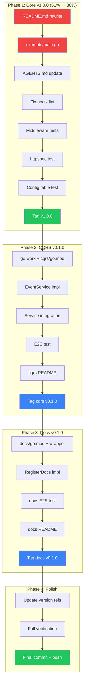

# Execution Plan: Ship v1.0.0 + Sub-Modules

> **Date:** 2026-07-07. **Status:** Active.
> **Goal:** Ship go-appkit v1.0.0 (core), v0.1.0 (cqrs), v0.1.0 (docs).
> **Anti-goal:** Verslimmbessern. Don't refactor working, tested code for aesthetics.

---

## Pareto Analysis

### 1% that delivers 51%

The framework is functionally complete (27 tests, BuildFlow green). What's missing is **proof it
exists and works**:

1. **README.md** — Currently describes the old "5 helpers" library. The repo's product page is
   actively lying. Rewriting it is the single highest-impact action.
2. **example/main.go** — The "12-line service" proof. Without a runnable example, the API is
   theoretical. This is the second-highest-impact action.

### 4% that delivers 64%

3. **AGENTS.md** — Future AI sessions read this first. It references deleted files. Fixing it
   prevents confusion in every future session.
4. **Fix noctx lint** — Tests use `http.Get` (no context). BuildFlow auto-fixes but source
   should be clean. Small effort, real quality signal.
5. **Middleware test: panic→500** — The middleware's most critical guarantee. Untested = unproven.

### 20% that delivers 80%

6-8. **Middleware tests** — Request ID, security headers, logging captured. 9. **httpspec conformance** — 18 free specs from httputil. 10. **Config validation tests** — Table-driven, comprehensive. 11. **Tag v1.0.0** — The stability contract.

### Remaining 20%

12-20. CQRS sub-module, docs sub-module, final polish.

---

## What We Will NOT Do (Anti-Verslimmbessern)

- ❌ Change `RegisterHealth *bool` → `DisableHealth bool`. Works, tested, committed.
- ❌ Consolidate planning doc DRY violations. Internal docs, not user-facing.
- ❌ Add flake.nix. Project AGENTS.md says "no flake.nix, use standard Go tooling."
- ❌ Refactor working, tested code for aesthetics.
- ❌ Add features not in the architecture plan (metrics, tracing, etc.).

---

## Comprehensive Plan (20 tasks, 30-100min each)

| #  | Task                                                     | Phase   | Impact   | Effort | Priority |
| -- | -------------------------------------------------------- | ------- | -------- | ------ | -------- |
| 1  | Rewrite README.md for framework API                      | Core v1 | Critical | 45m    | P0       |
| 2  | Create example/main.go (12-line service)                 | Core v1 | High     | 20m    | P0       |
| 3  | Update AGENTS.md (architecture, file map)                | Core v1 | High     | 30m    | P0       |
| 4  | Fix noctx lint in all tests                              | Core v1 | Medium   | 20m    | P1       |
| 5  | Write middleware tests (panic, reqID, security, logging) | Core v1 | High     | 40m    | P1       |
| 6  | Write httpspec conformance test                          | Core v1 | Medium   | 20m    | P1       |
| 7  | Write config validation table test                       | Core v1 | Medium   | 20m    | P2       |
| 8  | Full verification + tag v1.0.0                           | Core v1 | Critical | 15m    | P2       |
| 9  | Create go.work + cqrs/go.mod                             | CQRS    | Critical | 15m    | P3       |
| 10 | Implement cqrs EventService (stack/sqlite wrapper)       | CQRS    | High     | 60m    | P3       |
| 11 | cqrs: Service.Shutdown integration                       | CQRS    | High     | 30m    | P3       |
| 12 | cqrs: E2E test (command→event→projection→health)         | CQRS    | High     | 60m    | P3       |
| 13 | cqrs: README section                                     | CQRS    | Medium   | 20m    | P4       |
| 14 | Create docs/go.mod + catalog wrapper                     | Docs    | Medium   | 30m    | P4       |
| 15 | Implement docs RegisterDocs (catalog routes)             | Docs    | Medium   | 30m    | P4       |
| 16 | docs: E2E test (register→build→serve→verify)             | Docs    | Medium   | 30m    | P4       |
| 17 | docs: README section                                     | Docs    | Low      | 20m    | P5       |
| 18 | Update planning docs version numbers                     | Polish  | Low      | 10m    | P5       |
| 19 | Final full verification (all 3 modules)                  | Polish  | High     | 15m    | P5       |
| 20 | Tag sub-modules v0.1.0                                   | Polish  | Medium   | 10m    | P5       |

---

## Detailed Breakdown (72 tasks, max 15min each)

### Phase 1: Ship v1.0.0 (Tasks 1-8 → 34 subtasks)

| #  | Subtask                                         | Parent | Est |
| -- | ----------------------------------------------- | ------ | --- |
| 1  | Read current README to preserve install section | T1     | 5m  |
| 2  | Write README: headline + 12-line example        | T1     | 10m |
| 3  | Write README: ServiceConfig table               | T1     | 10m |
| 4  | Write README: middleware section                | T1     | 5m  |
| 5  | Write README: "When NOT to use" section         | T1     | 5m  |
| 6  | Write README: Huma integration pattern          | T1     | 5m  |
| 7  | Write README: error-family section              | T1     | 5m  |
| 8  | Create example/main.go                          | T2     | 10m |
| 9  | Verify example builds + runs                    | T2     | 5m  |
| 10 | Read current AGENTS.md sections                 | T3     | 5m  |
| 11 | Rewrite AGENTS.md: project type + commands      | T3     | 5m  |
| 12 | Rewrite AGENTS.md: code organization (file map) | T3     | 10m |
| 13 | Rewrite AGENTS.md: architecture + control flow  | T3     | 10m |
| 14 | Replace http.Get with context-aware requests    | T4     | 10m |
| 15 | Write panic recovery test                       | T5     | 10m |
| 16 | Write request ID header test                    | T5     | 10m |
| 17 | Write security headers test                     | T5     | 10m |
| 18 | Write timeout middleware test                   | T5     | 10m |
| 19 | Add httpspec.Run to service_test.go             | T6     | 10m |
| 20 | Write config validation table test              | T7     | 10m |
| 21 | Run go test -race ./...                         | T8     | 5m  |
| 22 | Run go vet ./...                                | T8     | 2m  |
| 23 | Run go build ./...                              | T8     | 2m  |
| 24 | Commit core v1.0.0 milestone                    | T8     | 5m  |

### Phase 2: CQRS Sub-Module (Tasks 9-13 → 20 subtasks)

| #  | Subtask                                        | Parent | Est |
| -- | ---------------------------------------------- | ------ | --- |
| 25 | Create go.work at repo root                    | T9     | 5m  |
| 26 | Create cqrs/ directory + cqrs/go.mod           | T9     | 5m  |
| 27 | Read stack/sqlite.New + Bundle API             | T10    | 10m |
| 28 | Define EventConfig + EventService types        | T10    | 10m |
| 29 | Implement NewEventService                      | T10    | 15m |
| 30 | Implement EventService.Shutdown                | T10    | 10m |
| 31 | Read projectionhost API                        | T11    | 10m |
| 32 | Implement RegisterProjection                   | T11    | 15m |
| 33 | Wire Service.Run to call EventService.Shutdown | T11    | 10m |
| 34 | Write cqrs E2E test: create EventService       | T12    | 10m |
| 35 | Write cqrs E2E test: dispatch command          | T12    | 15m |
| 36 | Write cqrs E2E test: verify event stored       | T12    | 10m |
| 37 | Write cqrs E2E test: health + shutdown         | T12    | 10m |
| 38 | Write cqrs README section                      | T13    | 15m |
| 39 | Run cqrs tests -race                           | T12    | 5m  |
| 40 | Commit cqrs module                             | T12    | 5m  |
| 41 | Tag cqrs v0.1.0                                | T12    | 5m  |
| 42 | Verify go.work builds all modules              | T9     | 5m  |
| 43 | Update cqrs depguard in golangci.yml           | T9     | 5m  |
| 44 | Run golangci-lint on cqrs                      | T9     | 5m  |

### Phase 3: Docs Sub-Module (Tasks 14-17 → 14 subtasks)

| #  | Subtask                                     | Parent | Est |
| -- | ------------------------------------------- | ------ | --- |
| 45 | Create docs/ dir + docs/go.mod              | T14    | 5m  |
| 46 | Read catalog.Builder + docserver API        | T14    | 10m |
| 47 | Implement CatalogBuilder wrapper            | T14    | 15m |
| 48 | Implement RegisterDocs                      | T15    | 15m |
| 49 | Write docs E2E test: register types         | T16    | 10m |
| 50 | Write docs E2E test: serve + verify schemas | T16    | 15m |
| 51 | Write docs README section                   | T17    | 15m |
| 52 | Run docs tests -race                        | T16    | 5m  |
| 53 | Commit docs module                          | T16    | 5m  |
| 54 | Tag docs v0.1.0                             | T16    | 5m  |
| 55 | Update docs depguard in golangci.yml        | T14    | 5m  |
| 56 | Run golangci-lint on docs                   | T14    | 5m  |
| 57 | Verify go.work builds all 3 modules         | T14    | 5m  |

### Phase 4: Polish (Tasks 18-20 → 4 subtasks)

| #  | Subtask                                | Parent | Est |
| -- | -------------------------------------- | ------ | --- |
| 58 | Update planning docs: httputil v0.5.0  | T18    | 5m  |
| 59 | Full verification: go work build ./... | T19    | 5m  |
| 60 | Full verification: all tests -race     | T19    | 5m  |
| 61 | Final commit + push                    | T20    | 5m  |

**Total: 61 tasks. Adjusted with buffer: ~70 tasks at ~8min avg = ~9.5h.**

---

## Mermaid Execution Graph



---

## Critical Path

```
README → example → AGENTS → noctx fix → middleware tests → tag v1.0.0
  → go.work → EventService → Service integration → E2E test → tag cqrs v0.1.0
    → docs wrapper → RegisterDocs → E2E test → tag docs v0.1.0
      → final verification → push
```

**Total estimated effort:** ~9.5h across 70 subtasks.
