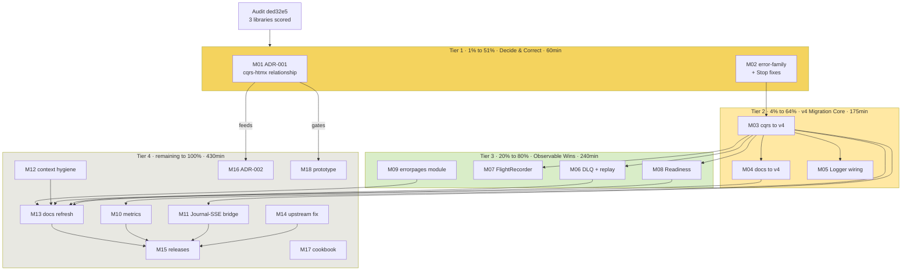

# SUPERB Ecosystem Execution Plan

> **Created:** 2026-08-15 19:27 · **Source:** [Ecosystem Utilization Audit](../research/2026-08-15_ecosystem-deep-dive.html) (commit `ded32e5`)
> **Status:** Approved for execution · **Repo state at planning time:** clean @ `ded32e5`
> **Verdict driving this plan:** go-cqrs-lite 28/100 (v3.7.x, 4 of ~35 module families), cqrs-htmx 0/100 (relationship plan dead, never documented), templ-components 0/100 (errorpage bridge missed).

---

## 1. Context — Why this plan exists

The 2026-08-15 audit of the three sibling libraries found:

1. **go-cqrs-lite is used minimally on a dead major version.** `cqrs/go.mod` pins v3.7.x (tagged 2026-07-07); v4.0.0 shipped 2026-07-11 — four days later. The whole v4 line (Bundle `HealthCheck`, topological shutdown, SQLite DLQ + admin, lag metrics, flight-recorder hooks, WAL single-writer pool cap) is invisible. v5 unification (ADR-0123 in go-cqrs-lite) is in progress; v3 will never catch up.
2. **The v3.7.1 pin carries a live correctness risk:** pre-v4.3.0 `stack/sqlite` lacks `SetMaxOpenConns(1)` → `SQLITE_BUSY (517)` under concurrent WAL writers (documented in go-cqrs-lite's own CHANGELOG).
3. **The wrapper is wired bare:** `projectionhost.New` gets zero options — no logger (appkit ships one), no DLQ, no flight recorder (appkit ships a whole module for it), no metrics. `host.Stop()` errors are swallowed; `DB()` uses `fmt.Errorf` against the project's own error-family rule; projections are invisible to `/health/ready`.
4. **The cqrs-htmx "first real consumer" plan is dead** — zero appkit references in that repo; every generic service concern is duplicated on the same upstreams, one major version ahead. Nobody wrote the decision down.
5. **templ-components/errorpage is a ready-made bridge** (standalone module, go-error-family native, same 5-family taxonomy as `appkit.HTTPStatus()`, JSON contract that `htmx.GlobalErrorHandling` turns into toasts) — unused.

**Customer** = downstream Go services consuming go-appkit modules (potentially cqrs-htmx itself). **Customer value** = correctness (no SQLITE_BUSY), operability (readiness, DLQ, logs, metrics), error UX (pretty/JSON errors), and ecosystem coherence (one future, not two).

## 2. Guardrails — what we will NOT do (Verschlimmbesserung protection)

- **NO rewrites of working core.** `Service` lifecycle, realtime Hub/Handler, flightrecorder middleware all pass tests with `-race`; they get additive changes only.
- **NO public API breaks** in existing modules. Additions only; anything breaking waits for a justified major version.
- **NO touching published v3 tags** in go-cqrs-lite or appkit submodules. Migration = move forward, never delete history.
- **NO upstream changes without verification.** templ-components fix goes through `verify-before-filing` discipline: reproduce, fix, test, PR. Never force-push anywhere.
- **NO breaking realtime's zero-cqrs-dependency constraint.** The Journal→SSE bridge becomes its own module, not an import into `realtime`.
- **NO speculative abstraction.** "Stack-generic EventService / adopt `system` package" is ADR-002 _research_, not code, until the ADR says otherwise.
- **NO chasing depguard "import not allowed" lint noise** — pre-existing config warnings across all modules, not ours to "fix" in this plan.
- Every task ends with its module green (`go test && go vet && go build`, with the right `GOEXPERIMENT`), or it is not done.

## 3. Pareto Breakdown

| Tier                              | Effort | Delivers                                                                                                  | Tasks              | Est. total |
| --------------------------------- | ------ | --------------------------------------------------------------------------------------------------------- | ------------------ | ---------- |
| **Tier 1 — the 1% → 51%**         | ~1h    | Strategic clarity (ADR decides the ecosystem's shape) + correctness fixes that close real failure modes   | M01, M02           | 60 min     |
| **Tier 2 — the 4% → 64%**         | ~3h    | go-cqrs-lite v4 migration core: kills the SQLITE_BUSY risk, unlocks the entire v4 line, gets logs flowing | M03, M04, M05      | 175 min    |
| **Tier 3 — the 20% → 80%**        | ~4h    | Observable wins: DLQ + replay, flight recorder wiring, projection readiness, pretty/JSON error pages      | M06, M07, M08, M09 | 240 min    |
| **Tier 4 — the other 20% → 100%** | ~7.2h  | Metrics path, Journal→SSE bridge, hygiene, docs, releases, second ADR, upstream fix, cookbook, prototype  | M10–M18            | 430 min    |

**Reading:** ~1 hour of work (Tier 1) settles the single biggest open question in the ecosystem and repairs the two honesty bugs in the wrapper. ~4 more hours (Tier 2) removes the only live correctness risk and lands the foundation every later task builds on. Tier 3 is everything an operator can _see_. Tier 4 is completion: polish, docs, releases, and two bounded research spikes.

## 4. Medium Plan — 18 tasks, 30–100 min each

Sorted by priority score (Impact × (6 − Effort)); Exec # = recommended execution order (respects dependencies, see graph §6).

| Exec # | ID  | Task                                                                                                  | Tier | Impact | Effort | Priority | Est.    | Depends on |
| ------ | --- | ----------------------------------------------------------------------------------------------------- | ---- | ------ | ------ | -------- | ------- | ---------- |
| 1      | M01 | ADR-001: decide cqrs-htmx ↔ appkit relationship (write ADR, update integrations.md)                   | 1    | 5      | 1      | 25       | 30 min  | —          |
| 2      | M02 | Fix `fmt.Errorf` → error-family + surface `host.Stop()` error (cqrs module)                           | 1    | 3      | 1      | 15       | 30 min  | —          |
| 3      | M03 | Migrate cqrs module to go-cqrs-lite v4 (paths, API, jsonv2, tests)                                    | 2    | 5      | 3      | 15       | 100 min | M02        |
| 4      | M04 | Migrate docs module to catalog/v4 + docserver v4                                                      | 2    | 4      | 2      | 16       | 45 min  | M03        |
| 5      | M05 | `EventConfig.Logger` → `projectionhost.WithLogger` + test                                             | 2    | 4      | 1      | 20       | 30 min  | M03        |
| 6      | M06 | `EventConfig.DLQ` (SQLite dead-letter store) + replay/purge accessors + tests                         | 3    | 4      | 2      | 16       | 60 min  | M03        |
| 7      | M07 | `EventConfig.FlightRecorder` → `WithFlightRecorder` + test + cross-link docs                          | 3    | 3      | 1      | 15       | 30 min  | M03        |
| 8      | M08 | Projection readiness: `Status()`/`LagPerProjection()` → `/health/ready` integration + tests           | 3    | 4      | 2      | 16       | 60 min  | M03        |
| 9      | M09 | New opt-in `errorpages` module wrapping templ-components/errorpage (Mount, JSON mode, tests, example) | 3    | 4      | 3      | 12       | 90 min  | —          |
| 10     | M10 | Metrics path: otel/prometheus accessors for the event store                                           | 4    | 3      | 3      | 9        | 60 min  | M03        |
| 11     | M11 | Journal→SSE bridge: cqrs `event.Journal` → `sse.EventStore` adapter in its own module                 | 4    | 4      | 3      | 12       | 100 min | M03        |
| 12     | M12 | Context hygiene: realtime/handler.go, service.go, docs_test.go request contexts                       | 4    | 2      | 1      | 10       | 30 min  | —          |
| 13     | M13 | Docs refresh: README, FEATURES, CHANGELOGs, AGENTS.md (v4, options, jsonv2)                           | 4    | 3      | 1      | 15       | 45 min  | M04–M09    |
| 14     | M14 | Upstream courtesy fix: FamilyOrchestration in templ-components/errorpage status map (verify → PR)     | 4    | 2      | 2      | 8        | 45 min  | —          |
| 15     | M15 | Releases: verify all modules, cut CHANGELOGs, tag cqrs v0.2.0 + docs v0.2.0 + errorpages v0.1.0       | 4    | 3      | 2      | 12       | 45 min  | M13        |
| 16     | M16 | ADR-002: EventService future — sqlite-first vs stack-generic vs `system` package adoption             | 4    | 3      | 3      | 9        | 45 min  | M03, M01   |
| 17     | M17 | cqrs README cookbook: scenario DSL, testutil, cqrs-lint leverage                                      | 4    | 2      | 1      | 10       | 30 min  | —          |
| 18     | M18 | cqrs-htmx prototype spike: appkit.Service behind `setup.Run` (conditional on ADR-001)                 | 4    | 4      | 4      | 8        | 100 min | M01        |

**Total: 905 min ≈ 15.1 h focused work.**

## 5. Fine Plan — 66 tasks, max 12 min each

Global priority sort = tier first, then execution order (dependency-safe). `#` is execution sequence.

| #  | ID     | Task (≤12 min)                                                                                                                 | Parent | Tier | Est. |
| -- | ------ | ------------------------------------------------------------------------------------------------------------------------------ | ------ | ---- | ---- |
| 1  | M01.1  | Draft ADR-001: three options (appkit-as-foundation / parallel assemblies / retire plan) + tradeoffs                            | M01    | 1    | 10   |
| 2  | M01.2  | Verify appkit-unique value claims (drain probe, `Addr() net.Addr`, charm log, FR middleware) against cqrs-htmx `setup/` source | M01    | 1    | 10   |
| 3  | M01.3  | Write decision + consequences into `docs/planning/design-decisions.md` (or new ADR file); commit                               | M01    | 1    | 8    |
| 4  | M01.4  | Update `docs/planning/integrations.md:36` to state the decided relationship                                                    | M01    | 1    | 5    |
| 5  | M02.1  | Replace `fmt.Errorf` in `DB()` with `errorfamily.NewRejection("cqrs.db_not_sql", ...)`                                         | M02    | 1    | 5    |
| 6  | M02.2  | Surface `host.Stop()` error via `errors.Join` in `Shutdown()`                                                                  | M02    | 1    | 8    |
| 7  | M02.3  | Tests for both paths; `go test/vet/build` green                                                                                | M02    | 1    | 10   |
| 8  | M03.1  | Read go-cqrs-lite MIGRATION-GUIDE v3→v4; list breaking changes touching EventService                                           | M03    | 2    | 10   |
| 9  | M03.2  | `go get` v4 modules (stack, stack/sqlite, projectionhost v4.3.0); fix import paths                                             | M03    | 2    | 8    |
| 10 | M03.3  | Adapt `eventservice.go` to v4 API (aliases, codec defaults, signature changes)                                                 | M03    | 2    | 12   |
| 11 | M03.4  | Adapt `eventservice_test.go`; `go mod tidy`                                                                                    | M03    | 2    | 10   |
| 12 | M03.5  | Full module green with `GOEXPERIMENT=jsonv2 GOWORK=off` (test+vet+build, `-race`)                                              | M03    | 2    | 10   |
| 13 | M03.6  | Update AGENTS.md cqrs build commands (jsonv2 requirement)                                                                      | M03    | 2    | 6    |
| 14 | M04.1  | `go get` catalog/v4 + docserver v4; adapt `docs.go` (Config/handler changes)                                                   | M04    | 2    | 12   |
| 15 | M04.2  | Adapt `docs_test.go` to v4                                                                                                     | M04    | 2    | 10   |
| 16 | M04.3  | Module green + jsonv2 noted in AGENTS.md                                                                                       | M04    | 2    | 8    |
| 17 | M05.1  | Add `EventConfig.Logger *slog.Logger`; map to `projectionhost.WithLogger`                                                      | M05    | 2    | 8    |
| 18 | M05.2  | Capturing-slog-handler test: projection logs flow through configured logger                                                    | M05    | 2    | 10   |
| 19 | M05.3  | Document option in cqrs README                                                                                                 | M05    | 2    | 6    |
| 20 | M06.1  | Add `EventConfig.DLQ event.DeadLetterStore`; wire `WithDeadLetterStore`                                                        | M06    | 3    | 10   |
| 21 | M06.2  | Helper: SQLite dead-letter store constructor over bundle `*sql.DB`                                                             | M06    | 3    | 10   |
| 22 | M06.2b | Expose `ReplayDeadLetters` + `Reset(WithPurgeDeadLetters)` accessors                                                           | M06    | 3    | 10   |
| 23 | M06.3  | Poison-event tests: capture to DLQ, checkpoint advances, replay clears                                                         | M06    | 3    | 12   |
| 24 | M07.1  | Add `EventConfig.FlightRecorder`; wire `WithFlightRecorder`                                                                    | M07    | 3    | 8    |
| 25 | M07.2  | Buffer-recorder test; cross-link appkit flightrecorder module docs                                                             | M07    | 3    | 10   |
| 26 | M08.1  | Add `EventService.ReadyCheck()` from `host.Status()` (live/stopped semantics)                                                  | M08    | 3    | 10   |
| 27 | M08.2  | Add `LagPerProjection()` accessor                                                                                              | M08    | 3    | 8    |
| 28 | M08.3  | Integrate with appkit `/health/ready` probe pattern; test 503→200 transition                                                   | M08    | 3    | 12   |
| 29 | M08.4  | Document readiness wiring in AGENTS.md + README                                                                                | M08    | 3    | 8    |
| 30 | M09.1  | Scaffold `errorpages` module: go.mod (jsonv2), doc.go, go.work entry                                                           | M09    | 3    | 10   |
| 31 | M09.2  | `Mount(mux, cfg)`: 404/405 + error-family-classified handler via `errorpage.ErrorHandler`                                      | M09    | 3    | 12   |
| 32 | M09.3  | JSON mode: content negotiation (`Accept: application/json`) → errorpage JSON contract                                          | M09    | 3    | 10   |
| 33 | M09.4  | Tests: 5 families → correct status, 404 page, JSON shape, render-failure fallback                                              | M09    | 3    | 12   |
| 34 | M09.5  | Example app + module README                                                                                                    | M09    | 3    | 10   |
| 35 | M10.1  | Evaluate `otel`/`prometheus` v4 surfaces; pick wiring (accessor vs Setup)                                                      | M10    | 4    | 10   |
| 36 | M10.2  | Implement metrics accessor; `/metrics` handler test with CQRS views                                                            | M10    | 4    | 12   |
| 37 | M10.3  | Document metrics path                                                                                                          | M10    | 4    | 6    |
| 38 | M11.1  | Design decision: bridge module location + name (keeps realtime cqrs-free)                                                      | M11    | 4    | 10   |
| 39 | M11.2  | Implement journal → `sse.EventStore` adapter (ReadFrom cursor mapping)                                                         | M11    | 4    | 12   |
| 40 | M11.3  | Last-Event-ID resume mapping + max-replay cap (mirror cqrs-htmx `JournalSSEStore` semantics)                                   | M11    | 4    | 12   |
| 41 | M11.4  | Replay→live dedup ring at subscribe boundary                                                                                   | M11    | 4    | 10   |
| 42 | M11.5  | Tests (ordering, resume) + AGENTS.md entry                                                                                     | M11    | 4    | 12   |
| 43 | M12.1  | Fix non-inherited contexts: `realtime/handler.go:105`, `:90` (`replayMissedEvents` ctx)                                        | M12    | 4    | 10   |
| 44 | M12.2  | Fix `service.go:127` context + `docs_test.go` → `NewRequestWithContext`                                                        | M12    | 4    | 10   |
| 45 | M12.3  | All-module test sweep (incl. race, jsonv2 flags)                                                                               | M12    | 4    | 8    |
| 46 | M13.1  | README: v4 migration note, new options, errorpages module                                                                      | M13    | 4    | 10   |
| 47 | M13.2  | FEATURES.md + CHANGELOG.md entries for cqrs, docs, errorpages                                                                  | M13    | 4    | 10   |
| 48 | M13.3  | AGENTS.md refresh: dependency tables (v4 versions), module list, gotchas                                                       | M13    | 4    | 8    |
| 49 | M14.1  | Verify 6th family exists in go-error-family source + intended HTTP status                                                      | M14    | 4    | 8    |
| 50 | M14.2  | Reproduce missing FamilyOrchestration mapping in templ-components/errorpage                                                    | M14    | 4    | 8    |
| 51 | M14.3  | Fix + test in templ-components (own branch)                                                                                    | M14    | 4    | 10   |
| 52 | M14.4  | File PR upstream (verify-before-filing checklist)                                                                              | M14    | 4    | 10   |
| 53 | M15.1  | Pre-release verification: all 6 modules build/test/vet green with correct flags                                                | M15    | 4    | 12   |
| 54 | M15.2  | Cut CHANGELOGs + bump versions                                                                                                 | M15    | 4    | 10   |
| 55 | M15.3  | Tag `cqrs/v0.2.0`, `docs/v0.2.0`, `errorpages/v0.1.0`                                                                          | M15    | 4    | 10   |
| 56 | M15.4  | Fresh-consumer `go get` smoke test (clean module cache, GOWORK=off)                                                            | M15    | 4    | 8    |
| 57 | M16.1  | Evaluate `system` package (DomainConfig/DeploymentConfig) vs EventService fit                                                  | M16    | 4    | 12   |
| 58 | M16.2  | Write ADR-002: sqlite-first vs stack-generic vs system adoption                                                                | M16    | 4    | 10   |
| 59 | M16.3  | Add chosen-path follow-ups to plan/TODO                                                                                        | M16    | 4    | 5    |
| 60 | M17.1  | cqrs README cookbook: scenario DSL, testutil, cqrs-lint usage                                                                  | M17    | 4    | 12   |
| 61 | M17.2  | Link cookbook from AGENTS.md                                                                                                   | M17    | 4    | 4    |
| 62 | M18.1  | Spike: swap cqrs-htmx `setup.Run` server layer → `appkit.Service` (branch, flag)                                               | M18    | 4    | 12   |
| 63 | M18.2  | Wire appkit drain probe ↔ `ProjectionReadinessCheck`                                                                           | M18    | 4    | 10   |
| 64 | M18.3  | Verify SSE header flush survives appkit middleware chain                                                                       | M18    | 4    | 12   |
| 65 | M18.4  | Smoke benchmark vs baseline server path                                                                                        | M18    | 4    | 10   |
| 66 | M18.5  | Adopt/reject report + follow-up tasks                                                                                          | M18    | 4    | 8    |

## 6. Execution Graph

**Critical path:** M02 → M03 → M06/M08 → M13 → M15. Everything else has slack.

## 7. Verification & Definition of Done

Per task: module `go test && go vet && go build` green (cqrs/docs/errorpages with `GOEXPERIMENT=jsonv2`, realtime additionally `GOWORK=off -race -count=1`); BuildFlow pre-commit passes.

Plan-level DoD:

- [ ] ADR-001 and ADR-002 written, linked from `docs/planning/integrations.md`
- [ ] cqrs + docs modules on go-cqrs-lite v4.3.0 line; SQLITE_BUSY risk eliminated
- [ ] projectionhost wired: logger, DLQ (+SQLite store), flight recorder, metrics accessor
- [ ] `/health/ready` reflects projection state (503 until live)
- [ ] `errorpages` module shipped with JSON contract + example
- [ ] Journal→SSE bridge module shipped; realtime still cqrs-free
- [ ] README/FEATURES/CHANGELOG/AGENTS.md current (no version drift, jsonv2 documented)
- [ ] Tags `cqrs/v0.2.0`, `docs/v0.2.0`, `errorpages/v0.1.0` pushed; fresh `go get` verified
- [ ] templ-components PR filed with reproduction evidence
- [ ] Zero public API breaks in core, realtime, flightrecorder

## 8. Notes

- This plan is a snapshot; harvest ongoing work into a `TODO_LIST.md` (repo currently has none — flagged as a gap, creation deliberately out of scope here).
- M18 is conditional: if ADR-001 selects "parallel assemblies" or "retire plan", drop M18 (saves 100 min; Tier 4 drops to 330 min).
- Re-verify version claims at execution time (tags move); the audit's numbers were current as of 2026-08-15.
