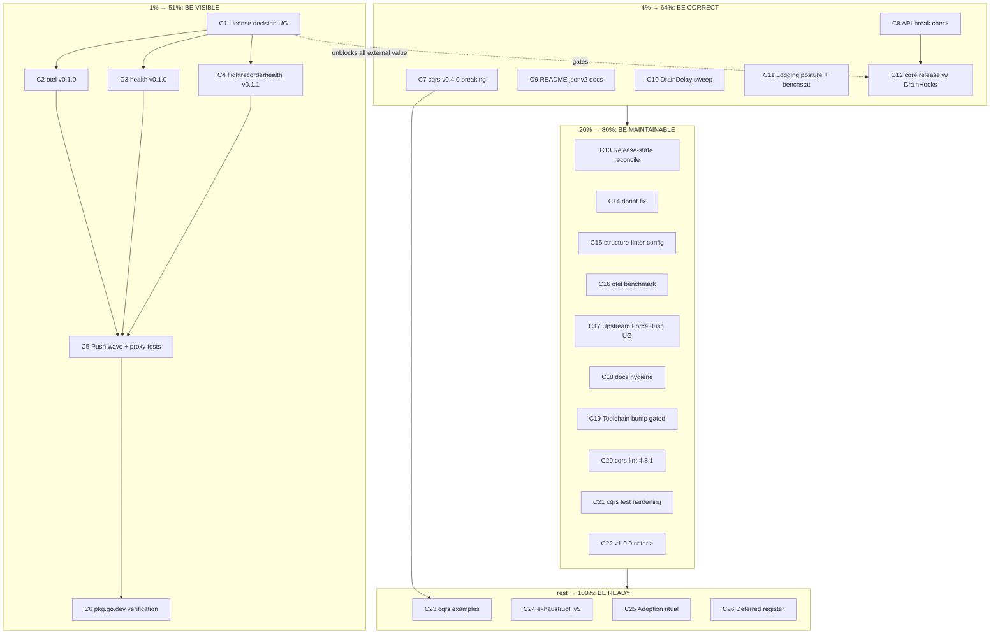

# SUPERB Plan — Release Visibility & Quality Wave

**Created:** 2026-09-04 17:40 CEST · **Scope:** ALL open go-appkit TODOs (TODO_LIST.md P1/P2/P3 as of 2026-09-04 17:40 + the 50 routed items from `docs/status/2026-09-04_17-17_go-cqrs-lite-deep-dive-session.md` §f) sorted by the Pareto principle.

**Method:** 1% → 51% of the result, then 4% → 64%, then 20% → 80%, then the rest to 100%. Two granularities: comprehensive (30–100 min tasks) and fine (≤12 min micro-tasks). Every open TODO is included exactly once.

**Context that shapes the whole plan:**

- The v0.3.0 wave (core, cqrs, realtime, flightrecorder, flightrecorderhealth) is **pushed and proxy-verified** (2026-08-30 / 2026-09-04). The old "push gate" is closed.
- **pkg.go.dev currently hides the framework**: root LICENSE is an unclassifiable proprietary text → core shows `License: UNKNOWN` with godoc hidden; the 7 submodule pages 404 outright. LICENSE files landed in every module root on 2026-09-04 but only take effect **with the next tagged versions**.
- Three releases are queued: `otel/v0.1.0`, `health/v0.1.0`, `flightrecorderhealth/v0.1.1` (the last flips on `GOEXPERIMENT=jsonv2` — must be in release notes).
- cqrs master carries a **public breaking change** (EventConfig.FlightRecorder → go-flightrecorder, committed 2026-09-04, untagged) → next cqrs tag must be a breaking bump (v0.4.0).
- A **parallel session is live** in this repo (health module, planning docs). This plan commits only its own file; shared-doc edits are listed as tasks, not done silently.
- Two standing USER GATES: license posture, upstream issue-vs-PR preference.

---

## Pareto Breakdown

### The 1% that delivers 51%: BE VISIBLE

> While pkg.go.dev hides godoc and 404s submodules, the framework is invisible to every prospective consumer (cqrs-htmx, PapDashboard reverse-adoption, fresh teams). Release wave #2 with correct licensing is the one lever that makes ALL other work count. Everything in this tier is release mechanics + one user decision.

1. **License posture decision (USER GATE)** — keep proprietary (docs stay hidden forever) vs adopt a standard license (cqrs-htmx is MIT). Blocks wave content.
2. **Wave #2 execution** — `otel/v0.1.0` (drop `replace ../`, require published core, hermetic verify), `health/v0.1.0` (same ritual), `flightrecorderhealth/v0.1.1` (go-health v0.1.1 + jsonv2 note), plus the tag strategy that ships LICENSE files into published versions.
3. **Post-tag verification** — fresh-consumer proxy test per new tag + pkg.go.dev render check: every module page exists, license classified, godoc visible.

### The 4% that delivers 64% (+13%): BE CORRECT

> The wave is out; now make sure the NEXT wave can't repeat past mistakes (v0.2.0 was reconstructed after the fact; cqrs master is currently ahead of its tag with a breaking change), and that consumers can actually build and benchmark us honestly.

4. **cqrs v0.4.0 breaking release** — the FlightRecorder migration + trigger option, CHANGELOG dated, tagged, fresh-consumer verified.
5. **Mechanical API-break check at tag time** (goapidiff or `go doc` snapshot diff) — added to the release checklist, never reconstruct releases again.
6. **Consumer-facing build docs** — README documents `GOEXPERIMENT=jsonv2` (which modules, why) — today only AGENTS.md knows.
7. **Test-time tax sweep** — `DrainDelay: 0` misuse in satellite suites (realtime, errorpages, docs, flightrecorder, health) → `NoDrainDelay`; ~30s→6s pattern already proven in core.
8. **Logging posture (decision + implementation + benchstat)** — the 2.8× per-request logging delta vs cqrs-htmx spike is the known performance story; needs a decision then code.
9. **core release carrying `DrainHooks`** (health module dependency — verify dep direction first; fold into wave membership decision).

### The 20% that delivers 80% (+16%): BE MAINTAINABLE

10. **Release-process/docs reconciliation** — single source of truth for release state (AGENTS.md vs TODO_LIST drift; stale "commit the OTEL work" item — verify whether `aaa2427` closed it).
11. **dprint CHANGELOG-only commit fix** (`--allow-no-files`) — the exit-14 gotcha already forced one `--no-verify`.
12. **go-structure-linter config** — accept core's intended root-package layout; stop living with 8 standing red errors.
13. **otel middleware benchmark** (no-op vs configured) + benchstat + README numbers.
14. **Upstream cqrs-lite otel ForceFlush issue** — verify-before-filing, then file (issue vs PR = user gate).
15. **design-decisions.md hygiene** — lychee 404 + MD013 long lines.
16. **Go toolchain 1.26.5 → 1.26.6+** when nixpkgs carries it (gated; two CVE-class findings noted by govulncheck).
17. **cqrs-lint 4.8.1 installed** + `.`-not-`./...` arg form documented.
18. **cqrs contract-test hardening** — negative-path trigger test (false → no capture) + precedence test (HostOptions cannot override derived wiring).
19. **core v1.0.0 exit criteria draft** (fold in OuterMiddlewares/ShutdownHooks as v1-shaped).

### The other 20% to reach 100%: BE READY (mostly demand-gated — deliberate restraint)

20. **cqrs examples** — shared `fr.Recorder` (HTTP middleware + projections), OTel metrics + Prometheus bridge pairing, DLQ admin assertions, replay-contract example.
21. **Linter modernization** — exhaustruct → exhaustruct_v5 across all module configs (deprecation warning observed in-session).
22. **Demand-gated cqrs opt-ins — NOT scheduled**: encryption/v4, signing/v4, idempotency/sqlstore, scheduling. Build only when a real consumer asks. Restraint is the feature.
23. **Cordis bridge / PapDashboard reverse-adoption — door held open, zero code**: tracked triggers only (cordis tags go/v0.1.0; PapDashboard ships an appkit-hosted release; a consumer demands core TLS → first concrete core TLS option signal).
24. **Adoption instrumentation** — re-run `cqrs-lint scorecard` after each wrapper feature; scenario/v4 cookbook drift guard after each cqrs-lite release.

---

## Comprehensive Plan (30–100 min tasks — ALL TODOs)

Sorted by importance → impact → effort → customer-value. UG = USER GATE inside.

| #   | Task (30–100 min)                                                                                                                                                                                                                 | Tier | Covers TODOs                     | Impact | Effort | Value | Depends on           |
| --- | --------------------------------------------------------------------------------------------------------------------------------------------------------------------------------------------------------------------------------- | ---- | -------------------------------- | ------ | ------ | ----- | -------------------- |
| C1  | License posture decision + wave #2 membership definition (proprietary vs MIT-family; which tags ship LICENSE)                                                                                                                     | 1%   | P2-license (UG)                  | 5      | 2      | 5     | —                    |
| C2  | otel/v0.1.0 release prep: drop example `replace ../`, require published core, `GOWORK=off` hermetic verify, annotated tag                                                                                                         | 1%   | P1-otel                          | 5      | 3      | 5     | C1                   |
| C3  | health/v0.1.0 release prep: same ritual for the new health module                                                                                                                                                                 | 1%   | P1-health                        | 5      | 3      | 5     | C1                   |
| C4  | flightrecorderhealth/v0.1.1 release prep: go-health v0.1.1 bump, jsonv2-requirement release note, verify, tag                                                                                                                     | 1%   | P1-frh                           | 4      | 2      | 4     | C1                   |
| C5  | Wave #2 push + per-tag fresh-consumer proxy tests                                                                                                                                                                                 | 1%   | P1-postpush                      | 5      | 2      | 5     | C2,C3,C4             |
| C6  | pkg.go.dev render verification: every module page exists, license classified, godoc visible; record before/after screenshots in status doc                                                                                        | 1%   | P1-postpush+P2-license           | 5      | 2      | 5     | C5                   |
| C7  | cqrs v0.4.0: CHANGELOG date, tag, push, fresh-consumer verify of the breaking FlightRecorder migration                                                                                                                            | 4%   | session-status #1                | 4      | 3      | 4     | — (parallel to wave) |
| C8  | API-break check wired into release checklist (goapidiff or go-doc snapshot diff), documented in AGENTS.md release ritual                                                                                                          | 4%   | P2-apibreak                      | 4      | 2      | 4     | —                    |
| C9  | README build-from-source section: GOEXPERIMENT=jsonv2 module table (root, cqrs, realtime, otel-no, docs, errorpages, flightrecorder, flightrecorderhealth-now-yes, integration-no)                                                | 4%   | P2-readme                        | 3      | 2      | 4     | C4 (frh jsonv2 flip) |
| C10 | DrainDelay sweep: convert satellite suites to NoDrainDelay, measure wall-time before/after                                                                                                                                        | 4%   | P2-draindelay                    | 3      | 2      | 3     | —                    |
| C11 | Logging posture: pick option (level config / sampling / consumer-logger), implement, benchstat before/after vs spike numbers                                                                                                      | 4%   | P2-logging (UG on option)        | 4      | 4      | 4     | —                    |
| C12 | core release carrying DrainHooks: verify health module's dep direction, tag (patch/minor decision via API-break check C8)                                                                                                         | 4%   | P1-health-a                      | 4      | 3      | 4     | C1, C8               |
| C13 | Release-state single source: reconcile AGENTS.md ↔ TODO_LIST.md; verify+close stale "commit the OTEL work" item (check `aaa2427` coverage); docs-health ANNOTATE pass on old status reports                                       | 20%  | P1-otel-stale + session #3       | 2      | 2      | 3     | —                    |
| C14 | dprint config fix: `--allow-no-files` (or skip-on-empty) so CHANGELOG-only commits stop exiting 14                                                                                                                                | 20%  | P3-dprint                        | 2      | 1      | 2     | —                    |
| C15 | go-structure-linter: configure root-package acceptance for core; get to zero standing errors                                                                                                                                      | 20%  | P3-linter                        | 2      | 1      | 2     | —                    |
| C16 | otel middleware benchmark: no-op vs configured, benchstat, numbers into otel README                                                                                                                                               | 20%  | P3-otelbench                     | 2      | 2      | 2     | —                    |
| C17 | Upstream cqrs-lite otel ForceFlush: reproduce in minimal probe, verify-before-filing, file issue/PR (UG: issue vs PR)                                                                                                             | 20%  | P2-upstream                      | 3      | 2      | 3     | —                    |
| C18 | design-decisions.md: fix lychee 404 + wrap MD013 long lines                                                                                                                                                                       | 20%  | P2-docs                          | 1      | 1      | 1     | —                    |
| C19 | Toolchain bump 1.26.5 → 1.26.6+ across modules when nixpkgs carries it (GOTOOLCHAIN=local means nixpkgs gates; re-run govulncheck)                                                                                                | 20%  | P2-toolchain (gated)             | 2      | 1      | 2     | external             |
| C20 | cqrs-lint 4.8.1 → `~/go/bin` + document `.` arg form in cqrs README gotchas                                                                                                                                                       | 20%  | P3-cqrslint                      | 1      | 1      | 1     | —                    |
| C21 | cqrs test hardening: trigger-returns-false test + HostOptions-cannot-override-derived-wiring test                                                                                                                                 | 20%  | session #18                      | 2      | 2      | 2     | —                    |
| C22 | core v1.0.0 exit criteria draft (fold OuterMiddlewares/ShutdownHooks; link framework-architecture.md ideas)                                                                                                                       | 20%  | P3-v1criteria                    | 2      | 2      | 2     | —                    |
| C23 | cqrs examples: shared fr.Recorder across appkit middleware + projections; OTel→Prometheus pairing snippet; DLQ admin + replay-contract examples                                                                                   | rest | session #20                      | 2      | 2      | 2     | C7                   |
| C24 | exhaustruct → exhaustruct_v5 migration in all module .golangci.yml files (kill deprecation warning)                                                                                                                               | rest | session #21                      | 1      | 2      | 1     | —                    |
| C25 | Adoption instrumentation ritual: scorecard after each wrapper feature + cookbook drift guard (documented as checklist lines in AGENTS.md)                                                                                         | rest | session #24                      | 1      | 1      | 1     | —                    |
| C26 | Deferred-by-design register (DO NOT BUILD): encryption/signing/idempotency/scheduling opt-ins; cordis bridge; PapDashboard appkit-side code; core TLS until PapDashboard demands it — one checklist block with trigger conditions | rest | P3-cordis, P3-papdash, P3-optins | 1      | 1      | 2     | —                    |

## Fine-Grained Plan (≤12 min micro-tasks — ALL TODOs)

Same sort order. Parent task in brackets. ~80 micro-tasks; every comprehensive task expands fully.

| #   | Micro-task (≤12 min)                                                                                                      | Parent |
| --- | ------------------------------------------------------------------------------------------------------------------------- | ------ |
| F1  | Read root LICENSE text; list classification options (proprietary / MIT / Apache-2.0 / BSD) with consumer consequences     | C1     |
| F2  | Write 1-paragraph decision memo: adoption cost of hidden godoc vs licensing goals; recommend one                          | C1     |
| F3  | Ask the user gate: license choice + wave #2 tag list (blocked until answered)                                             | C1     |
| F4  | Open `otel/go.mod`, locate example `replace ../`; check `otel/example/main.go` imports                                    | C2     |
| F5  | Remove `replace`, set core requirement to published v0.3.0, `go mod tidy`                                                 | C2     |
| F6  | Hermetic verify: `cd otel && GOWORK=off go test ./... -race -count=1`                                                     | C2     |
| F7  | Annotated tag `otel/v0.1.0` with release-note message                                                                     | C2     |
| F8  | Locate health module example `replace ../`; repeat F5                                                                     | C3     |
| F9  | Hermetic verify health: race suite                                                                                        | C3     |
| F10 | Annotated tag `health/v0.1.0`                                                                                             | C3     |
| F11 | Verify flightrecorderhealth go.mod pins go-health v0.1.1; run suite with GOEXPERIMENT=jsonv2                              | C4     |
| F12 | Draft v0.1.1 release note line: "now requires GOEXPERIMENT=jsonv2" + reason (go-health dependency graph)                  | C4     |
| F13 | Annotated tag `flightrecorderhealth/v0.1.1`                                                                               | C4     |
| F14 | Push wave #2 tags: `git push origin otel/v0.1.0 health/v0.1.0 flightrecorderhealth/v0.1.1`                                | C5     |
| F15 | Fresh-consumer test: clean /tmp module, `go get` each new tag, blank import, `go build`                                   | C5     |
| F16 | Screenshot/record pkg.go.dev state BEFORE (current 404s/hidden godoc) for the comparison                                  | C6     |
| F17 | Check each new module page: license classification + godoc visibility; record AFTER state                                 | C6     |
| F18 | If still UNKNOWN: confirm LICENSE files actually inside each tagged tree (`git show tag:module/LICENSE`)                  | C6     |
| F19 | Write wave #2 mini status note (link from TODO_LIST P1 when closing)                                                      | C6     |
| F20 | Confirm cqrs Unreleased CHANGELOG wording (breaking entry) is dated-ready                                                 | C7     |
| F21 | Tag `cqrs/v0.4.0` (annotated, breaking-change message)                                                                    | C7     |
| F22 | Push tag; fresh-consumer: `go get go-appkit/cqrs@v0.4.0` + compile snippet using `*fr.Recorder`                           | C7     |
| F23 | Evaluate goapidiff vs `go doc` snapshot diff (5-min spike, pick one)                                                      | C8     |
| F24 | Wire chosen check into release ritual section in AGENTS.md                                                                | C8     |
| F25 | Add checklist line: run API-break diff before every tag                                                                   | C8     |
| F26 | Draft README "Building from source" skeleton with module × GOEXPERIMENT matrix                                            | C9     |
| F27 | Fill matrix rows for the 5 jsonv2 modules incl. flightrecorderhealth flip                                                 | C9     |
| F28 | Add one-line WHY (encoding/json/v2 via httputil/httpspec, codec/v4, catalog/v4, errorpage, go-sse chain)                  | C9     |
| F29 | Commit README section                                                                                                     | C9     |
| F30 | Grep satellite suites for `DrainDelay: 0` (realtime, errorpages, docs-mod, flightrecorder, flightrecorderhealth)          | C10    |
| F31 | Convert realtime occurrences → `NoDrainDelay`; run suite; note wall-time                                                  | C10    |
| F32 | Convert errorpages occurrences; run suite                                                                                 | C10    |
| F33 | Convert docs-mod + flightrecorder occurrences; run suites                                                                 | C10    |
| F34 | Sum wall-time saved; one-line note in AGENTS Testing section                                                              | C10    |
| F35 | Re-read comparison finding 7 (spike benchmark context)                                                                    | C11    |
| F36 | Ask user gate: pick logging option (A level-config, B sampling, C consumer-logger)                                        | C11    |
| F37 | Implement chosen option behind appkit ServiceConfig                                                                       | C11    |
| F38 | Port the spike benchmark; run benchstat before/after; record table                                                        | C11    |
| F39 | Verify health module imports core (or not): read health/*.go imports                                                      | C12    |
| F40 | If core tag needed for DrainHooks: decide patch vs minor via API-break check                                              | C12    |
| F41 | Tag core release accordingly; push                                                                                        | C12    |
| F42 | Diff AGENTS.md Release State vs TODO_LIST header; list contradictions                                                     | C13    |
| F43 | Verify OTEL commit coverage: `git show aaa2427 --stat` vs TODO_LIST P1 item 2 scope                                       | C13    |
| F44 | Close stale TODO items (move completed facts into CHANGELOG references)                                                   | C13    |
| F45 | Annotate `docs/status/2026-08-18_*.md` + `2026-08-16` reports with current-state notes                                    | C13    |
| F46 | Edit BuildFlow/dprint config: add `--allow-no-files` (or empty-set skip)                                                  | C14    |
| F47 | Regression test: commit a CHANGELOG-only change; confirm no exit 14                                                       | C14    |
| F48 | Locate go-structure-linter config; add root-package acceptance rule for core                                              | C15    |
| F49 | Run linter; confirm 8 standing errors gone; commit config                                                                 | C15    |
| F50 | Write otel bench file: no-op middleware vs configured (tracer+meter) benchmark                                            | C16    |
| F51 | Run with `-benchmem -count=10`; benchstat old-vs-new if baseline exists                                                   | C16    |
| F52 | Paste results table into otel README performance section                                                                  | C16    |
| F53 | Write minimal repro: end span → immediate Provider.Shutdown → span dropped (probe test from 2026-08-18 session)           | C17    |
| F54 | Check go-cqrs-lite/otel for existing fix/issue (avoid duplicate); prepare issue text                                      | C17    |
| F55 | Ask user gate: file issue vs PR; then file with repro                                                                     | C17    |
| F56 | Open design-decisions.md:118; fix dead link target                                                                        | C18    |
| F57 | Re-wrap MD013 long lines in that file; run dprint                                                                         | C18    |
| F58 | Check `nix flake update nixpkgs` availability of go 1.26.6+ (blocked until then — set reminder note)                      | C19    |
| F59 | When available: bump toolchain lines, full-module verify, govulncheck re-run                                              | C19    |
| F60 | `go install github.com/larsartmann/go-cqrs-lint...@v4.8.1` equivalent from cqrs-lite repo                                 | C20    |
| F61 | Add `cqrs-lint .` (arg-form) line to cqrs README gotchas                                                                  | C20    |
| F62 | Write trigger-false test: gate returns false → buffer stays empty after WorkerFailed                                      | C21    |
| F63 | Write precedence test: HostOptions WithFlightRecorder is overridden by derived wiring                                     | C21    |
| F64 | Run cqrs race suite; commit both tests                                                                                    | C21    |
| F65 | Read framework-architecture.md v1.0.0 ideas section                                                                       | C22    |
| F66 | Draft criteria list (stability, API surface freeze, consumer count, telemetry, docs)                                      | C22    |
| F67 | Fold OuterMiddlewares/ShutdownHooks as v1-shaped items; commit draft                                                      | C22    |
| F68 | Write cqrs/example/main.go: one fr.Recorder serving middleware + projection host                                          | C23    |
| F69 | Add OTel→Prometheus pairing snippet to otelmetrics docs                                                                   | C23    |
| F70 | Add DLQ admin example (Count/ListPaged/PurgeBefore type-assert) to README                                                 | C23    |
| F71 | Add replay-contract example: ReplayResult.Replayed → caller deletes                                                       | C23    |
| F72 | Grep modules for `exhaustruct:` config; swap to exhaustruct_v5                                                            | C24    |
| F73 | Run lint per module sequentially; fix any rule-behavior deltas                                                            | C24    |
| F74 | Add AGENTS.md checklist: scorecard after wrapper features                                                                 | C25    |
| F75 | Add AGENTS.md checklist: scenario cookbook drift guard after cqrs-lite releases                                           | C25    |
| F76 | Write deferred-register block (encryption/signing/idempotency/scheduling/cordis/PapDashboard/TLS triggers) into AGENTS.md | C26    |
| F77 | Link the register from TODO_LIST P3 so it survives sessions                                                               | C26    |

---

## Execution Graph

**Critical path:** C1 → (C2 ∥ C3 ∥ C4) → C5 → C6. cqrs v0.4.0 (C7) and the quality tier run in parallel — nothing in T2/T3/T4 blocks visibility.

## Deliberately NOT in this plan (restraint register)

| Item                                                                   | Why deferred                                       | Re-open trigger                                                         |
| ---------------------------------------------------------------------- | -------------------------------------------------- | ----------------------------------------------------------------------- |
| encryption/v4, signing/v4, idempotency, scheduling EventConfig opt-ins | Wrapper surface stays demand-driven                | A real consumer asks                                                    |
| Cordis bridge module                                                   | Pseudo-version pin, no consumer requirement        | cordis tags go/v0.1.0 + consumer requirement + core v1 criteria shipped |
| PapDashboard appkit-side code                                          | It's an application; hosts on appkit in THEIR repo | They ship an appkit-hosted release                                      |
| Core TLS option                                                        | No demand yet                                      | PapDashboard PAP_TLS_CERT/KEY becomes an appkit hosting requirement     |
| Go toolchain bump                                                      | Gated on nixpkgs availability                      | nixpkgs carries 1.26.6+                                                 |

## Risks

1. **Parallel session collisions** — a second session is committing to AGENTS.md/TODO_LIST right now. This plan only adds its own file; reconciliation tasks (C13) verify before closing anything.
2. **License gate stalls wave #2** — C2–C6 are blocked on C1; if the decision lags, ship wave #2 tags anyway (LICENSE lands in a follow-up tag) but record that pkg.go.dev stays degraded one more cycle.
3. **jsonv2 flip surprise** — flightrecorderhealth v0.1.1 changes its build requirement; consumers' CI must set GOEXPERIMENT. Release note (F12) is not optional.
