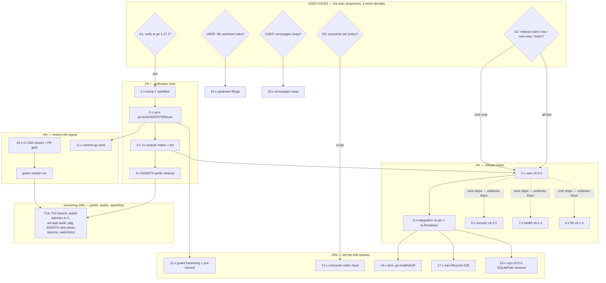

# SUPERB Plan v5 — Unification, Release Trains & the Gated Unlocks

**Created:** 2026-09-29 00:45 CEST · **Predecessor:** `doc/planning/archived/2026-09-17_19-20_SUPERB-v4-drift-guards-security-adoption-and-gated-unlocks.md` (EXECUTED IN TRAINS 09-20/23, archived 2026-09-28) ← v3 (superseded UNEXECUTED) ← v2/v1 (archived).
**Inputs:** `TODO_LIST.md` (post 2026-09-28 docs-health harvest, 64 lines open-only), the three current status reports (`2026-09-24_16-52`, `2026-09-28_23-03`, `2026-09-29_00-05`), and the 2026-09-28/29 docs-health pass report (`docs/status/2026-09-29_00-38_docs-health-full-pass.md`).
**Location note:** this file lives in `docs/planning/` per EXPLICIT instruction (2026-09-29). The status tree was made canonical under `docs/` on 2026-09-28; if planning consolidates the same way, migrate `doc/planning/` → `docs/planning/` in one `git mv` train and update ~40 references. Until answered, `doc/planning/` keeps the existing verdict docs (composition-spike, cordis, papdashboard, core-v1-exit-criteria, design-decisions, …).

**Scope:** ALL open go-appkit work — every TODO_LIST item and every carried report item appears EXACTLY ONCE below (Coverage Map at the bottom proves it). Gated items are IN the plan with their gates named; **this plan does not self-authorize gates**.

---

## Verschlimmbesserung guards (non-negotiable)

1. **Gates stay gates.** G1 (unification), G2 (trains), G3 (consumer-pin policy), upstream filings, errorpages swap, browser-CSP environment: nothing here executes them without the user's word. The plan sequences, it does not decide.
2. **Released-module API discipline:** every train re-runs the mechanical API-break diff (`git archive <old-tag>` vs working tree, `go doc -all`, additions-only → minor; ANY removal/signature change → breaking per 0.x convention + migration notes).
3. **Frozen-fact discipline:** run ALL tree probes (directives, tags, suites) in one snapshot BEFORE writing AGENTS/CHANGELOG facts; `go mod tidy` can raise directives — re-probe after every tidy.
4. **Baseline-first:** green `go test` per module BEFORE refactors, even (especially) when the toolchain fights back.
5. **Docs trail actions:** verdicts and CHANGELOG lines land only after their evidence exists (the D1 lesson from the 00-38 report).
6. **One train at a time:** unification completes before the release trains start; integration re-pins only after core ships.

---

## 0. Pareto — what actually delivers

### The 1% → 51% of the result

**Two trains: (a) the go 1.27.1 unification, (b) the four release trains.**
Why they carry half the total value: EVERY workspace command, every LSP diagnostic, and two of three guard jobs are degraded or red until the floor unifies; and the reference consumer (cqrs-htmx) is **blocked on core > v0.5.1** — their go-etag stub-replace cannot drop until we ship. Two USER decisions (G1, G2) unblock ~60% of the backlog's preconditions. Everything else in this plan is worth less until these land.

### The 4% → 64% cumulative

**+ the CI SSH secret (P1) and the go.work tracked-status decision.** The dead CI signal hides every other gate's result (guards run red-on-red); the untracked go.work makes the directives job vacuous on fresh checkouts. Both are small, both are pure unblock.

### The 20% → 80% cumulative

**+ guard hardening (pre-commit wiring, semver-aware directives check, `toolchain` coverage), consumer-claim ritual mechanics, the integration re-pin + `ts.Shutdown` simplification, the cqrs lifecycle E2E, and the upstream filings (6 asks, all drafted, all USER-gated).** These close the classes that bit three times in September: directive re-drift, stale consumer claims, pin rot.

### The remaining 20% → 100%

Polish backlog (typed `seriesKey`, `Hook` type, testkit drain helper, `errors.Join` shape test, frame-ancestors assert, SSE×health E2E, `-hardened` example mode), art-dupl suppression audit + policy, pdg backlog (their repo), prompt-crusher merge (needs user intent), AGENTS deep slim-down, govulncheck + browser CSP (environment-blocked), post-train bench re-baselines, watchlists, demand-gated battery waves, core v1 exit-criteria graduation, standing rituals (cqrs cookbook, lessons.md). Full task tables below.

---

## Table A — Comprehensive plan (30–100 min tasks, impact-ordered)

| #   | Task                                                                                                                                                                                                                                     | Tier      | Effort      | Depends on       | Gate      | Customer value                                                                 |
| --- | ---------------------------------------------------------------------------------------------------------------------------------------------------------------------------------------------------------------------------------------- | --------- | ----------- | ---------------- | --------- | ------------------------------------------------------------------------------ |
| T01 | Unification train A: bump 7 satellite go.mods to 1.27.1 (`go mod tidy` each; re-probe directives after every tidy)                                                                                                                       | 1%        | 45m         | G1 = unify       | G1        | Unblocks every workspace command, LSP, and 2 guard jobs                        |
| T02 | Unification train B: sync go.work + root + AGENTS toolchain note + `documentedGoDirective`; guard green 11/11                                                                                                                            | 1%        | 30m         | T01              | G1        | Same                                                                           |
| T03 | Full 11-module matrix: build + vet + `test -race -count=1` + sequential golangci-lint; fix fallout                                                                                                                                       | 1%        | 90m         | T02              | —         | Proof the floor is real for consumers                                          |
| T04 | AGENTS cleanup: drop `GOTOOLCHAIN=go1.27.1 GOWORK=off` prefixes + stale GOEXPERIMENT notes (cap dance at 376/377)                                                                                                                        | 1%        | 30m         | T03              | —         | Next sessions stop tripping on dead prefixes                                   |
| T05 | Release train: **core v0.6.0** (testkit.Shutdown + hook-code tests + runHooks/sortedRoutes refactors): API-break diff vs v0.5.1, CHANGELOG date, hermetic verify, annotated tag, proxy check, AGENTS release line + `check-pin-drift.sh` | 1%        | 60m         | T03, G2 = trains | G2        | Unblocks cqrs-htmx (their stub-replace drop) + all published-surface consumers |
| T06 | Release train: **security v0.2.0** (example + THREAT_MODEL + example-only core dep; additions-only diff vs v0.1.0)                                                                                                                       | 1%        | 45m         | T03, G2          | G2        | Consumer-facing hardened-chain reference + threat model                        |
| T07 | Release train: **health v0.1.3** (NonceFromContext godoc fix + setStarted refactor)                                                                                                                                                      | 1%        | 45m         | T03, G2          | G2        | Correct godoc for every dashboard consumer                                     |
| T08 | Release train: **frh v0.1.4** (Register ProvideNamedValue + determinism + slices.Sort)                                                                                                                                                   | 1%        | 45m         | T03, G2          | G2        | Same-class hygiene                                                             |
| T09 | Integration re-pin train: go.mod + `documentedPins` + doc.go for new core; simplify `security_realtime_test.go` to published `ts.Shutdown`; suite green                                                                                  | 4%        | 30m         | T05              | —         | Integration tests what consumers actually resolve                              |
| T10 | CI SSH secret restore + ssh-agent step gated off `pull_request`; watch one fully green master run (matrix + 3 guards + proxy-smoke ×10)                                                                                                  | 4%        | 30m + async | owner action     | owner     | The signal for EVERYTHING else becomes real                                    |
| T11 | go.work: commit to the repo (it matches the unified state) + verify the `go-directives` job parses it on a fresh checkout                                                                                                                | 4%        | 30m         | T02              | —         | CI guard stops being vacuous                                                   |
| T12 | Guard hardening: semver-aware directives compare + `toolchain` directive coverage + wire `check-go-directives.sh`/`check-dependabot-parity.sh` into BuildFlow pre-commit                                                                 | 20%       | 60m         | T02              | —         | The 09-18/09-23 re-drift class dies at the source                              |
| T13 | Consumer-claim ritual mechanics (per G3 outcome): script that re-verifies AGENTS/FEATURES consumer pins after each cqrs-htmx release — or strip exact pins from AGENTS                                                                   | 20%       | 60m         | G3 answered      | G3        | Ends the 11-day-stale-claim class                                              |
| T14 | Integration `documentedPins` extension: assert go-health + samber/do + go-flightrecorder legs; guard follow-through                                                                                                                      | 20%       | 30m         | T09              | —         | Composition contracts fully pinned                                             |
| T15 | Upstream filings batch (all 6 drafted asks) or direct fixes where the repo is ours (go-health)                                                                                                                                           | 20%       | 60m         | user says file   | USER      | Unblocks F1 cliff fix at the source; better upstream docs                      |
| T16 | errorpages: `statusRecorder` → `httputil.ResponseRecorder` + suite                                                                                                                                                                       | 20%       | 30m         | user says go     | USER      | One ResponseWriter wrapper per job, one repo                                   |
| T17 | cqrs lifecycle E2E through a live appkit Service (register/dispatch/query + in-flight drain on Shutdown) — the last big uncovered module                                                                                                 | 20%       | 100m        | T09              | —         | 8/10 released modules composition-proven (from 7/10)                           |
| T18 | cqrs v0.6.0 train: remove deprecated `SQLitePath` alias; migration note; API-break diff                                                                                                                                                  | 20%       | 60m         | T03              | announced | Announced breaking change shipped on schedule                                  |
| T19 | Post-train re-baselines: otel benchmark suite; example E2Es (`example/`, `health/example`)                                                                                                                                               | 20%       | 45m         | T03              | —         | Numbers true on the new floor                                                  |
| T20 | AGENTS deep slim-down: extract per-module build commands / gotcha groups to module READMEs; restore ≥10 lines headroom                                                                                                                   | remaining | 90m         | —                | —         | The cap stops costing a trade per fact                                         |
| T21 | art-dupl suppression audit (~431 groups, both episodes never looked) + standing policy + corrected invocation recorded durably                                                                                                           | remaining | 90m         | —                | —         | "Zero harmful duplication" becomes earned                                      |
| T22 | pdg backlog sweep (their repo): header relabel, `(replace …)` rendering, doctor subcommand, `Graph.Consumers` severed-key fix, benchmark, release cut                                                                                    | remaining | 90m         | their repo       | —         | Consumer-attribution tooling trustworthy                                       |
| T23 | prompt-crusher-exec: resolve go.mod merge (HEAD vs master side), tidy, build, module-path reconciliation                                                                                                                                 | remaining | 30m         | user intent      | user      | Stops the cross-repo scan corruption spam                                      |
| T24 | Polish batch A: typed `seriesKey` in metrics.go + named `Hook` type                                                                                                                                                                      | remaining | 60m         | T03              | —         | Kills the last stringly-typed metric pair                                      |
| T25 | Polish batch B: `errors.Join` shape test + hardened-dashboard `frame-ancestors`/ordering asserts + SSE×health lifecycle E2E                                                                                                              | remaining | 90m         | T09              | —         | Contract edges that no test pins today                                         |
| T26 | Polish batch C: testkit drain-window helper + health example `-hardened` mode                                                                                                                                                            | remaining | 60m         | T09              | —         | Drain contracts stop being hand-rolled                                         |
| T27 | govulncheck on health + security (networked machine)                                                                                                                                                                                     | remaining | 30m         | env              | env       | Advisory visibility                                                            |
| T28 | Browser CSP pass over `DashboardHardenedPreset` (chromedp/Chrome) + link evidence into THREAT_MODEL                                                                                                                                      | remaining | 60m         | env              | env       | Browser-side proof for the hardened story                                      |
| T29 | Watchlist refresh sweep: cordis consumers, PapDashboard v0.3.1+, nixpkgs toolchain, dprint exit-14, cqrs-htmx v5 window                                                                                                                  | remaining | 30m         | —                | —         | Standing triggers re-checked in one sitting                                    |
| T30 | External-consumer proxy ritual: decide + document whether rolls-royce-mtuGoHelpCenter-golang/papdashboard integrations get verified per release                                                                                          | remaining | 30m         | policy           | —         | Release ritual scope made explicit                                             |
| T31 | lessons.md entry (crush-config repo, commit): "check GOTOOLCHAIN/go.work parity before trusting AGENTS build commands"                                                                                                                   | remaining | 12m         | —                | —         | Cross-project lesson lands where future sessions read                          |
| T32 | Standing rituals re-armed: cqrs cookbook re-verify (next go-cqrs-lite release), core v1 exit-criteria graduation check, battery-wave demand re-check                                                                                     | remaining | 30m         | triggers         | demand    | Demand-gated items stay honestly gated                                         |
| T33 | Battery waves W3–W5 (`httpx`, W4 ops kit, W5 realtime completions) — remain DEMAND-GATED; only the demand re-check (T32) is scheduled                                                                                                    | remaining | —           | demand signal    | demand    | New modules only on real consumer pull                                         |

## Table B — Micro-task decomposition (every step ≤ 12 min, full expansion of Table A)

| #    | Micro-task                                                                                                                                                       | ≤min                               | Parent | Gate/depends |
| ---- | ---------------------------------------------------------------------------------------------------------------------------------------------------------------- | ---------------------------------- | ------ | ------------ |
| 1.1  | `go mod tidy` cqrs + docs + realtime (GOTOOLCHAIN=go1.27.1 GOWORK=off); `grep '^go '` after each                                                                 | 12                                 | T01    | G1           |
| 1.2  | `go mod tidy` errorpages + flightrecorder + otel; re-probe                                                                                                       | 12                                 | T01    | G1           |
| 1.3  | `go mod tidy` flightrecorderhealth; re-probe; confirm 11/11 at 1.27.1                                                                                            | 12                                 | T01    | G1           |
| 2.1  | `go work use` all 11 dirs; `check-go-directives.sh` → green 11/11                                                                                                | 12                                 | T02    | 1.3          |
| 2.2  | AGENTS toolchain note → unified state (one frozen snapshot first)                                                                                                | 12                                 | T02    | 2.1          |
| 2.3  | `integration/pin_drift_test.go` `documentedGoDirective` → 1.27.1; module suite                                                                                   | 12                                 | T02    | 2.1          |
| 2.4  | Structure linter + pin-drift + parity guards re-run; commit-train note                                                                                           | 12                                 | T02    | 2.3          |
| 3.1  | Matrix script: build+vet all 11 modules, log failures                                                                                                            | 12                                 | T03    | 2.x          |
| 3.2  | `test -race -count=1` batch 1: root, testkit, cqrs                                                                                                               | 12                                 | T03    | 3.1          |
| 3.3  | `test -race` batch 2: health, frh, security, integration                                                                                                         | 12                                 | T03    | 3.1          |
| 3.4  | `test -race` batch 3: realtime, otel, docs, errorpages, flightrecorder                                                                                           | 12                                 | T03    | 3.1          |
| 3.5  | Sequential golangci-lint sweeps (4 modules per 12-min slot ×3)                                                                                                   | 12×3                               | T03    | 3.2–3.4      |
| 3.6  | Fix any fallout found; re-run affected slice                                                                                                                     | 12                                 | T03    | 3.5          |
| 4.1  | AGENTS build-command blocks: strip GOTOOLCHAIN prefixes                                                                                                          | 12                                 | T04    | 3.6          |
| 4.2  | AGENTS: retire stale GOEXPERIMENT notes (keep the jsonv2-default-on paragraph)                                                                                   | 12                                 | T04    | 4.1          |
| 4.3  | Structure-linter cap check after AGENTS edits (376/377 → verify ≤377)                                                                                            | 12                                 | T04    | 4.2          |
| 5.1  | core API-break diff: `git archive v0.5.1` extract + `go doc -all` both sides + diff                                                                              | 12                                 | T05    | G2           |
| 5.2  | Root CHANGELOG `[Unreleased]` → `[0.6.0] - date` (Added/Changed sections)                                                                                        | 12                                 | T05    | 5.1          |
| 5.3  | Hermetic verify: root + testkit suites + lint 0                                                                                                                  | 12                                 | T05    | 5.2          |
| 5.4  | Annotated tag `v0.6.0` (message states the delta)                                                                                                                | 12                                 | T05    | 5.3          |
| 5.5  | Push + fresh-consumer proxy check per recipe                                                                                                                     | 12                                 | T05    | 5.4          |
| 5.6  | AGENTS release line + module bullet + TODO header + `check-pin-drift.sh`                                                                                         | 12                                 | T05    | 5.5          |
| 6.1  | security API-break diff vs v0.1.0                                                                                                                                | 12                                 | T06    | G2           |
| 6.2  | security CHANGELOG date → v0.2.0; hermetic suite + lint                                                                                                          | 12                                 | T06    | 6.1          |
| 6.3  | Tag `security/v0.2.0` + push + proxy check + AGENTS/TODO same-train                                                                                              | 12                                 | T06    | 6.2          |
| 7.1  | health API-break diff vs v0.1.2 (expect additions-only)                                                                                                          | 12                                 | T07    | G2           |
| 7.2  | health CHANGELOG date → v0.1.3; suite + lint                                                                                                                     | 12                                 | T07    | 7.1          |
| 7.3  | Tag `health/v0.1.3` + push + proxy + AGENTS/TODO same-train                                                                                                      | 12                                 | T07    | 7.2          |
| 8.1  | frh API-break diff vs v0.1.3                                                                                                                                     | 12                                 | T08    | G2           |
| 8.2  | frh CHANGELOG date → v0.1.4; suite + lint                                                                                                                        | 12                                 | T08    | 8.1          |
| 8.3  | Tag `flightrecorderhealth/v0.1.4` + push + proxy + AGENTS/TODO                                                                                                   | 12                                 | T08    | 8.2          |
| 9.1  | integration: bump core pin in go.mod + `documentedPins` + doc.go (one change)                                                                                    | 12                                 | T09    | 5.6          |
| 9.2  | `security_realtime_test.go` cleanup → published `ts.Shutdown`; suite + lint                                                                                      | 12                                 | T09    | 9.1          |
| 10.1 | Owner: set `SSH_PRIVATE_KEY` secret (repo settings)                                                                                                              | 12                                 | T10    | owner        |
| 10.2 | ci.yml: gate the ssh-agent step off `pull_request` events                                                                                                        | 12                                 | T10    | —            |
| 10.3 | Push a no-op docs change; watch the matrix + guards + proxy-smoke to green                                                                                       | async                              | T10    | 10.1–10.2    |
| 11.1 | Commit go.work (drop it from .gitignore if listed)                                                                                                               | 12                                 | T11    | 2.1          |
| 11.2 | Simulate fresh checkout (worktree) → run `check-go-directives.sh` there                                                                                          | 12                                 | T11    | 11.1         |
| 12.1 | Guard: semver-aware compare (sort -V / version floor logic) + negative test                                                                                      | 12                                 | T12    | 2.1          |
| 12.2 | Guard: `toolchain` directive coverage + negative test                                                                                                            | 12                                 | T12    | 12.1         |
| 12.3 | BuildFlow: wire both guards into pre-commit config; test fire + pass paths                                                                                       | 12                                 | T12    | 12.2         |
| 13.1 | G3 policy per user answer: write `scripts/check-consumer-claims.sh` skeleton (grep AGENTS/FEATURES pins vs `git -C cqrs-htmx show <tag>`)                        | 12                                 | T13    | G3           |
| 13.2 | Wire into the release ritual step 5; dry-run against current claims                                                                                              | 12                                 | T13    | 13.1         |
| 14.1 | `documentedPins`: add go-health v0.2.0 + do v2.1.0 + fr v0.2.0 legs; suite                                                                                       | 12                                 | T14    | 9.x          |
| 14.2 | `check-pin-drift.sh`: assert the three new legs vs the proxy                                                                                                     | 12                                 | T14    | 14.1         |
| 15.1 | File go-health pack as direct fixes (our repo): sentinel + Evaluate godoc + restart/rearm                                                                        | 12×2                               | T15    | USER         |
| 15.2 | File go-sse `ReplayFiltered` + httputil Logging-context + `NewServerListener` asks (github-voice pass first)                                                     | 12×2                               | T15    | USER         |
| 15.3 | File samber/do lazy-healthy doc note                                                                                                                             | 12                                 | T15    | USER         |
| 16.1 | errorpages: swap `statusRecorder` → `httputil.ResponseRecorder`; suite + lint                                                                                    | 12                                 | T16    | USER         |
| 16.2 | errorpages CHANGELOG `[Unreleased]` line                                                                                                                         | 12                                 | T16    | 16.1         |
| 17.1 | cqrs E2E: scaffold `integration/cqrs_lifecycle_test.go` (pins + testkit.Serve)                                                                                   | 12                                 | T17    | 9.x          |
| 17.2 | Register decider + dispatch through a live Service (one green path)                                                                                              | 12                                 | T17    | 17.1         |
| 17.3 | Query + `DispatchQueryChecked` staleness path                                                                                                                    | 12                                 | T17    | 17.2         |
| 17.4 | In-flight command drain on Shutdown assertion                                                                                                                    | 12                                 | T17    | 17.3         |
| 17.5 | Lint + AGENTS integration table row + line-19 bullet                                                                                                             | 12                                 | T17    | 17.4         |
| 18.1 | cqrs: remove `SQLitePath` alias + deprecated branch; compile fallout list                                                                                        | 12                                 | T18    | T03          |
| 18.2 | Migration note (CHANGELOG Breaking + README snippet) + API-break diff vs v0.5.0                                                                                  | 12                                 | T18    | 18.1         |
| 18.3 | Suite + lint + tag `cqrs/v0.6.0` + proxy + AGENTS/TODO                                                                                                           | 12                                 | T18    | 18.2         |
| 19.1 | otel benchmark suite re-run (n≥5) vs README table; update if drifted >noise                                                                                      | 12                                 | T19    | 3.6          |
| 19.2 | frh Trigger benchmark re-run (episode-2 f-5 candidate)                                                                                                           | 12                                 | T19    | 3.6          |
| 19.3 | `example/` + `health/example` live E2E via Go prober                                                                                                             | 12                                 | T19    | 3.6          |
| 20.1 | AGENTS slim-down: extract per-module build-command blocks → each module README (batch 1: cqrs, realtime, otel)                                                   | 12                                 | T20    | —            |
| 20.2 | Extract batch 2 (docs, errorpages, flightrecorder, frh)                                                                                                          | 12                                 | T20    | 20.1         |
| 20.3 | Extract batch 3 (health, security) + AGENTS dedupe; linter cap verify                                                                                            | 12                                 | T20    | 20.2         |
| 21.1 | art-dupl suppression audit: run with `--show-suppressed` (or equivalent), triage batch 1                                                                         | 12                                 | T21    | —            |
| 21.2 | Triage batch 2 + record accepted/real classification                                                                                                             | 12                                 | T21    | 21.1         |
| 21.3 | Policy decision note + corrected invocation into recipes; Decision 13 cross-link                                                                                 | 12                                 | T21    | 21.2         |
| 22.1 | pdg: who-uses header relabel + `(replace …)` rendering                                                                                                           | 12                                 | T22    | their repo   |
| 22.2 | pdg: `Graph.Consumers` severed-key fix + tests                                                                                                                   | 12×2                               | T22    | 22.1         |
| 22.3 | pdg: doctor subcommand + parse-WARN one-liner mode                                                                                                               | 12×2                               | T22    | 22.2         |
| 22.4 | pdg: `/v4`-matching regression test + benchmark + release cut                                                                                                    | 12×2                               | T22    | 22.3         |
| 23.1 | prompt-crusher: resolve merge per user's side answer; tidy; build; path reconciliation                                                                           | 12×2                               | T23    | user         |
| 24.1 | `seriesKey` type: replace `                                                                                                                                      | `-join/SplitN in metrics.go; suite | 12     | T24          |
| 24.2 | `type Hook func(context.Context) error`: config.go + service.go signatures; suite                                                                                | 12                                 | T24    | 3.6          |
| 25.1 | `errors.Join` message-shape test (multi-hook failure text)                                                                                                       | 12                                 | T25    | 4.x          |
| 25.2 | hardened-dashboard: `frame-ancestors 'none'` + sorted-order asserts                                                                                              | 12                                 | T25    | 9.x          |
| 25.3 | SSE×health lifecycle E2E (drain during an open stream)                                                                                                           | 12                                 | T25    | 9.x          |
| 26.1 | testkit drain-window assertion helper + migrate 2 hand-rolled tests                                                                                              | 12                                 | T26    | 9.x          |
| 26.2 | health example `-hardened` mode (T21-style wiring) + README note                                                                                                 | 12                                 | T26    | 9.x          |
| 27.1 | govulncheck health + security on a networked machine; triage output                                                                                              | 12                                 | T27    | env          |
| 28.1 | Browser CSP pass: chromedp script against the hardened example; capture verdicts                                                                                 | 12                                 | T28    | env          |
| 28.2 | Link browser evidence into security/THREAT_MODEL.md composition section                                                                                          | 12                                 | T28    | 28.1         |
| 29.1 | Watchlist sweep: cordis count, PapDashboard, nixpkgs, dprint, cqrs-htmx v5 — update TODO rows with as-of dates                                                   | 12                                 | T29    | —            |
| 30.1 | External-consumer ritual: write the decision + one-paragraph recipe section                                                                                      | 12                                 | T30    | policy       |
| 31.1 | crush-config repo: add the GOTOOLCHAIN/go.work lesson to `references/lessons.md` (commit there)                                                                  | 12                                 | T31    | —            |
| 32.1 | Rituals re-arm: calendar/trigger notes for cqrs-cookbook, v1-criteria check, battery demand re-check                                                             | 12                                 | T32    | —            |
| 33–  | Battery waves: NOT decomposed — demand-gated; the canonical spec owns the breakdown (`doc/feedback/processed/2026-09-04_batteries-included-sdk-gap-analysis.md`) | —                                  | T33    | demand       |

---

## Execution graph

Reading order: the two 1% subgraphs first (they are independent of each other — unification touches directives, trains touch CHANGELOGs/tags — but both need the T03 matrix green). The 4% signal items can run in parallel by the owner. Everything in HARDEN waits on the integration re-pin (9.x) so tests stay consumer-real. REST is deliberately unscheduled until the 20% lands.

---

## Coverage map — TODO_LIST (2026-09-28) → plan

| TODO_LIST item                            | Plan task(s)                                                                                |
| ----------------------------------------- | ------------------------------------------------------------------------------------------- |
| P1 CI SSH secret                          | T10                                                                                         |
| P2 unification train                      | T01–T04                                                                                     |
| P2 re-drift class + guard hardening       | T12                                                                                         |
| P2 go.work tracked + 11-dir assert        | T11                                                                                         |
| P2 release trains ×4 + post-core re-pin   | T05–T09                                                                                     |
| P2 cqrs lifecycle E2E                     | T17                                                                                         |
| P2 browser CSP pass                       | T28                                                                                         |
| P2 errorpages swap                        | T16                                                                                         |
| P2 [~] health F1 cliff (upstream half)    | T15                                                                                         |
| P2 [~] composition on httputil.Server     | BLOCKED upstream (`NewServerListener`) — T15 files the ask; no refactor task until answered |
| P2 [~] upstream asks                      | T15                                                                                         |
| P2 [~] govulncheck                        | T27                                                                                         |
| P2 [~] otel benchstat re-baseline         | T19                                                                                         |
| P2 [~] core v1 exit criteria              | T32 (graduation check; draft stays)                                                         |
| P2 consumer-claim ritual                  | T13                                                                                         |
| P3 composition watchlist                  | T25 (+T17)                                                                                  |
| P3 battery waves W3–W5                    | T33 (+T32 demand re-check)                                                                  |
| P3 cqrs encryption/signing opt-ins        | demand-gated — T32 re-check only (no task by design)                                        |
| P3 cqrs-htmx setup suite hermetic run     | T32 watchlist (their repo)                                                                  |
| P3 AGENTS deep slim-down                  | T20                                                                                         |
| P3 cqrs cookbook ritual                   | T32                                                                                         |
| P3 BuildFlow dprint exit-14               | T29 (upstream watch)                                                                        |
| P3 samber-do-auditlog hooks               | demand-gated — T32 re-check                                                                 |
| P3 pdg tool polish                        | T22                                                                                         |
| P3 health/polish backlog                  | T24–T26                                                                                     |
| P3 [~] cordis bridge                      | T29 (trigger watch; no build task)                                                          |
| P3 [~] PapDashboard                       | T29                                                                                         |
| P3 [~] nixpkgs toolchain watch            | T29                                                                                         |
| P3 watchlist refresh                      | T29                                                                                         |
| P3 (added) cqrs v0.6.0 SQLitePath removal | T18                                                                                         |
| Report-carried: prompt-crusher merge      | T23                                                                                         |
| Report-carried: art-dupl audit + policy   | T21                                                                                         |
| Report-carried: lessons.md entry          | T31                                                                                         |
| Report-carried: external-consumer ritual  | T30                                                                                         |
| Report-carried: LSP verification          | (2.x, folded into T03 — live diagnostics already observed 09-29)                            |

Every open TODO_LIST line maps to exactly one task cluster. Nothing from the three current reports' §f lists is uncaptured (their go-appkit items were executed by the 2026-09-28/29 passes; cross-repo items are T22/T23/T29).

---

## Open gates (blocking the critical path)

| Gate  | Question                                            | Unblocks                                |
| ----- | --------------------------------------------------- | --------------------------------------- |
| G1    | Commit to go 1.27.1 across all 11 modules?          | T01–T04 (the whole 1% unification tier) |
| G2    | Release trains: all four / core-only / batch?       | T05–T09 (+ cqrs-htmx's unblock)         |
| G3    | Consumer-pin claims: keep (with ritual) or drop?    | T13                                     |
| USER  | File the 6 upstream asks (or direct-fix go-health)? | T15                                     |
| USER  | errorpages `statusRecorder` swap?                   | T16                                     |
| owner | `SSH_PRIVATE_KEY` secret                            | T10                                     |
| user  | prompt-crusher merge intent (HEAD vs master side)   | T23                                     |

_Plan ends. Execution starts on the user's word — one gate answer each; the plan handles sequencing._
