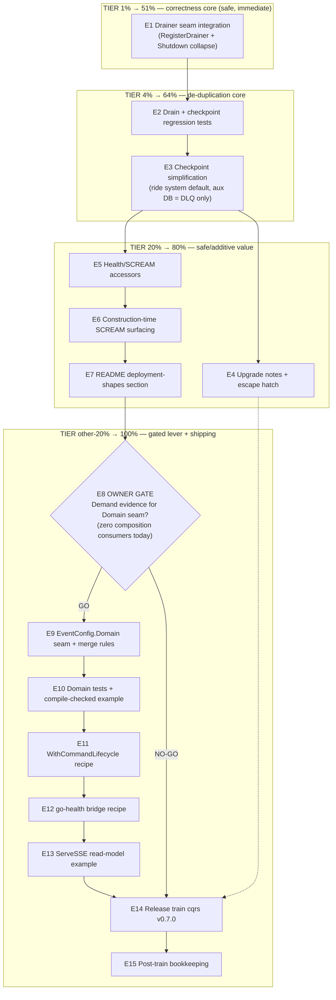

# SUPERB Plan — cqrs composition-root adoption closure (system + metaengine)

**Date:** 2026-10-06 15:20 · **Status:** planned, awaiting execution · **Source:** library deep-dive `docs/research/2026-10-06_go-cqrs-lite-system-metaengine-deep-dive.html` (adoption score **52/100**), routed as the P2 cqrs item in `TODO_LIST.md`
**Scope:** the go-appkit `cqrs` module ONLY (plus its README/CHANGELOG, integration re-pin, AGENTS/TODO bookkeeping). Everything else in `TODO_LIST.md` is explicitly out of scope.
**Anti-verschlimmbesser contract:** additive-only public API; zero removals; the demand-gated `Domain` seam ships only behind an explicit owner decision (E8); every behavioral change carries an upgrade note; every task has a verify step. If a task cannot be verified green, it is reverted, not "improved".

---

## 1. Context — why this plan exists

The 2026-10-06 deep dive audited go-appkit's `cqrs` wrapper against the pinned
`system/v4 v4.10.2` + `metaengine/v4 v4.16.1` (both ARE the latest published tags). Verdict: the
command side and operator story are superb; four gaps hold the score at 52/100:

| #  | Finding                                                                                                                                                                                               | Evidence                                                   | Grade                             |
| -- | ----------------------------------------------------------------------------------------------------------------------------------------------------------------------------------------------------- | ---------------------------------------------------------- | --------------------------------- |
| F1 | Wrapper seals `system.DomainConfig` — no metaengine read-model declarations (`Lookup`/`QuerySet`/`Evolve`, typed `Find`/`Get`), no coeffect gate, no `Timers`, no `WithCommandLifecycle`              | `cqrs/eventservice.go:473-485`                             | Missed, high                      |
| F2 | ~150 lines aux-DB checkpoint plumbing duplicate system's engine-backed default (ADR-0142, table `system_checkpoints` vs old SQL table `checkpoints`)                                                  | `cqrs/eventservice.go:286-443`                             | Partially used                    |
| F3 | Hand-rolled in-flight drain bypasses `RegisterDrainer`; on drain-timeout `Shutdown` returns **without** `GracefulClose` → engines leak                                                                | `cqrs/commands.go:117-180`, `cqrs/eventservice.go:690-713` | Partially used, correctness-grade |
| F4 | `HealthCheck`/`HealthCheckDetailed`/`ScreamReport`/`VerifyProjections` unused; a YAML deployment without `RoleProjections` silently gets a MEMORY projection store and nobody sees the SCREAM warning | `cqrs/eventservice.go:637-678`                             | Missed, medium                    |

Already DONE in the audit pass (2026-10-06, committed): doc-drift fixes (stale GOEXPERIMENT
note, phantom `EventService.Status()`, CheckpointStore doc claims, AGENTS dep-table rows).

**Repo invariants this plan must respect**

- Hermetic verify: `cd cqrs && GOWORK=off GOTOOLCHAIN=go1.27.1 go test ./... -race -count=1` (machine default is go1.26.7 + `GOTOOLCHAIN=local`).
- Lint one module at a time from its own dir: `cd cqrs && golangci-lint run ./...`; `cqrs-lint` from inside `cqrs/` (scorecard delta recorded in CHANGELOG after wrapper changes — repo ritual).
- Doc snippets are code: compile-check every Go snippet in a scratch module before shipping.
- `integration/` is NOT a workspace member: always `GOWORK=off` there; re-pin cqrs + `documentedPins` fixture on release.
- Release ritual: API-break check (`go doc -all` diff vs `cqrs/v0.6.0`), CHANGELOG dating, annotated tag + `./scripts/pre-tag-checks.sh`, guards (`check-pin-drift.sh`, `check-go-directives.sh`) green before push, AGENTS Release State + TODO_LIST header updated in the same train.
- AGENTS.md length cap ≤ 377 counted lines (`go-structure-linter`).

---

## 2. Pareto breakdown

### The 1% that deliver 51% — **E1: the Drainer fix**

A single `sys.RegisterDrainer(inFile)` call plus collapsing `Shutdown` to `GracefulClose`
delegation. Kills the only correctness-grade defect (leaked engines on drain timeout), deletes
hand-rolled sequencing, and inherits the library's guaranteed close-attempt semantics
("if the context expires during draining, Close is still attempted" — system godoc).
~5 micro-tasks, ~50 min. No API change.

### The 4% that deliver 64% — **E1 + E2 + E3: de-duplication core**

Adds the checkpoint simplification (F2): stop overriding `DomainConfig.CheckpointStore` for
sqlite-file deployments, keep the aux `*sql.DB` solely for the DLQ default, delete
`applyCheckpointSchema` + the `eventstore` import + the checkpoint half of `buildAuxStores`
(~100 LOC net-negative, one fewer sqlite connection), plus regression tests proving checkpoint
persistence across restarts via the system default (`system_checkpoints` collection).
Zero new API.

### The 20% that deliver 80% — **E1–E7: all safe value**

Adds health/SCREAM accessors (F4: `HealthCheck`, `EngineHealth`, `ScreamReport` + construction-time
SCREAM surfacing so the silent-memory-projection-store class of mistake becomes visible), the
operator "deployment shapes" README section (buses, priority, materialized views, durability,
engine pools, cache, manifest pinning), and the upgrade notes. Everything here is internal or
additive — the demand-gated surface is untouched.

### The other 20% to reach 100% — **E8–E15: the gated big lever + shipping**

The `EventConfig.Domain` passthrough (F1) — the single highest-value item of the audit — plus its
dependents (lifecycle recipe, go-health bridge, ServeSSE example) and the v0.7.0 release train.
This is the ONLY part that can verschlimmbessern if built without demand: today there are zero
cqrs+realtime composition consumers (TODO_LIST W5), and the wrapper surface is deliberately
demand-driven (2026-09-04 deep-dive routing). Therefore: E8 decision gate FIRST (owner call,
linked to W5-C2 demand), implementation strictly behind it, additive-only, then the train.

### Explicitly out of scope (tracked elsewhere in TODO_LIST)

W3-W5 batteries, systemd/core release trains, CI `SSH_PRIVATE_KEY` fix, httputil composition,
health upstream asks, all P1/P3 watchlist items.

---

## 3. Execution graph

Parallelism: E4–E7 are mutually independent (can run in any order / parallel once E3 lands);
E11–E13 are independent of each other behind E10.

---

## 4. Comprehensive plan — medium granularity (30–100 min per task)

Sorted by importance → impact → effort → customer-value (execution order; gates make it
also the priority order). Customer = go-appkit/cqrs consumers (cqrs-htmx setup class, bank-sync
fleet candidates).

| #   | Task                                                                                                                                                                                                                                                                                                                               | Tier      | Impact (1-5) | Effort (min) | Customer value                                                                   | Depends         | Verify (exit criteria)                                                          |
| --- | ---------------------------------------------------------------------------------------------------------------------------------------------------------------------------------------------------------------------------------------------------------------------------------------------------------------------------------- | --------- | ------------ | ------------ | -------------------------------------------------------------------------------- | --------------- | ------------------------------------------------------------------------------- |
| E1  | Drainer seam integration: `RegisterDrainer(inFile)` in `buildSystem`; `Shutdown` collapses to `GracefulClose`; godoc + focused drain-timeout test; drain-error assertions updated                                                                                                                                                  | 1% → 51%  | 5            | 60           | No leaked engines in rolling deploys; smaller surface                            | —               | race suite green; NEW test proves close runs despite drain-ctx expiry           |
| E2  | Regression tests: checkpoint persistence across restart via system default; consumer override wins; integration lifecycle drain expectations reconciled                                                                                                                                                                            | 4% → 64%  | 4            | 70           | Upgrade confidence (no silent full replays except the documented one)            | E1              | new tests green under `-race`; integration suite green (GOWORK=off)             |
| E3  | Checkpoint simplification: drop SQL checkpoint store creation; delete `applyCheckpointSchema` + `eventstore` import; aux DB retained only for default DLQ; docs of `CheckpointStore`/`DB()` updated                                                                                                                                | 4% → 64%  | 4            | 80           | Net −~100 LOC; one fewer sqlite connection; checkpoints live with the engine     | E2              | suite green; `deploymentUsesSQLiteFile`/`openAuxResources` branch coverage kept |
| E4  | Upgrade notes + escape hatch: CHANGELOG entries; README note (checkpoint moves `checkpoints` → `system_checkpoints`, one-time replay, escape hatch = keep passing `eventstore.NewSQLiteCheckpointStore`); compile-check the hatch snippet                                                                                          | 20% → 80% | 3            | 30           | Zero-surprise upgrades                                                           | E3              | snippet compiles in scratch module                                              |
| E5  | Health/SCREAM accessors: `HealthCheck(ctx)`, `EngineHealth(ctx)`, `ScreamReport()` + tests + README accessor table + go-health wiring snippet                                                                                                                                                                                      | 20% → 80% | 3            | 70           | K8s-grade probes + dashboards for engines, not just workers                      | —               | accessor tests green; snippet compile-checked                                   |
| E6  | Construction-time SCREAM surfacing: log `sys.ScreamReport()` errors/warnings via `cfg.Logger` in `NewEventService`; test with a memory-fallback deployment                                                                                                                                                                         | 20% → 80% | 2            | 40           | The silent volatile-read-model mistake becomes visible at boot                   | E5              | test captures log lines; clean report logs nothing                              |
| E7  | README "Deployment shapes" section: buses/publish, priority, materialized views, durability, engine pools, cache, `manifest_path`/`acknowledge_warnings` — YAML validated against `system.LoadConfig` in a test                                                                                                                    | 20% → 80% | 2            | 60           | Operators discover the knobs the operator-story exists for                       | —               | every YAML snippet round-trips through `LoadConfig` in a cqrs test              |
| E8  | OWNER GATE: demand decision for the Domain seam — decision brief (zero composition consumers today, W5-C2 linkage, additive-only proposal, ~2 dev-days) recorded in TODO_LIST                                                                                                                                                      | other 20% | 5 (gated)    | 30           | Prevents verschlimmbessern-by-speculation                                        | E7              | verdict recorded; plan proceeds on GO, trains on NO-GO                          |
| E9  | `EventConfig.Domain *system.DomainConfig` passthrough + merge rules (bootstrap-skip when consumer declares ≥1 projection; middleware `[inFile] + Domain.Middleware + CommandMiddleware`; derived host-options/checkpoint wins; `Events`/`Timers`/decoders/`Evolutions`/`ShutdownDependencies` verbatim; nil-Domain byte-identical) | other 20% | 5            | 100          | Read models become declarations: planner, indexes, typed `Find`/`Get`, typo gate | E8=GO           | nil-Domain suite unchanged green; cqrs-lint scorecard delta recorded            |
| E10 | Domain seam tests + example: QuerySet→`Find` round-trip; coeffect gate error; bootstrap skip; Evolutions/Lookup; runnable godoc example                                                                                                                                                                                            | other 20% | 5            | 100          | Compile-checked proof the metaengine surface works through appkit                | E9              | all green under `-race`; example output verified                                |
| E11 | `WithCommandLifecycle` recipe: README section wiring recorder middleware + prebuilt projections through `Domain` (docs-only — no wrapper code)                                                                                                                                                                                     | other 20% | 2            | 40           | Command audit trail without new API                                              | E10             | snippet compile-checked                                                         |
| E12 | go-health bridge recipe: `appkithealth.NewProbe` check funcs over `es.HealthCheck`/lag (docs; optional cross-link in health README)                                                                                                                                                                                                | other 20% | 2            | 40           | One dashboard for HTTP + engines                                                 | E5              | snippet compile-checked                                                         |
| E13 | ServeSSE example: `metaengine.NewWatcher` + `ServeSSE` over a declared collection; httptest stream assertion; realtime-module pairing note; (stretch) integration E2E                                                                                                                                                              | other 20% | 2            | 60           | Live read-model UI push, pairs with appkit/realtime                              | E10             | example test green; stretch = integration test green                            |
| E14 | Release train `cqrs/v0.7.0`: API-break check (expect additions-only), CHANGELOG dating, hermetic verify, integration re-pin + `documentedPins`, both guards, annotated tag + `pre-tag-checks.sh`, push + proxy verify (networked machine)                                                                                          | other 20% | 4            | 90           | Consumers get the value at a real tag                                            | E4 (+E13 if GO) | `pre-tag-checks` green; proxy smoke passes on networked box                     |
| E15 | Post-train bookkeeping: AGENTS Release State + cqrs bullet + TODO_LIST close-out; `go-structure-linter` AGENTS length ≤ 377                                                                                                                                                                                                        | other 20% | 2            | 40           | Memory stays true (the v0.5.1-while-AGENTS-said-v0.5.0 class becomes impossible) | E14             | guards green; linter 0 findings                                                 |

**Totals:** 15 epics, ~1010 min ≈ 2 focused days. Tiers 1%+4%+20% (E1–E7) = 440 min ≈ 1 day, all safe.

---

## 5. Fine breakdown — micro tasks (≤ 12 min each)

63 tasks, grouped by epic, sorted by importance within the execution order. Every task ends with
its verify step — a task is done only when its verify is green.

| ID      | Task                                                                                                                                                                             | Min | Verify                                              |
| ------- | -------------------------------------------------------------------------------------------------------------------------------------------------------------------------------- | --- | --------------------------------------------------- |
| **E1**  | **Drainer seam integration (1% → 51%)**                                                                                                                                          |     |                                                     |
| E1.1    | `buildSystem`: add `sys.RegisterDrainer(inFile)` after `system.New`                                                                                                              | 6   | `go build ./...` green                              |
| E1.2    | `Shutdown`: drop manual `inFile.drain` + early return; delegate to `sys.GracefulClose(ctx)`                                                                                      | 8   | existing race suite green                           |
| E1.3    | Update `Shutdown`/inFlightTracker godoc (drain inside GracefulClose; close always attempted)                                                                                     | 10  | doc reads true vs system godoc                      |
| E1.4    | New test: parked in-flight command + expired drain ctx → closers still ran (no engine leak)                                                                                      | 12  | `go test -run TestShutdownDrainTimeout -race` green |
| E1.5    | Reconcile drain-error assertions in `commands_test.go`/`eventservice_test.go` (error now joined from GracefulClose)                                                              | 12  | full module suite green                             |
| **E2**  | **Regression tests (4% → 64%)**                                                                                                                                                  |     |                                                     |
| E2.1    | Test setup: sqlite-file svc, dispatch + process one event, graceful shutdown (part 1 of restart round-trip)                                                                      | 12  | test compiles + phase 1 green                       |
| E2.2    | Reopen same DSN → assert checkpoint resumed (no full replay; worker caught up without reprocessing)                                                                              | 10  | round-trip green under `-race`                      |
| E2.3    | Test: consumer `CheckpointStore` override still wins over system default                                                                                                         | 8   | green                                               |
| E2.4    | `integration/cqrs_lifecycle_test.go`: reconcile drain-semantics expectations (GOWORK=off)                                                                                        | 12  | integration suite green                             |
| E2.5    | Full hermetic race suite + `golangci-lint run ./...` from `cqrs/`                                                                                                                | 10  | 0 issues                                            |
| **E3**  | **Checkpoint simplification (4% → 64%)**                                                                                                                                         |     |                                                     |
| E3.1    | `buildAuxStores`: stop creating the SQL checkpoint store; return `cfg.CheckpointStore` only                                                                                      | 10  | build + suite green (E2 tests prove persistence)    |
| E3.2    | Delete `applyCheckpointSchema` + `eventstore` import + now-unused `SQLiteCheckpointSchema` path                                                                                  | 10  | `go vet` green; no dangling refs                    |
| E3.3    | `openAuxResources`: aux DB opens only when default DLQ wanted on sqlite-file; simplify `wantDefaultCP` logic                                                                     | 12  | branch tests adjusted + green                       |
| E3.4    | Prune `auxDSN`/`DB()` godocs (aux DB is now DLQ-only)                                                                                                                            | 8   | docs read true                                      |
| E3.5    | `EventConfig.CheckpointStore` godoc: default = system engine-backed (ADR-0142); override for legacy/escape                                                                       | 8   | godoc matches system DomainConfig doc               |
| **E4**  | **Upgrade notes + escape hatch (20% → 80%)**                                                                                                                                     |     |                                                     |
| E4.1    | CHANGELOG `[Unreleased]`: Changed (drain path, checkpoint store location + one-time replay), Added (health accessors, [Domain])                                                  | 12  | keep-a-changelog format                             |
| E4.2    | README upgrade note: `checkpoints` table → `system_checkpoints` collection; one-time replay is safe (read models are derived); escape hatch snippet                              | 10  | note states hatch + why replay is safe              |
| E4.3    | Compile-check escape-hatch snippet (`eventstore.NewSQLiteCheckpointStore` via `DB()`) in scratch module                                                                          | 8   | scratch `go build` green                            |
| **E5**  | **Health/SCREAM accessors (20% → 80%)**                                                                                                                                          |     |                                                     |
| E5.1    | Add `HealthCheck(ctx) error` + `EngineHealth(ctx) []system.EngineHealth` delegating methods + godoc                                                                              | 10  | build green                                         |
| E5.2    | Add `ScreamReport() *system.ScreamReport` accessor                                                                                                                               | 5   | build green                                         |
| E5.3    | Tests: sqlite svc → HealthCheck nil, EngineHealth non-empty w/ name+status, ScreamReport non-nil                                                                                 | 12  | green under `-race`                                 |
| E5.4    | README Accessors table rows + go-health wiring snippet (`appkithealth.NewProbe` with `es.HealthCheck`)                                                                           | 12  | snippet compile-checked                             |
| **E6**  | **Construction-time SCREAM surfacing (20% → 80%)**                                                                                                                               |     |                                                     |
| E6.1    | `NewEventService`: after `buildSystem`, log `ScreamReport()` errors (ERROR) / warnings (WARN) via `cfg.Logger` or `slog.Default()`                                               | 12  | build green                                         |
| E6.2    | Test: deployment without `RoleProjections` (memory fallback) → construction logs a SCREAM warning                                                                                | 12  | captured-log assertion green                        |
| E6.3    | Test: clean report → no SCREAM log lines                                                                                                                                         | 8   | green                                               |
| **E7**  | **README deployment-shapes section (20% → 80%)**                                                                                                                                 |     |                                                     |
| E7.1    | Section: `buses` + `publish` fan-out YAML + `PublisherFor` note                                                                                                                  | 12  | snippet in E7.4 test                                |
| E7.2    | Section: `priority` (global/perEngine/perQuery) + `materialized_views` + `durability` tiers                                                                                      | 12  | snippet in E7.4 test                                |
| E7.3    | Section: `manifest_path` + `acknowledge_warnings` + mixed `engines` pools + `cache` tiers                                                                                        | 12  | snippet in E7.4 test                                |
| E7.4    | Test: each README YAML snippet round-trips through `system.LoadConfig` (testdata files)                                                                                          | 12  | test green                                          |
| **E8**  | **Owner gate (other 20%)**                                                                                                                                                       |     |                                                     |
| E8.1    | Decision brief: demand evidence (0 composition consumers; W5-C2 is the first), additive-only API sketch, cost ~2 days, risk (v5 rename exposure of `system.DomainConfig` fields) | 12  | brief appended to TODO_LIST item                    |
| E8.2    | OWNER decision recorded (GO / NO-GO / GO-on-W5-C2)                                                                                                                               | 5   | verdict in TODO_LIST                                |
| **E9**  | **`EventConfig.Domain` seam (other 20%, GO only)**                                                                                                                               |     |                                                     |
| E9.1    | Add `Domain *system.DomainConfig` field + godoc merge contract                                                                                                                   | 10  | build green                                         |
| E9.2    | `mergeDomain`: consumer `Projections` + bootstrap appended ONLY when consumer declares none                                                                                      | 12  | unit test E10.3                                     |
| E9.3    | Middleware merge `[inFile] + Domain.Middleware + cfg.CommandMiddleware`; `QueryMiddleware` unchanged                                                                             | 12  | ordering test                                       |
| E9.4    | Merge `ProjectionHostOptions`/`CheckpointStore` (derived wins); passthrough `Events`, `Timers`, `Evolutions`, decoders, `ShutdownDependencies`, `Commands`/`Queries` funcs       | 12  | each field covered by a test                        |
| E9.5    | Prove nil-Domain path byte-identical: full existing suite green with zero test edits                                                                                             | 10  | suite diff empty                                    |
| E9.6    | Lint pass: exhaustruct nolints, wrapcheck delegations                                                                                                                            | 8   | 0 lint issues                                       |
| E9.7    | `cqrs-lint` from `cqrs/` + scorecard delta note                                                                                                                                  | 10  | delta in CHANGELOG                                  |
| **E10** | **Domain tests + example (other 20%)**                                                                                                                                           |     |                                                     |
| E10.1   | Test: `QuerySet` declaration → `system.Find` filtered+sorted round-trip through `EventService`                                                                                   | 12  | green                                               |
| E10.2   | Test: coeffect gate — projection on undeclared event type fails `NewEventService` with `ErrDanglingEventSubscription`                                                            | 10  | green                                               |
| E10.3   | Test: bootstrap skipped when consumer declares ≥1 projection (host registers only consumer decls + adapter)                                                                      | 12  | green                                               |
| E10.4   | Test: `Evolve`/`Lookup` declarations + `system.Get` point read                                                                                                                   | 12  | green                                               |
| E10.5   | Runnable godoc example with verified output                                                                                                                                      | 12  | `go test -run Example` green                        |
| E10.6   | Hermetic race suite + scratch-module compile of the README quickstart snippet                                                                                                    | 10  | both green                                          |
| **E11** | **WithCommandLifecycle recipe (other 20%)**                                                                                                                                      |     |                                                     |
| E11.1   | README section: recorder + middleware pair + `cl.Projections` wired through `Domain`                                                                                             | 12  | written                                             |
| E11.2   | Compile-check the recipe snippet in scratch module                                                                                                                               | 8   | green                                               |
| E11.3   | Cross-link from the TODO_LIST cqrs item                                                                                                                                          | 5   | link resolves                                       |
| **E12** | **go-health bridge recipe (other 20%)**                                                                                                                                          |     |                                                     |
| E12.1   | cqrs README section: `appkithealth.NewProbe` check funcs over `es.HealthCheck` + `LagPerProjection`                                                                              | 12  | written                                             |
| E12.2   | Compile-check snippet                                                                                                                                                            | 8   | green                                               |
| E12.3   | Optional cross-link in health module README                                                                                                                                      | 5   | link resolves                                       |
| **E13** | **ServeSSE example (other 20%)**                                                                                                                                                 |     |                                                     |
| E13.1   | Example: `metaengine.NewWatcher[TaskView]` over declared collection + `metaengine.ServeSSE` handler                                                                              | 12  | example test compiles                               |
| E13.2   | Example test: httptest client asserts streamed events after an `Apply` (dispatch)                                                                                                | 12  | green                                               |
| E13.3   | README note: read-model streaming pairs with appkit/realtime (raw-event vs materialized distinction)                                                                             | 12  | written                                             |
| E13.4   | Stretch: integration E2E through an appkit Service (`NoTimeout`)                                                                                                                 | 12  | green or dropped                                    |
| **E14** | **Release train `cqrs/v0.7.0` (other 20%)**                                                                                                                                      |     |                                                     |
| E14.1   | API-break check: `git archive cqrs/v0.6.0` vs worktree `go doc -all` diff → expect additions-only                                                                                | 12  | diff shows additions only                           |
| E14.2   | Date CHANGELOG `[Unreleased]` → `[0.7.0] - 2026-…`; hermetic verify of cqrs + integration                                                                                        | 12  | suites green                                        |
| E14.3   | `integration/go.mod`: require `go-appkit/cqrs v0.7.0` + `documentedPins` fixture + `go mod tidy` (GOWORK=off)                                                                    | 12  | pin-drift test green                                |
| E14.4   | `./scripts/check-pin-drift.sh` + `./scripts/check-go-directives.sh`                                                                                                              | 10  | both green                                          |
| E14.5   | `git tag -a cqrs/v0.7.0 -m "<semantic delta>"` + `./scripts/pre-tag-checks.sh cqrs/v0.7.0`                                                                                       | 12  | script green                                        |
| E14.6   | Push master + tag; fresh-consumer proxy check on a networked machine (per `doc/recipes/fresh-consumer-proxy-check.md`)                                                           | 10  | proxy resolves + builds                             |
| E14.7   | Record adoption-closure outcome + scorecard delta in CHANGELOG                                                                                                                   | 8   | entry present                                       |
| **E15** | **Post-train bookkeeping**                                                                                                                                                       |     |                                                     |
| E15.1   | AGENTS: Release State line + cqrs module bullet (v0.7.0, new surface)                                                                                                            | 12  | facts match tag                                     |
| E15.2   | TODO_LIST: close the P2 cqrs adoption item; carry any NO-GO remainder to P3 watchlist                                                                                            | 10  | item states verdict                                 |
| E15.3   | `go-structure-linter . --exclude root-package-files --exclude internal-directory --exclude examples-directory` (AGENTS ≤ 377 lines)                                              | 8   | 0 findings                                          |

---

## 6. Risk register

| Risk                                                                                                                                                       | Mitigation                                                                                                                                                                     |
| ---------------------------------------------------------------------------------------------------------------------------------------------------------- | ------------------------------------------------------------------------------------------------------------------------------------------------------------------------------ |
| Checkpoint migration: existing sqlite deployments replay all projections ONCE on upgrade (`checkpoints` table orphaned, `system_checkpoints` starts empty) | Read models are derived — replay is safe; documented in E4.2 with escape hatch (keep old store via `EventConfig.CheckpointStore`); integration pin proves restart-resume works |
| Drain-error classification changes (`cqrs.drain_inflight_failed` code disappears; error now joined from GracefulClose)                                     | E1.5 + E2.4 reconcile assertions; CHANGELOG Changed entry states it                                                                                                            |
| `DomainConfig` field renames at go-cqrs-lite v5 could break `EventConfig.Domain` consumers                                                                 | `Domain` is a passthrough pointer — v5 impact equals any direct system user's; noted in E8.1 brief as accepted exposure, additive-only now                                     |
| AGENTS.md length cap overflow after train bookkeeping                                                                                                      | E15.3 runs the linter; over-budget → graduate detail to cqrs README (repo policy)                                                                                              |
| BuildFlow pre-commit hook reformatting / env traps                                                                                                         | Commit from repo root with `GOTOOLCHAIN` unset-in-hook env; if hook edits files, amend; dprint exit-14 escape (`--no-verify` + justification) only if staged-set bug recurs    |
| Over-building without consumers (THE verschlimmbesser risk)                                                                                                | E8 owner gate in front of the entire Domain-seam cluster; NO-GO path still ships E1–E7 + train                                                                                 |

## 7. Definition of done

- E1–E7 merged, race-green, lint-clean; deep-dive score re-derived ≥ 80/100 without the Domain seam.
- E8 verdict recorded. On GO: E9–E13 merged with tests + compile-checked docs.
- `cqrs/v0.7.0` tagged through `pre-tag-checks.sh`, pushed, proxy-verified; integration re-pinned; guards green.
- AGENTS + TODO_LIST updated in the same train; AGENTS ≤ 377 lines; deep-dive report's opportunity table cross-linked from TODO_LIST.
