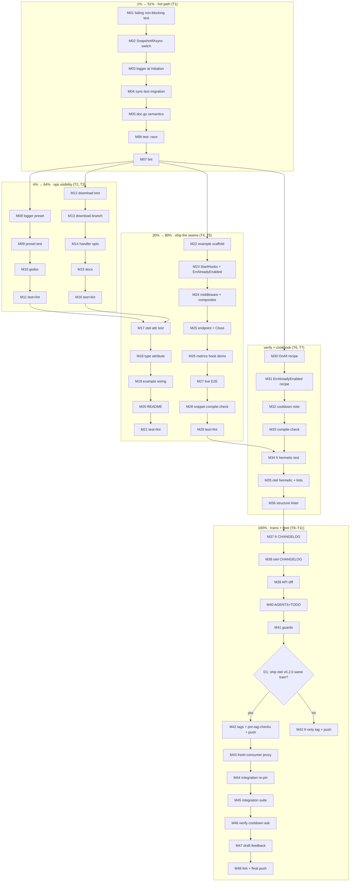

# SUPERB Plan: go-flightrecorder Adoption — 73 → 90+

**Date:** 2026-10-06 16:06 CEST &middot; **Source audit:** [`docs/research/2026-10-06_go-flightrecorder-deep-dive.html`](../research/2026-10-06_go-flightrecorder-deep-dive.html) (73/100, 7 findings, all source-verified)
**Goal:** close the audit's punch list and ship it as release trains, taking go-appkit's go-flightrecorder adoption from 73 to ~90 without regressing anything.
**Scope rule:** plan-only artifact. Execution starts after approval (pareto-planning → Full Execution Mode).

---

## 0. Guardrails (Verschlimmbessern prevention)

| Risk | Guard |
| --- | --- |
| Async switch changes observable middleware behavior | Migration note in CHANGELOG; `WithAutoReset` semantics preserved; `WithLogger` still works (logs capture *initiation* with request correlation); sink-content tests synchronize via `rec.Stop()`/`Close()` which the library guarantees **drain in-flight async captures** |
| Middleware cannot register fr hooks (recorder is consumer-built) | No attempt to — middleware logs initiation; completion telemetry stays at construction time via `fr.WithMetrics` (that is exactly what T2's preset variant makes ergonomic) |
| Handler signature change breaks consumers | `SnapshotHandler(rec, opts...)` is variadic — existing `SnapshotHandler(rec)` call sites compile unchanged (additions-only API diff) |
| Download names lie about compression | New `WithSnapshotFilename` handler option; godoc states the default and the gzip caveat |
| Tag hygiene violation | Release ritual per AGENTS.md: hermetic verify, API-diff check, no filesystem replaces, `pre-tag-checks.sh`, pin-drift + go-directives guards green **before** push |
| Silent scope creep into the otel v0.2.0 train | D1 (below) is an explicit open decision |

**Open decision D1 (owner: Lars):** otel's UNRELEASED v0.2.0 train already carries OTLP + exception capture + dashboard JSON. Default plan: ship `otel/v0.2.0` in the same train as `flightrecorder/v0.2.0` (frmetrics wiring completes that train). Alternative: flightrecorder-only train, otel later.

---

## 1. Pareto tiers

| Tier | Tasks | Cumulative value | Score projection |
| --- | --- | --- | --- |
| **1% → 51%** | T1 (async capture on the hot path) | Removes the only actively harmful behavior; the audit's heaviest-weighted area (hot path = 20 pts) | 73 → ~79 |
| **4% → 64%** | T1 + T2 (logger preset) + T3 (trace download) | The three priority-20 items: hot path fixed, ops failures visible, artifact deliverable | 73 → ~85 |
| **20% → 80%** | + T5 (ops example), T4 (OTel hook shipped), T7 (verify sweep) | Every finding ≥ Medium closed and provable | 73 → ~90 |
| **100%** | + T6 (cookbook), T8–T11 (release trains, integration re-pin, docs harvest, upstream ask) | Shipped, pinned, documented, upstream leverage | 90 + fleet value |

---

## 2. Level 1 — Comprehensive plan (30–100 min tasks, ALL todos, sorted by impact)

| # | ID | Task | Findings | Tier | Min | Impact | Ease | Customer value |
| --- | --- | --- | --- | --- | --- | --- | --- | --- |
| 1 | T1 | Switch HTTP middleware to `SnapshotIfAsync` (non-blocking capture), keep `WithAutoReset` semantics, move capture logging to initiation | F1 | 1% | 75 | 5 | 4 | Requests never pay trace-write latency; incidents stop amplifying themselves |
| 2 | T2 | Add `OpsRecorderLoggerPreset` (preset + `fr.WithLogger`) so retention-cleanup failures surface | F3 | 4% | 45 | 4 | 5 | Ops sees silent failures (disk full, permissions) instead of losing traces invisibly |
| 3 | T3 | Trace download mode on `/debug/flightrecorder/snapshot` via `SnapshotToWriter` (+ `WithSnapshotFilename`) | F2 | 4% | 60 | 4 | 5 | Operator gets the artifact over HTTP; no shell access needed; works for writer sinks |
| 4 | T5 | Compile-checked ops example (`flightrecorder/example/`): full loop — preset, Start/Close hooks, middleware, endpoint, metrics/logger hooks | F7 | 20% | 90 | 3 | 5 | Consumers copy a working production wiring; every other fix becomes demonstrable |
| 5 | T4 | Ship the OTel bridge: add `type` attribute, wire hook into otel example, document metric names in README | F4 | 20% | 60 | 3 | 4 | Dashboards label captures per operation; the built-but-dead seam goes live |
| 6 | T7 | Hermetic verify sweep: `go test -race` + per-module `golangci-lint` (sequential) + structure linter | — | 20% | 45 | 4 | 5 | Nothing merges broken; the 0-issues standard holds |
| 7 | T6 | doc.go cookbook: `OnAll` narrowing pattern, `errors.Is(ErrAlreadyEnabled)` start pattern, cooldown guidance for dir sinks | F5, F6 | 100% | 45 | 2 | 5 | Capture-noise and double-start mistakes prevented at the docs layer |
| 8 | T8 | Release docs: CHANGELOG entries (flightrecorder v0.2.0 with migration note; otel v0.2.0 frmetrics bullet), API-diff check, AGENTS release-state, TODO_LIST harvest, guards green | — | 100% | 75 | 3 | 3 | Release ritual satisfied; no v0.5.1-style drift |
| 9 | T9 | Tag + push trains: `flightrecorder/v0.2.0` (+ `otel/v0.2.0` per D1), annotated, pre-tag-checks, fresh-consumer proxy check | — | 100% | 60 | 3 | 3 | Consumers can actually adopt the fixes |
| 10 | T10 | Integration re-pin: go.mod pins, `documentedPins` fixture, full integration suite `GOWORK=off`, pin-drift green | — | 100% | 45 | 2 | 4 | The composition contract tests what consumers resolve |
| 11 | T11 | Upstream cooldown ask: verify against fr TODO_LIST/ROADMAP (verify-before-filing), draft outgoing feedback doc, link from TODO_LIST | F8 | 100% | 45 | 3 | 2 | Deletes hand-rolled adapter code fleet-wide once landed upstream |

**Total: 11 tasks, ~645 min (~10.75 h). Task count ≤ 27 per skill budget.**

---

## 3. Level 2 — Micro-task breakdown (≤ 12 min each, ALL todos, execution order)

| ID | Micro-task | Parent | Min | Tier |
| --- | --- | --- | --- | --- |
| M01 | Write failing test: request with fired trigger returns BEFORE capture write completes (blocked-writer sink; release + `rec.Close()` drain to assert content) | T1 | 12 | 1% |
| M02 | Switch `middleware.go:95` to `rec.SnapshotIfAsync(context.WithoutCancel(r.Context()), tc, trigger)` | T1 | 5 | 1% |
| M03 | Rework `WithLogger` path: log "capture initiated" with method/path/status at initiation; godoc documents that completion telemetry belongs to `fr.WithMetrics` | T1 | 12 | 1% |
| M04 | Update the 7 sync middleware tests: initiation assertions + drain-based content assertions | T1 | 12 | 1% |
| M05 | Update `doc.go` middleware section: async semantics, autoReset-vs-dir-sink note | T1 | 8 | 1% |
| M06 | `flightrecorder` module: `GOWORK=off GOTOOLCHAIN=go1.27.1 go test ./... -race -count=1` | T1 | 8 | 1% |
| M07 | Lint `flightrecorder/` from its own directory (sequential rule) | T1 | 8 | 1% |
| M08 | Add `OpsRecorderLoggerPreset(dir, maxSnapshots, maxBytes, log)` appending `fr.WithLogger` (7 options total) | T2 | 12 | 4% |
| M09 | Test: preset composition + logger hook receives lifecycle/capture events (sink assertions after drain) | T2 | 12 | 4% |
| M10 | `OpsRecorderPreset`/`OpsRecorderLoggerPreset` godoc cross-reference + example snippet | T2 | 8 | 4% |
| M11 | test + lint for `preset.go` change | T2 | 8 | 4% |
| M12 | Failing test: `?download=1` returns non-empty body, `application/octet-stream`, custom filename honored | T3 | 12 | 4% |
| M13 | Implement download branch in `SnapshotHandler` via `rec.SnapshotToWriter(r.Context(), w)`; errors → existing 500 JSON path | T3 | 12 | 4% |
| M14 | Add variadic options to `SnapshotHandler(rec, opts...)` + `WithSnapshotFilename(name)` (default `trace.trace`, gzip caveat in godoc) | T3 | 12 | 4% |
| M15 | Update `Mount`/`doc.go`/handler godoc with the `?download=1` recipe | T3 | 8 | 4% |
| M16 | test + lint for handler change | T3 | 12 | 4% |
| M17 | Failing otel test: hook emits `type` attribute (3 attrs) | T4 | 12 | 20% |
| M18 | Add `attribute.String("type", event.Type)` to `frmetrics.go:52-55` | T4 | 5 | 20% |
| M19 | Wire `fr.WithMetrics(appkitotel.NewFlightRecorderMetricsHook(meter))` into `otel/example/main.go` (own recorder, one per process) | T4 | 12 | 20% |
| M20 | otel README: fr-bridge rows in the signal table + wiring snippet | T4 | 12 | 20% |
| M21 | otel module: test (incl. frmetrics E2E) + lint | T4 | 12 | 20% |
| M22 | Scaffold `flightrecorder/example/main.go`: PORT env, `DefaultServiceConfig`, logger preset | T5 | 12 | 20% |
| M23 | StartHooks adapter: `rec.Start()`, `errors.Is(fr.ErrAlreadyEnabled)` → classified fail-closed start | T5 | 12 | 20% |
| M24 | Wire `Middleware(rec, fr.OnAll(fr.OnError(), fr.OnLatency(100ms)))` (dogfoods composites) + slow route for live triggers | T5 | 12 | 20% |
| M25 | Mount snapshot endpoint; ShutdownHooks: drain hook + `rec.Close()` | T5 | 12 | 20% |
| M26 | `fr.WithMetrics` → slog metrics hook in the example (completion telemetry demo) | T5 | 12 | 20% |
| M27 | Live E2E: run example, hit slow route, verify timestamped `.trace.gz` lands in dir | T5 | 12 | 20% |
| M28 | Compile-check README/doc.go snippets in scratch module (house rule) | T5 | 12 | 20% |
| M29 | example test + lint | T5 | 12 | 20% |
| M30 | doc.go cookbook: `OnAll(OnError, OnLatency)` slow-errors-only pattern | T6 | 12 | 100% |
| M31 | doc.go cookbook: `errors.Is(ErrAlreadyEnabled)` shared-recorder start pattern | T6 | 8 | 100% |
| M32 | doc.go: cooldown guidance for dir sinks (30–60s, cross-ref frh `WithCooldown`) | T6 | 8 | 100% |
| M33 | Compile-check updated doc.go snippets | T6 | 12 | 100% |
| M34 | `flightrecorder` hermetic test re-run after all code changes | T7 | 8 | 20% |
| M35 | `otel` hermetic test re-run + sequential lint of both modules | T7 | 20 | 20% |
| M36 | `go-structure-linter` root run (exclude flags per AGENTS.md) → 0 findings | T7 | 8 | 20% |
| M37 | flightrecorder CHANGELOG: `[Unreleased]` → `[v0.2.0]` — async capture behavior change + migration note, preset variant, handler options | T8 | 12 | 100% |
| M38 | otel CHANGELOG v0.2.0 entry gains frmetrics `type`-attribute + example-wiring bullets | T8 | 8 | 100% |
| M39 | API-diff check vs `flightrecorder/v0.1.1` (git-archive ritual) — verify additions-only | T8 | 20 | 100% |
| M40 | AGENTS.md: release-state + flightrecorder/otel module bullets; TODO_LIST: harvest remaining plan items | T8 | 12 | 100% |
| M41 | `./scripts/check-pin-drift.sh` + `check-go-directives.sh` green | T8 | 8 | 100% |
| M42 | Annotated tags (`flightrecorder/v0.2.0`, `otel/v0.2.0` per D1) + `pre-tag-checks.sh` + push master + tags | T9 | 12 | 100% |
| M43 | Fresh-consumer proxy check per `doc/recipes/fresh-consumer-proxy-check.md` | T9 | 30 | 100% |
| M44 | Integration go.mod pins → new tags; `documentedPins` fixture + `doc.go` pin contract | T10 | 12 | 100% |
| M45 | Integration suite `GOWORK=off GOTOOLCHAIN=go1.27.1 go test ./...` green; `check-pin-drift.sh` green | T10 | 15 | 100% |
| M46 | Verify cooldown ask against fr TODO_LIST/ROADMAP (verify-before-filing gate) | T11 | 12 | 100% |
| M47 | Draft `doc/feedback/outgoing/2026-10-06_upstream-ask-goflightrecorder-cooldown.md` | T11 | 20 | 100% |
| M48 | Link the ask from TODO_LIST (filing remains gated); final commit + push | T11 | 8 | 100% |

**Total: 48 micro-tasks, ~499 min. Task count ≤ 150 per skill budget; every micro-task ≤ 12 min.**

---

## 4. Execution graph

Parallel lanes: T2 ∥ T3 ∥ T5 scaffold after M07; T4 after M11+M16; all release work (M37+) strictly after M36 (structure linter green).

---

## 5. Provenance

- Audit findings F1–F7 + reverse finding F8: `docs/research/2026-10-06_go-flightrecorder-deep-dive.html`
- Release ritual + tag hygiene: `AGENTS.md` → *Release Ritual*, *Release State*
- Fresh-consumer recipe: `doc/recipes/fresh-consumer-proxy-check.md`
- Upstream-ask template precedent: `doc/feedback/outgoing/2026-09-20_upstream-ask-gohealth-recorder-sentinel.md`
- Library source of truth: `/home/lars/projects/go-flightrecorder` (v0.2.0 = latest tag; HEAD 86a1cb5 internal-only)
