# SUPERB Pareto Execution Plan — go-appkit

> 2026-10-07 10:11 CEST · point-in-time plan over `TODO_LIST.md` as of
> 2026-10-07 (second docs-health pass). Sources: TODO_LIST (26 open items +
> 6 open questions), session report `docs/status/2026-10-07_10-07_docs-health-audit-live-leak-and-pin-bump.md`,
> AGENTS Release State. Format: `.md` + mermaid at explicit user demand
> (skill default is HTML).
>
> **Sorting key:** importance (release correctness > automation integrity >
> verification debt > docs truth > upstream > long tail) × impact ÷ effort,
> weighted by customer value (consumers = LarsArtmann fleet apps +
> cqrs-htmx setup + potential adopters).
>
> **Gates:** OWNER = needs Lars; USER-GATE = needs explicit go-ahead;
> TRIGGER = demand/event-gated; none = agent-executable now.

---

## 1) Pareto Breakdown

### The 1% that delivers 51%

**Restore the `SSH_PRIVATE_KEY` Actions secret** (owner, ~5 minutes).
One secret re-activates the entire 12-module build/vet/`-race` matrix — the
project's core verification signal, dead since ~2026-10-01. Every regression
the guards don't cover (and they don't cover tests) is currently invisible.
No other single action compares.

### The 4% that delivers 64%

The 1% plus:

1. **Per-module pin-drift guard** (`AGENTS`-says-vX vs tag-says-vY) — the
   release-truth drift class missed twice in two days and caught only by
   luck. Guards-as-code beats prose; build it BEFORE the next train so the
   train itself is protected.
2. **core v0.8.0 + systemd v0.1.0 release train** — ships ALL
   implemented-but-unreleased work (StartHooks seam + the entire systemd
   module), demand-proven by bank-sync ADR-017 (they adopted go-daemon and
   hand-rolled the drain window this repo already solved).

### The 20% that delivers 80%

The 4% plus the automation-integrity cluster (push-lag watch, HEAD-advance
hook, go-directive structural fix, AGENTS pipe rule, daemon evidence
dossier, license-check decision), the verification-debt cluster (cqrs flake
hunt, docs-module + flightrecorder-middleware E2E legs, browser CSP pass,
govulncheck), the first upstream-ask batch (cqrs-lite GracefulClose, fr
cooldown), and the small consumer-facing fix (errorpages recorder swap).

### The other 20% (to 100%)

Docs verify sweep (FEATURES evidence cells, README, ROADMAP), StartHooks
example migration + fr v0.2.1 sweep (post-train), consumer-claim ritual,
benchstat probe, v1.0.0 criteria review, cqrs-htmx suite run, AGENTS
slim-down, health/polish batch, watchlist refresh — plus the TRIGGER-gated
long tail (battery W3-W5, cordis, PapDashboard, SSE-hub coherence, cqrs
encryption, samber-do-auditlog, dep-graph polish, dprint upstream, cookbook
ritual, nixpkgs toolchain, buildcache topology, compose-on-httputil BLOCKED
upstream). Every one appears in §5 (coverage) — nothing dropped.

---

## 2) Level-1 Plan — tasks 30–100 min, sorted (T01 = highest priority)

| ID  | Task                                                                                                                                                 | Pareto   | Area            | Impact | Effort | Gate / Dep         |
| --- | ---------------------------------------------------------------------------------------------------------------------------------------------------- | -------- | --------------- | ------ | ------ | ------------------ |
| T01 | Restore `SSH_PRIVATE_KEY` + observe ONE fully green master run                                                                                       | 1%       | CI              | 10     | 30     | OWNER (secret)     |
| T02 | Per-module pin-drift guard (AGENTS-vs-tag for every module)                                                                                          | 4%       | guards          | 9      | 60     | —                  |
| T03 | core v0.8.0 release train (API-break check → CHANGELOG → tag → guards → push → AGENTS same-train)                                                    | 4%       | release         | 9      | 90     | after/with T02     |
| T04 | systemd v0.1.0 train (lift replace → tag → integration pin + `documentedPins` + CI proxy-smoke slot → AGENTS)                                        | 4%       | release         | 9      | 90     | dep T03            |
| T05 | Push-lag / origin-age watch guard script                                                                                                             | 20%      | guards          | 7      | 45     | —                  |
| T06 | Post-commit HEAD-advance sanity hook (design first)                                                                                                  | 20%      | guards          | 7      | 90     | —                  |
| T07 | go-directive re-drift CLASS fix (BuildFlow pre-commit wiring + semver-aware + `toolchain` directives)                                                | 20%      | guards          | 7      | 100    | —                  |
| T08 | AGENTS pipe rule (never pipe verify output) + removal trade                                                                                          | 20%      | AGENTS          | 5      | 30     | —                  |
| T09 | Daemon evidence dossier + owner-triage checklist (rewind, leaks ×4, push stall, heuristic bundling)                                                  | 20%      | process         | 7      | 30     | OWNER (location)   |
| T10 | `.buildflow.yml` license-check decision (probe step; restore skip or keep removal)                                                                   | 20%      | build           | 5      | 30     | —                  |
| T11 | E2E: docs-module composition through a live appkit Service                                                                                           | 20%      | integration     | 6      | 90     | —                  |
| T12 | E2E: flightrecorder middleware through a full Service chain                                                                                          | 20%      | integration     | 6      | 90     | —                  |
| T13 | cqrs flake hunt (`-race -count=10` under load, capture name)                                                                                         | 20%      | cqrs            | 6      | 60     | —                  |
| T14 | security: browser CSP pass on hardened dashboard (chromedp/manual) + THREAT_MODEL link                                                               | 20%      | security        | 6      | 100    | —                  |
| T15 | Upstream asks batch A: go-cqrs-lite GracefulClose + fr cooldown combinator                                                                           | 20%      | upstream        | 6      | 40     | USER-GATE (filing) |
| T16 | errorpages: `statusRecorder` → `httputil.ResponseRecorder`                                                                                           | 20%      | errorpages      | 4      | 30     | USER-GATE          |
| T17 | Upstream asks batch B: go-sse `ReplayFiltered`, httputil logging + `NewServerListener`, go-health pack, samber/do note                               | 20%→tail | upstream        | 5      | 90     | USER-GATE (filing) |
| T18 | Docs verify sweep: FEATURES evidence cells + README + ROADMAP (fix drift on sight)                                                                   | 20%      | docs            | 6      | 100    | —                  |
| T19 | Example StartHooks migration (flightrecorder + otel examples) + fr v0.2.1 sweep on frh/cqrs                                                          | tail     | examples        | 5      | 45     | dep T03/T04        |
| T20 | govulncheck on health + security (networked machine)                                                                                                 | tail     | security/health | 4      | 30     | env (network)      |
| T21 | Consumer-claim drift ritual — posture decision + wiring                                                                                              | tail     | process         | 4      | 30     | USER-GATE          |
| T22 | otel benchstat re-baseline probe (`nix run nixpkgs#benchstat`)                                                                                       | tail     | otel            | 3      | 45     | env probe          |
| T23 | v1.0.0 exit-criteria graduation review (keep draft vs graduate)                                                                                      | tail     | core            | 3      | 30     | —                  |
| T24 | Full cqrs-htmx setup suite hermetic run (extend 3/3 → suite-green)                                                                                   | tail     | consumer        | 4      | 100    | env (their repo)   |
| T25 | AGENTS deep slim-down (what graduates to module READMEs; structural cut, 361/377)                                                                    | tail     | AGENTS          | 5      | 100    | —                  |
| T26 | Health/polish backlog batch (dashboard assertions, testkit drain helper, `Hook` alias, `seriesKey`, `errors.Join` test, `-hardened` example)         | tail     | health/core     | 4      | 90     | —                  |
| T27 | Watchlist refresh batch (cordis, PapDashboard, nixpkgs, art-dupl audit-pass decision, external-consumer ritual, dep-graph/dprint/samber owner-notes) | tail     | watchlist       | 3      | 60     | —                  |

**Total: 27 tasks · ~23.6 h agent-executable effort + 3 owner minutes (the secret).**

---

## 3) Level-2 Plan — every task broken to ≤12 min slices

| Sub   | Parent | Slice (each ≤ 12 min)                                                          |
| ----- | ------ | ------------------------------------------------------------------------------ |
| T01.1 | T01    | OWNER: restore secret in GitHub → Settings → Secrets → Actions                 |
| T01.2 | T01    | Trigger a push; observe `ci-preflight` green + matrix UNSKIPPED (`gh run`)     |
| T01.3 | T01    | Verify all 12 module jobs + guards green; record run ID; close P1 in TODO      |
| T02.1 | T02    | Enumerate per-module version claims in AGENTS vs `git ls-remote` tags          |
| T02.2 | T02    | Extend `check-pin-drift.sh`: parse AGENTS module bullets + "Latest per module" |
| T02.3 | T02    | Negative test: plant a stale claim, verify the guard goes red                  |
| T02.4 | T02    | Wire into `pre-tag-checks.sh` + CI guard job; full battery green               |
| T03.1 | T03    | API-break check core vs v0.7.0 (`go doc -all` diff from extracted old tag)     |
| T03.2 | T03    | Hermetic core suite: `GOWORK=off GOTOOLCHAIN=go1.27.1 go test -race -count=1`  |
| T03.3 | T03    | Date core CHANGELOG `[Unreleased]` → `[0.8.0] - 2026-10-07`                    |
| T03.4 | T03    | `pre-tag-checks.sh` + annotated tag `v0.8.0` + push (with T02 guard live)      |
| T03.5 | T03    | AGENTS same-train release-state line + core bullet + TODO header               |
| T04.1 | T04    | systemd: lift `replace => ../`, bump require to core v0.8.0, hermetic tidy     |
| T04.2 | T04    | systemd suite `-race` green; date CHANGELOG `[0.1.0]`                          |
| T04.3 | T04    | Tag `systemd/v0.1.0` via pre-tag-checks; push                                  |
| T04.4 | T04    | integration: pin + `documentedPins` entry + CI proxy-smoke matrix slot         |
| T04.5 | T04    | AGENTS same-train (systemd bullet UNRELEASED → v0.1.0) + TODO header           |
| T05.1 | T05    | `scripts/check-push-lag.sh`: origin/master age via `git for-each-ref`          |
| T05.2 | T05    | Threshold (default 6h) + invocation point (preflight or pre-tag-checks)        |
| T05.3 | T05    | Test + AGENTS one-liner (with removal trade)                                   |
| T06.1 | T06    | Design note: rewind-vs-legitimate-rebase discrimination rules                  |
| T06.2 | T06    | Prototype post-commit hook (HEAD backward OR content revert w/o reflog)        |
| T06.3 | T06    | Simulated-rewind test in a scratch repo                                        |
| T06.4 | T06    | Install decision + AGENTS line (with removal trade)                            |
| T07.1 | T07    | Wire `check-go-directives.sh` into BuildFlow pre-commit (project-guards block) |
| T07.2 | T07    | Semver-aware directive compare (`go 1.26` ≡ `go 1.26.7`)                       |
| T07.3 | T07    | Extend guard to `toolchain` directives                                         |
| T07.4 | T07    | Regression test: plant drift, verify the commit is blocked                     |
| T08.1 | T08    | Draft the pipe-rule line; pick the removal trade (361/377)                     |
| T08.2 | T08    | Edit AGENTS; structure linter green                                            |
| T09.1 | T09    | Compile evidence dossier (timeline, hashes 2d991a9→19100c5, damage modes)      |
| T09.2 | T09    | Owner-triage checklist: candidate unit names, config paths, log locations      |
| T10.1 | T10    | Probe: `env -u GOTOOLCHAIN buildflow -s license-check --dry-run`               |
| T10.2 | T10    | Verdict: restore skip (comment why) or keep removal + AGENTS note              |
| T11.1 | T11    | Read docs-module API from module cache (pinned tag!)                           |
| T11.2 | T11    | Write `integration` composition test (Service + `RegisterDocs` + build)        |
| T11.3 | T11    | Suite green; commit + CHANGELOG `[Unreleased]` note                            |
| T12.1 | T12    | Write FR-middleware E2E via `testkit.Serve` (trigger → capture → snapshot)     |
| T12.2 | T12    | Assertions: non-blocking capture + artifact present                            |
| T12.3 | T12    | Suite green; commit                                                            |
| T13.1 | T13    | `go test -race -count=10 ./...` output → FILE (no pipes!)                      |
| T13.2 | T13    | Analyze; capture failing test name or close the item as unreproduced           |
| T14.1 | T14    | Launch health example `-hardened`; chromedp console-violation probe script     |
| T14.2 | T14    | Manual fallback pass if chromedp env-blocked; record evidence                  |
| T14.3 | T14    | Link evidence in `security/THREAT_MODEL.md` Composition-proofs                 |
| T15.1 | T15    | Final-check cqrs-lite ask vs current upstream master (semantics unchanged)     |
| T15.2 | T15    | USER-GATE: file go-cqrs-lite GracefulClose + timers ask                        |
| T15.3 | T15    | USER-GATE: file fr cooldown-combinator ask                                     |
| T16.1 | T16    | USER-GATE: swap `statusRecorder` → `httputil.ResponseRecorder`                 |
| T16.2 | T16    | errorpages suite + lint green                                                  |
| T16.3 | T16    | CHANGELOG `[Unreleased]`                                                       |
| T17.1 | T17    | Final-check go-sse ask draft                                                   |
| T17.2 | T17    | USER-GATE: file go-sse `ReplayFiltered` ask                                    |
| T17.3 | T17    | USER-GATE: file httputil Logging + `NewServerListener` asks                    |
| T17.4 | T17    | USER-GATE: file go-health pack + samber/do lazy-healthy note                   |
| T18.1 | T18    | FEATURES evidence cells: core + realtime + security + errorpages               |
| T18.2 | T18    | FEATURES evidence cells: cqrs + otel + health + frh + docs + systemd           |
| T18.3 | T18    | README verify (claims vs code)                                                 |
| T18.4 | T18    | ROADMAP verify (graduations vs TODO_LIST state)                                |
| T18.5 | T18    | Fix all drift found on sight; re-run guards                                    |
| T19.1 | T19    | flightrecorder example: `rec.Start()` → `cfg.StartHooks`                       |
| T19.2 | T19    | otel example: same migration                                                   |
| T19.3 | T19    | Drop in-doc caveats; verify both examples build + run                          |
| T19.4 | T19    | fr v0.2.1 require bump in frh + cqrs; both suites `-race` green                |
| T20.1 | T20    | govulncheck on health (networked machine)                                      |
| T20.2 | T20    | govulncheck on security                                                        |
| T20.3 | T20    | Record results; close/partition the TODO item                                  |
| T21.1 | T21    | Present posture options (keep pins + ritual vs drop pins) with data            |
| T21.2 | T21    | USER-GATE decision; wire the chosen ritual note                                |
| T22.1 | T22    | Probe `nix run nixpkgs#benchstat` availability                                 |
| T22.2 | T22    | If available: n=10 otel re-baseline; record in otel README                     |
| T23.1 | T23    | Review `core-v1-exit-criteria.md` vs current consumer count                    |
| T23.2 | T23    | Decision note: keep draft (default) or graduate; fold lessons if graduating    |
| T24.1 | T24    | Prepare bounded, container-aware run plan for cqrs-htmx setup suite            |
| T24.2 | T24    | Run suite hermetically; capture failures to file                               |
| T24.3 | T24    | Triage failures (theirs vs ours); report; extend verified set                  |
| T25.1 | T25    | Inventory AGENTS sections; mark README-graduation candidates                   |
| T25.2 | T25    | Execute cut batch 1 (Release Ritual → docs/recipe)                             |
| T25.3 | T25    | Execute cut batch 2 (per-module Gotchas → module READMEs)                      |
| T25.4 | T25    | Structure-linter loop green ≤377; AGENTS/README crosslinks verified            |
| T26.1 | T26    | Hardened-dashboard test: `frame-ancestors 'none'` + sorted directives          |
| T26.2 | T26    | testkit drain-window assertion helper; convert drain tests                     |
| T26.3 | T26    | `type Hook` alias + typed `seriesKey` (additions-only, API-break check)        |
| T26.4 | T26    | `errors.Join` message-shape test + health-example `-hardened` mode             |
| T27.1 | T27    | Recheck cordis + PapDashboard + nixpkgs states                                 |
| T27.2 | T27    | art-dupl: record corrected invocation; scope the ~431-group audit pass         |
| T27.3 | T27    | External-consumer ritual decision prep (rolls-royce + papdashboard)            |
| T27.4 | T27    | Owner-notes: dep-graph polish, dprint exit-14, samber-do-auditlog triggers     |

**Total: 92 slices · all ≤12 min · executable in priority order, parallelizable inside a tier.**

---

## 4) Execution Graph (mermaid)

```mermaid
flowchart TD
    subgraph T1["1% — 51%"]
        T01["T01 SSH secret restore<br/>(OWNER) + green-run observe"]
    end
    subgraph T4["4% — 64%"]
        T02["T02 pin-drift guard<br/>per-module"]
        T03["T03 core v0.8.0 train"]
        T04["T04 systemd v0.1.0 train"]
    end
    subgraph T20g["20% — 80%"]
        T05["T05 push-lag watch"]
        T06["T06 HEAD-advance hook"]
        T07["T07 go-directive class fix"]
        T08["T08 AGENTS pipe rule"]
        T09["T09 daemon dossier (OWNER)"]
        T10["T10 license-check decision"]
        T11["T11 docs-module E2E"]
        T12["T12 flightrecorder E2E"]
        T13["T13 cqrs flake hunt"]
        T14["T14 browser CSP pass"]
        T15["T15 upstream batch A (GATE)"]
        T16["T16 errorpages swap (GATE)"]
    end
    subgraph TAIL["other 20% — 100%"]
        T17["T17 upstream batch B (GATE)"]
        T18["T18 docs verify sweep"]
        T19["T19 examples + fr v0.2.1"]
        T20["T20 govulncheck"]
        T21["T21 consumer-claim ritual (GATE)"]
        T22["T22 benchstat probe"]
        T23["T23 v1.0.0 criteria"]
        T24["T24 cqrs-htmx suite"]
        T25["T25 AGENTS slim-down"]
        T26["T26 health/polish batch"]
        T27["T27 watchlist refresh"]
    end

    T02 --> T03
    T03 --> T04
    T04 --> T19
    T03 --> T19
    T01 -.->|matrix live again| T13
    T02 -.->|guards the train| T04
    T09 -.->|owner input| T06
    T17 -.->|NewServerListener ask| BLOCKED["Compose on httputil.Server<br/>BLOCKED upstream"]
    T23 -.->|criteria shipped| CORDIS["cordis bridge<br/>TRIGGER 2/3"]
    T25 -.-> T08
```

---

## 5) Coverage — every open TODO_LIST item mapped

| TODO_LIST item (2026-10-07)                       | Plan slot                                                                                       |
| ------------------------------------------------- | ----------------------------------------------------------------------------------------------- |
| P1: SSH secret restore + green run                | T01                                                                                             |
| Daemon root-cause (owner-gated half)              | T09 (+T05, T06 guards)                                                                          |
| Per-module pin-drift guard                        | T02                                                                                             |
| Push-lag / daemon-health watch                    | T05                                                                                             |
| Post-commit HEAD-advance sanity hook              | T06                                                                                             |
| cqrs flake hunt                                   | T13                                                                                             |
| AGENTS pipe rule                                  | T08 (also T25)                                                                                  |
| go-directive re-drift CLASS + guard hardening     | T07                                                                                             |
| E2E: docs-module + flightrecorder middleware      | T11 + T12                                                                                       |
| security browser CSP pass                         | T14                                                                                             |
| errorpages `statusRecorder` swap                  | T16                                                                                             |
| health `WithHealthRecorder` upstream ask          | T17 (go-health pack)                                                                            |
| Compose on `httputil.Server` (BLOCKED)            | T17 (`NewServerListener` ask) — refactor stays BLOCKED                                          |
| Upstream asks drafted (sse/httputil/go-health/do) | T17                                                                                             |
| govulncheck health+security                       | T20                                                                                             |
| otel benchstat re-baseline                        | T22                                                                                             |
| v1.0.0 exit criteria                              | T23                                                                                             |
| Consumer-claim drift ritual                       | T21                                                                                             |
| go-cqrs-lite GracefulClose watch + ask            | T15 (ask) + standing watch stays                                                                |
| fr cooldown combinator ask                        | T15                                                                                             |
| fr v0.2.1 sweep (frh + cqrs trains)               | T19.4                                                                                           |
| Example StartHooks migration                      | T19.1-T19.3                                                                                     |
| systemd train (REMAINING half)                    | T04                                                                                             |
| SSE-hub fleet coherence + go-aichat               | TRIGGER (owner decision; no action now)                                                         |
| Composition-gap watchlist (remaining legs)        | T11/T12 cover two; otel×realtime, otel×dashboard, security×errorpages, SSE+health stay ON-TOUCH |
| Battery program W3-W5                             | TRIGGER (demand; canonical spec doc)                                                            |
| cqrs encryption/signing opt-ins                   | TRIGGER (demand)                                                                                |
| cqrs-htmx setup suite run                         | T24                                                                                             |
| AGENTS deep slim-down                             | T25                                                                                             |
| cqrs README cookbook ritual                       | TRIGGER (next go-cqrs-lite release)                                                             |
| BuildFlow dprint exit-14                          | TRIGGER (upstream; T27.4 owner-note)                                                            |
| samber-do-auditlog hooks                          | TRIGGER (demand)                                                                                |
| project-dependency-graph polish                   | TRIGGER (their repo; T27.4 owner-note)                                                          |
| Health/polish backlog                             | T26                                                                                             |
| cordis bridge watch                               | TRIGGER (T27.1 recheck)                                                                         |
| PapDashboard watch                                | TRIGGER (T27.1 recheck)                                                                         |
| Go toolchain / nixpkgs watch                      | TRIGGER (T27.1 recheck)                                                                         |
| Watchlist refresh (standing)                      | T27                                                                                             |
| Open questions 1-6                                | OWNER inputs gating T09/T15/T17/T21 (+buildcache)                                               |

**NEW tasks surfaced by planning (added to TODO_LIST with this plan):**
license-check decision (T10) and the docs verify sweep (T18).

---

## 6) Acceptance / verification

- Every task closes with its named acceptance (green run ID, guard red→green
  negative test, suite exit 0, tag on origin, CHANGELOG dated) — the same
  verify-then-claim discipline the 01-22 report demands.
- No Verschlimmbesserung: no speculative rewrites; guards before prose;
  member go.mod changes ride release trains only (T19.4, T04); never tag a
  module carrying a filesystem `replace` (pre-tag-checks enforces).
- Verification commands are NEVER piped — redirect to a file, inspect the file.
